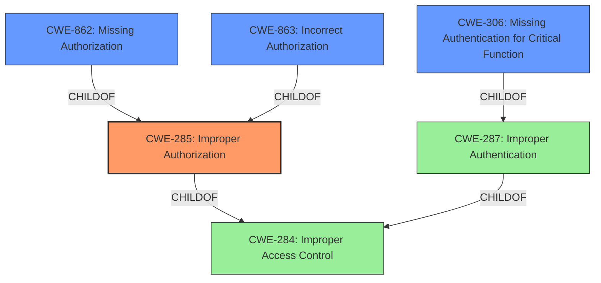

# Analysis Report for CVE-2024-28967

# Vulnerability Analysis Report: CVE-2024-28967

## Description

Dell SCG, versions prior to 5.24.00.00, contain an **Improper Access Control** vulnerability in the SCG exposed for an internal maintenance REST API (if enabled by Admin user from UI). A remote low privileged attacker could potentially exploit this vulnerability, leading to the execution of certain APIs applicable only for Admin Users on the applications backend database that could potentially allow an unauthorized user access to restricted resources and change of state.

## Vulnerability Description Key Phrases

- **Rootcause:** Improper Access Control
- **Impact:** unauthorized user access to restricted resources and change of state
- **Attacker:** remote low privileged attacker
- **Product:** Dell SCG
- **Version:** versions prior to 5.24.00.00
- **Component:** internal maintenance REST API

## Analysis (with Relationship Data)

# Summary
| CWE ID  | CWE Name                                                        | Confidence | CWE Abstraction Level | CWE Vulnerability Mapping Label | CWE-Vulnerability Mapping Notes |
| :-------- | :-------------------------------------------------------------- | :--------- | :---------------------- | :------------------------------ | :------------------------------ |
| CWE-285   | Improper Authorization                                          | 0.9        | Class                   | Allowed-with-Review               | Primary CWE                     |
| CWE-306   | Missing Authentication for Critical Function                    | 0.7        | Base                    | Allowed                       | Secondary Candidate           |
| CWE-862   | Missing Authorization                                           | 0.7        | Base                    | Allowed                       | Secondary Candidate           |
| CWE-863   | Incorrect Authorization                                           | 0.7        | Class                   | Allowed-with-Review               | Secondary Candidate           |

## Evidence and Confidence

*   **Confidence Score:** 0.9
*   **Evidence Strength:** HIGH

## Relationship Analysis
The primary weakness is **Improper Authorization** (CWE-285), which falls under the broader category of access control issues. CWE-285 is a class-level CWE, and there are potentially more specific base-level CWEs that could apply, like CWE-862 (Missing Authorization) or CWE-863 (Incorrect Authorization). CWE-306 (Missing Authentication for Critical Function) is also considered because authentication is a prerequisite for authorization. The choice between these depends on whether the vulnerability is due to a complete lack of authorization, an incorrect authorization check, or a missing authentication step.



## Vulnerability Chain
The vulnerability chain begins with an **Improper Access Control** (**ROOTCAUSE**) in the Dell SCG's internal maintenance REST API. The chain progresses as follows:

1.  **Improper Access Control** (CWE-285): The API, intended for Admin Users, is accessible by low-privileged users due to **improper access control**.

2.  **Unauthorized Access and State Change**: A remote low-privileged attacker exploits this vulnerability to execute APIs intended for Admin Users, potentially leading to unauthorized access to restricted resources and changes of state.

The **Primary CWE** is CWE-285 as it identifies the issue that led to the vulnerability i.e. the first in the "Vulnerability Chain"

## Summary of Analysis
The initial assessment identified **Improper Access Control** as the root cause. The evidence from the vulnerability description and CVE Reference Links Content Summary supports this, highlighting that the internal maintenance REST API, meant for Admin Users, is accessible to low-privileged users.

The analysis considered several related CWEs, including:

*   CWE-285 (Improper Authorization): This was chosen as the primary CWE because the vulnerability involves an authorization check that is either missing or incorrectly implemented, allowing low-privileged users to access admin-level functions.
*   CWE-306 (Missing Authentication for Critical Function): This was considered because authentication is a prerequisite for authorization, and a missing authentication step could lead to unauthorized access.
*   CWE-862 (Missing Authorization): Any logged-in user can change any other user's email without being an admin.
*   CWE-863 (Incorrect Authorization): An admin check exists but incorrectly grants access to non-admin users.

CWE-285 is selected as the **Primary CWE** because the vulnerability description explicitly mentions **"Improper Access Control"**. The evidence from CVE Reference Links Content Summary reinforces this. The other CWE's are secondary candidates.

Relevant CWE Information:
*   **CWE-285 (Improper Authorization)**: "The product does not perform or incorrectly performs an authorization check when an actor attempts to access a resource or perform an action." This aligns with the vulnerability description, which states that a low-privileged attacker can execute APIs applicable only for Admin Users. The security implication is unauthorized access to restricted resources and change of state.
*   **CWE-306 (Missing Authentication for Critical Function)**: "The product does not perform any authentication for functionality that requires a provable user identity or consumes a significant amount of resources." This is a possible contributing factor if the API lacks proper authentication mechanisms. The impact is unauthorized access to critical functions.
*   **CWE-862 (Missing Authorization)**: The application doesn't check whether the user is authorized at all.
*   **CWE-863 (Incorrect Authorization)**: The application checks authorization, but does it incorrectly (e.g., flawed logic).

I am overriding the retriever result that listed CWE-NVD-noinfo as the primary match for similar CVE Descriptions because the current description has enough information to classify it as **Improper Access Control** (CWE-285).

# Enhanced Context (25 CWEs)

## CWE-497: Exposure of Sensitive System Information to an Unauthorized Control Sphere
*Not Used:* This CWE focuses on the exposure of sensitive system information, which is not the primary issue described in the vulnerability. The focus is on unauthorized access to APIs and state changes, not specifically on information exposure.

## CWE-280: Improper Handling of Insufficient Permissions or Privileges
*Not Used:* While related to access control, this CWE is more about the product's handling of its own insufficient privileges, not about granting excessive privileges to users.

## CWE-668: Exposure of Resource to Wrong Sphere
*Not Used:* This CWE is too high-level and doesn't capture the specific authorization flaw.

## CWE-274: Improper Handling of Insufficient Privileges
*Not Used:* Similar to CWE-280, this focuses on the product's handling of its own insufficient privileges.

## CWE-41: Improper Resolution of Path Equivalence
*Not Used:* This CWE is specific to file system path manipulation, which is not relevant to the described vulnerability.

## CWE-267: Privilege Defined With Unsafe Actions
*Not Used:* This CWE is about privileges being used for unintended actions, which is not the core issue here. The issue is about access control to APIs.

## CWE-807: Reliance on Untrusted Inputs in a Security Decision
*Not Used:* This CWE is about relying on untrusted inputs for security decisions, which is not directly applicable here.

## CWE-1391: Use of Weak Credentials
*Not Used:* This CWE is about weak credentials, which is not the focus of the vulnerability description.

## CWE-345: Insufficient Verification of Data Authenticity
*Not Used:* This CWE is about data authenticity, which is not relevant to the described vulnerability.

## CWE-303: Incorrect Implementation of Authentication Algorithm
*Not Used:* This CWE is about incorrect implementation of authentication algorithms, which is not the primary issue here. The vulnerability focuses on access control and authorization, not the authentication algorithm itself.

## CWE-639: Authorization Bypass Through User-Controlled Key
*Not Used:* This CWE is about bypassing authorization by manipulating key values, which is not the specific mechanism described in the vulnerability.

## CWE-613: Insufficient Session Expiration
*Not Used:* This CWE relates to session management, not the core issue of access control to the REST API.

## CWE-73: External Control of File Name or Path
*Not Used:* This CWE deals with file path manipulation, which is not relevant to the described vulnerability.

## CWE-259: Use of Hard-coded Password
*Not Used:* This CWE is about hard-coded passwords, which is not the focus of the vulnerability.

## CWE-942: Permissive Cross-domain Policy with Untrusted Domains
*Not Used:* This CWE is specific to cross-domain policies, which is not relevant to the vulnerability description.

## CWE-499: Serializable Class Containing Sensitive Data
*Not Used:* This CWE is about serializable classes containing sensitive data, which is not applicable here.

## CWE-498: Cloneable Class Containing Sensitive Information
*Not Used:* This CWE is about cloneable classes containing sensitive information, which is not applicable here.


## CWE Relationship Analysis

Current CWEs represent these abstraction levels: .


### Vulnerability Chain Analysis

**Chain starting from CWE-274:**
- 274 (Improper Handling of Insufficient Privileges) - ROOT


**Chain starting from CWE-499:**
- 499 (Serializable Class Containing Sensitive Data) - ROOT


### CWE Relationship Diagram

```mermaid
graph TD
    classDef primary fill:#f96,stroke:#333,stroke-width:2px
    classDef secondary fill:#69f,stroke:#333
    classDef tertiary fill:#9e9,stroke:#333
```


*Report generated on 2025-07-13 06:56:35*
