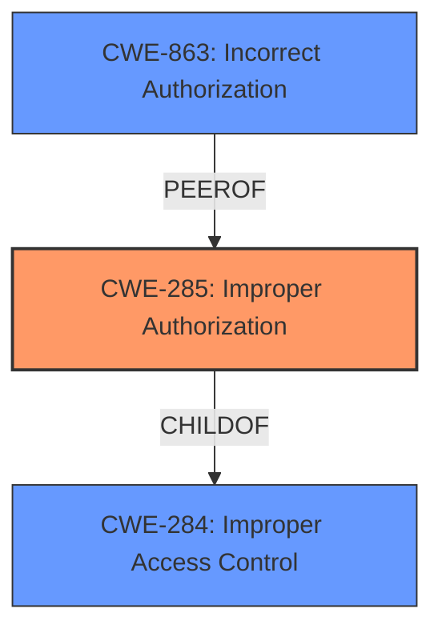

# Analysis Report for CVE-2024-28969

# Vulnerability Analysis Report: CVE-2024-28969

## Description

Dell SCG, versions prior to 5.24.00.00, contain an **Improper Access Control** vulnerability in the SCG exposed for an internal update REST API (if enabled by Admin user from UI). A remote low privileged attacker could potentially exploit this vulnerability, leading to the execution of certain APIs applicable only for Admin Users on the applications backend database that could potentially allow an unauthorized user access to restricted resources.

## Vulnerability Description Key Phrases

- **Rootcause:** Improper Access Control
- **Impact:** unauthorized user access to restricted resources
- **Attacker:** remote low privileged attacker
- **Product:** Dell SCG
- **Version:** versions prior to 5.24.00.00
- **Component:** internal update REST API

## Analysis (with Relationship Data)

# Summary
| CWE ID | CWE Name | Confidence | CWE Abstraction Level | CWE Vulnerability Mapping Label | CWE-Vulnerability Mapping Notes |
|---|---|---|---|---|---|
| CWE-285 | Improper Authorization | 0.9 | Class | Primary | Discouraged |

## Evidence and Confidence

*   **Confidence Score:** 0.9
*   **Evidence Strength:** HIGH

## Relationship Analysis
The primary relationship influencing the decision is the parent-child relationship. CWE-285 is a child of the broader CWE-284 (Improper Access Control), which aligns with the vulnerability description. However, since the description specifies that a low-privileged attacker can access APIs intended for admin users, indicating an authorization issue rather than a general access control problem, CWE-285 is a more specific and appropriate choice. The relationship to CWE-863 (Incorrect Authorization) was also considered, but the description doesn't explicitly state that the authorization check is performed incorrectly; it implies the check either doesn't exist or is insufficient. Therefore, CWE-285 is selected as the best fit.



## Vulnerability Chain
The vulnerability chain starts with an **Improper Access Control** (**CWE-285**) in the Dell SCG application. This leads to a low-privileged attacker gaining unauthorized access to restricted resources, specifically admin-level APIs. The chain can be summarized as:
1.  **Improper Authorization (CWE-285)**: **Root cause** due to the application not properly restricting access to certain APIs based on user privileges.
2.  **Unauthorized Access**: The impact of the **improper authorization**, allowing a low-privileged user to execute admin-level APIs.

## Summary of Analysis
The analysis indicates that the most appropriate CWE for this vulnerability is CWE-285 (Improper Authorization). This is based on the vulnerability description highlighting the **Improper Access Control** that allows a low-privileged attacker to execute APIs intended for Admin users. The "CVE Reference Links Content Summary" confirms that the **Root cause of vulnerability** is "Improper Access Control".

While the initial description mentions **Improper Access Control**, a closer examination reveals that the core issue is related to authorization. The vulnerability allows a low-privileged user to access admin-level APIs, which falls under the purview of authorization controls.

CWE-284 (Improper Access Control) was considered but deemed too general. CWE-306 (Missing Authentication for Critical Function) was also considered but rejected because the vulnerability description does not indicate a missing authentication mechanism. The issue lies in the authorization process after a user is authenticated.

The selection of CWE-285 is at the optimal level of specificity, as it directly addresses the authorization aspect of the vulnerability. While CWE-285 is discouraged, because it is a Class-level CWE, the provided description does not contain enough information to select a more specific Base-level CWE, so it is the best match.

Relevant CWE Information:

# Enhanced Context (25 CWEs)
The following CWEs were identified as potentially relevant to this vulnerability:

## CWE-497: Exposure of Sensitive System Information to an Unauthorized Control Sphere
**Abstraction Level**: Base
**Similarity Score**: 0.78
**Source**: dense

**Description**:
The product does not properly prevent sensitive system-level information from being accessed by unauthorized actors who do not have the same level of access to the underlying system as the product does.

**Mapping Guidance**:
- Usage: Allowed
- Rationale: This CWE entry is at the Base level of abstraction, which is a preferred level of abstraction for mapping to the root causes of vulnerabilities.


## CWE-668: Exposure of Resource to Wrong Sphere
**Abstraction Level**: Class
**Similarity Score**: 0.77
**Source**: dense

**Description**:
The product exposes a resource to the wrong control sphere, providing unintended actors with inappropriate access to the resource.

**Mapping Guidance**:
- Usage: Discouraged
- Rationale: CWE-668 is high-level and is often misused as a catch-all when lower-level CWE IDs might be applicable. It is sometimes used for low-information vulnerability reports [REF-1287]. It is a level-1 Class (i.e., a child of a Pillar). It is not useful for trend analysis.


## CWE-280: Improper Handling of Insufficient Permissions or Privileges 
**Abstraction Level**: Base
**Similarity Score**: 0.77
**Source**: dense

**Description**:
The product does not handle or incorrectly handles when it has insufficient privileges to access resources or functionality as specified by their permissions. This may cause it to follow unexpected code paths that may leave the product in an invalid state.

**Mapping Guidance**:
- Usage: Allowed
- Rationale: This CWE entry is at the Base level of abstraction, which is a preferred level of abstraction for mapping to the root causes of vulnerabilities.


## CWE-274: Improper Handling of Insufficient Privileges
**Abstraction Level**: Base
**Similarity Score**: 0.77
**Source**: dense

**Description**:
The product does not handle or incorrectly handles when it has insufficient privileges to perform an operation, leading to resultant weaknesses.

**Mapping Guidance**:
- Usage: Discouraged
- Rationale: This CWE entry could be deprecated in a future version of CWE.


## CWE-41: Improper Resolution of Path Equivalence
**Abstraction Level**: Base
**Similarity Score**: 0.76
**Source**: dense

**Description**:
The product is vulnerable to file system contents disclosure through path equivalence. Path equivalence involves the use of special characters in file and directory names. The associated manipulations are intended to generate multiple names for the same object.

**Mapping Guidance**:
- Usage: Allowed
- Rationale: This CWE entry is at the Base level of abstraction, which is a preferred level of abstraction for mapping to the root causes of vulnerabilities.


## CWE-267: Privilege Defined With Unsafe Actions
**Abstraction Level**: Base
**Similarity Score**: 0.76
**Source**: dense

**Description**:
A particular privilege, role, capability, or right can be used to perform unsafe actions that were not intended, even when it is assigned to the correct entity.

**Mapping Guidance**:
- Usage: Allowed
- Rationale: This CWE entry is at the Base level of abstraction, which is a preferred level of abstraction for mapping to the root causes of vulnerabilities.


## CWE-345: Insufficient Verification of Data Authenticity
**Abstraction Level**: Class
**Similarity Score**: 0.76
**Source**: dense

**Description**:
The product does not sufficiently verify the origin or authenticity of data, in a way that causes it to accept invalid data.

**Mapping Guidance**:
- Usage: Discouraged
- Rationale: This CWE entry is a level-1 Class (i.e., a child of a Pillar). It might have lower-level children that would be more appropriate


## CWE-212: Improper Removal of Sensitive Information Before Storage or Transfer
**Abstraction Level**: Base
**Similarity Score**: 0.75
**Source**: dense

**Description**:
The product stores, transfers, or shares a resource that contains sensitive information, but it does not properly remove that information before the product makes the resource available to unauthorized actors.

**Mapping Guidance**:
- Usage: Allowed
- Rationale: This CWE entry is at the Base level of abstraction, which is a preferred level of abstraction for mapping to the root causes of vulnerabilities.


## CWE-807: Reliance on Untrusted Inputs in a Security Decision
**Abstraction Level**: Base
**Similarity Score**: 0.75
**Source**: dense

**Description**:
The product uses a protection mechanism that relies on the existence or values of an input, but the input can be modified by an untrusted actor in a way that bypasses the protection mechanism.

**Mapping Guidance**:
- Usage: Allowed
- Rationale: This CWE entry is at the Base level of abstraction, which is a preferred level of abstraction for mapping to the root causes of vulnerabilities.


## CWE-1391: Use of Weak Credentials
**Abstraction Level**: Class
**Similarity Score**: 0.75
**Source**: dense

**Description**:
The product uses weak credentials (such as a default key or hard-coded password) that can be calculated, derived, reused, or guessed by an attacker.

**Mapping Guidance**:
- Usage: Allowed-with-Review
- Rationale: This CWE entry is a Class and might have Base-level children that would be more appropriate


## CWE-285: Improper Authorization
**Abstraction Level**: Class
**Similarity Score**: 1565.27
**Source**: sparse


## CWE Relationship Analysis

Current CWEs represent these abstraction levels: .


### Vulnerability Chain Analysis

**Chain starting from CWE-274:**
- 274 (Improper Handling of Insufficient Privileges) - ROOT


**Chain starting from CWE-863:**
- 863 (Incorrect Authorization) - ROOT


### CWE Relationship Diagram

```mermaid
graph TD
    classDef primary fill:#f96,stroke:#333,stroke-width:2px
    classDef secondary fill:#69f,stroke:#333
    classDef tertiary fill:#9e9,stroke:#333
```


*Report generated on 2025-07-13 06:57:15*
