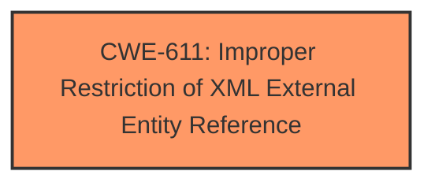

# Analysis for CVE-2024-28982

# Summary
| CWE ID | CWE Name | Confidence | CWE Abstraction Level | CWE Vulnerability Mapping Label | CWE-Vulnerability Mapping Notes |
|---|---|---|---|---|---|
| CWE-611 | Improper Restriction of XML External Entity Reference | 1.0 | Base | Primary | Allowed |

## Evidence and Confidence

*   **Confidence Score:** 1.0
*   **Evidence Strength:** HIGH

## Relationship Analysis
The primary CWE identified is CWE-611, which is a Base level CWE. No parent or child relationships influenced this decision, as CWE-611 directly reflects the **XXE** vulnerability described. The relationship analysis confirms that selecting a Base level CWE is appropriate when the evidence directly supports it.

## Vulnerability Chain
The vulnerability chain starts with the **improper restriction of XML external entity references**, leading directly to the **XXE** vulnerability.

## Summary of Analysis
The vulnerability description explicitly states that the Hitachi Vantara Pentaho Business Analytics Server does **not correctly protect the ACL service endpoint against XML External Entity Reference**. This directly aligns with CWE-611 (Improper Restriction of XML External Entity Reference). The retriever results also strongly suggest CWE-611 as the primary candidate, with a score of 1.0.

Relevant CWE Information:

# Enhanced Context (25 CWEs)
The following CWEs were identified as potentially relevant to this vulnerability:

## CWE-611: Improper Restriction of XML External Entity Reference
**Abstraction Level**: Base
**Similarity Score**: 0.76
**Source**: dense

**Description**:
The product processes an XML document that can contain XML entities with URIs that resolve to documents outside of the intended sphere of control, causing the product to embed incorrect documents into its output.

**Mapping Guidance**:
- Usage: Allowed
- Rationale: This CWE entry is at the Base level of abstraction, which is a preferred level of abstraction for mapping to the root causes of vulnerabilities.

The vulnerability description matches the CWE-611 description perfectly. The **rootcause** is the **failure to properly protect against XML External Entity Reference**, leading to the **XXE** vulnerability. This is a direct match, and the mapping guidance allows for the use of this Base level CWE.