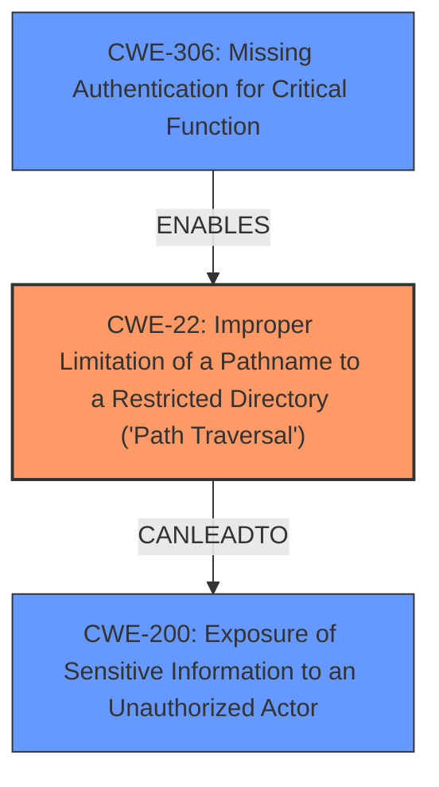

# Analysis Report for CVE-2024-28992

# Vulnerability Analysis Report: CVE-2024-28992

## Description

The SolarWinds Access Rights Manager was susceptible to a Directory Traversal and **Information Disclosure Vulnerability**. This vulnerability allows an unauthenticated user to perform arbitrary file deletion and leak sensitive information.

## Vulnerability Description Key Phrases

- **Weakness:** ['Information Disclosure Vulnerability', 'directory traversal']
- **Impact:** ["['arbitrary file deletion'", "'information disclosure']"]
- **Attacker:** unauthenticated user
- **Product:** SolarWinds Access Rights Manager

## Analysis (with Relationship Data)

# Summary
| CWE ID | CWE Name | Confidence | CWE Abstraction Level | CWE Vulnerability Mapping Label | CWE-Vulnerability Mapping Notes |
|---|---|---|---|---|---|
| CWE-22 | Improper Limitation of a Pathname to a Restricted Directory ('Path Traversal') | 0.9 | Base | Primary | Allowed |
| CWE-200 | Exposure of Sensitive Information to an Unauthorized Actor | 0.8 | Base | Secondary | Allowed |
| CWE-306 | Missing Authentication for Critical Function | 0.7 | Base | Secondary | Allowed |

## Evidence and Confidence

*   **Confidence Score:** 0.8
*   **Evidence Strength:** MEDIUM

## Relationship Analysis
The primary weakness is **CWE-22** which describes the **improper limitation of a pathname to a restricted directory**. This allows for **directory traversal**, a weakness explicitly mentioned in the vulnerability description. **CWE-200** (Exposure of Sensitive Information) arises as a direct result of the successful **directory traversal**, while **CWE-306** (Missing Authentication for Critical Function) highlights the lack of authentication that enables unauthenticated users to exploit the **directory traversal** vulnerability. The relationships show that **CWE-22** can lead to **CWE-200**, and the absence of authentication (**CWE-306**) facilitates the exploitation of **CWE-22**.



## Vulnerability Chain
The vulnerability chain starts with **CWE-306**, the **missing authentication**, which allows an unauthenticated user to exploit **CWE-22**, the **directory traversal** vulnerability, ultimately leading to **CWE-200**, the **exposure of sensitive information** and **arbitrary file deletion**.

## Summary of Analysis
The analysis is based on the vulnerability description that explicitly mentions **directory traversal** and **information disclosure**. The keyphrase-specific analysis also supports the selection of **CWE-22** as the primary weakness due to the mention of **directory traversal**. The unauthenticated nature of the exploit points towards **CWE-306** as a contributing factor.

The relationships between the CWEs, as visualized in the graph, confirm that the **missing authentication** allows exploitation of the **directory traversal** vulnerability, which then leads to **information disclosure**.

**CWE-22** is chosen because the vulnerability description clearly states a directory traversal issue. **CWE-200** is selected as a consequence of the **directory traversal** enabling **information disclosure**. **CWE-306** highlights that this is possible due to the lack of authentication. These CWEs are at the optimal level of specificity, providing a clear and accurate representation of the vulnerability.

The primary **weakness** is the **directory traversal**, which is best represented by **CWE-22**. The resulting impact is **information disclosure**, which maps to **CWE-200**. The vulnerability is exploitable by an **unauthenticated user**, indicating a **missing authentication** issue, which maps to **CWE-306**.

Other CWEs Considered:

*   **CWE-23 (Relative Path Traversal)**, **CWE-24 (Path Traversal: '../filedir')**, **CWE-25 (Path Traversal: '/../filedir')**, **CWE-29 (Path Traversal: '\..\filename')**, **CWE-36 (Absolute Path Traversal)** and **CWE-41 (Improper Resolution of Path Equivalence)** were considered as more specific types of path traversal, but the provided description is not detailed enough to confirm which specific type is used. Thus, the more general **CWE-22** is more appropriate.
*   **CWE-434 (Unrestricted Upload of File with Dangerous Type)**: This was considered, but the vulnerability description doesn't mention file uploads.
*   **CWE-862 (Missing Authorization)**: While related to access control, **CWE-306** is more specific because it directly addresses the **missing authentication**, which is the root cause in this case.


## CWE Relationship Analysis

Current CWEs represent these abstraction levels: .


### Vulnerability Chain Analysis

**Chain starting from CWE-862:**
- 862 (Missing Authorization) - ROOT


**Chain starting from CWE-22:**
- 22 (Improper Limitation of a Pathname to a Restricted Directory ('Path Traversal')) - ROOT


### CWE Relationship Diagram

```mermaid
graph TD
    classDef primary fill:#f96,stroke:#333,stroke-width:2px
    classDef secondary fill:#69f,stroke:#333
    classDef tertiary fill:#9e9,stroke:#333
```


*Report generated on 2025-07-13 06:57:41*
