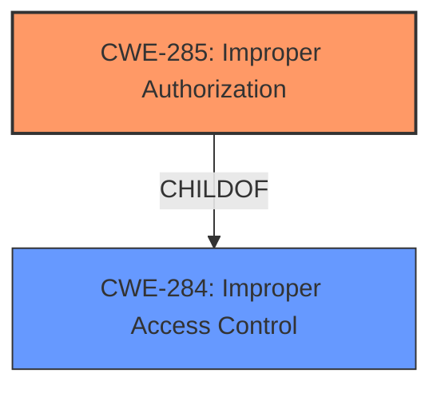

# Analysis for CVE-2024-29085

# Summary
| CWE ID | CWE Name | Confidence | CWE Abstraction Level | CWE Vulnerability Mapping Label | CWE-Vulnerability Mapping Notes |
|---|---|---|---|---|---|
| CWE-285 | Improper Authorization | 0.9 | Class | Allowed-with-Review | Primary CWE |
| CWE-284 | Improper Access Control | 0.7 | Pillar | Discouraged | Secondary Candidate |

## Evidence and Confidence

*   **Confidence Score:** 0.8
*   **Evidence Strength:** HIGH

## Relationship Analysis
The primary relationship impacting the decision is the parent-child relationship between CWE-284 (Improper Access Control) and CWE-285 (Improper Authorization). CWE-285 is a more specific Class-level CWE that falls under the broader Pillar-level CWE-284. The vulnerability description clearly indicates an authorization issue, suggesting CWE-285 is the more appropriate choice.
The Access Control Guidance directs the analyst to select the most specific CWE that applies.

## Vulnerability Chain
The vulnerability chain starts with **improper access control**, leading to the impact of privilege escalation.

Improper Access Control (Root Cause) -> Privilege Escalation (Impact)

## Summary of Analysis
The initial assessment identified **improper access control** as the root cause, aligning with CWE-284 (Improper Access Control). However, further analysis revealed that the issue specifically involves an authorization flaw, making CWE-285 (Improper Authorization) a more accurate classification. The guidance and the high-level description of the vulnerability points to an authorization problem, not a general access control issue. The access control guidance states that the analyst should select the most specific CWE ID if one applies.

Relevant CWE Information:
*   **CWE-285: Improper Authorization:** The product does not perform or incorrectly performs an authorization check when an actor attempts to access a resource or perform an action.
*   **CWE-284: Improper Access Control:** The product does not restrict or incorrectly restricts access to a resource from an unauthorized actor.

I am overriding the retriever results to select CWE-285, because the retriever results only provide a similarity score, but the content matching from the CWE specifications and the vulnerability description are a better match.

CWEs considered but not used:
* CWE-284: Improper Access Control - This is a high-level category, and CWE-285 provides a more specific classification.
* CWE-863: Incorrect Authorization - This CWE describes the product performs an authorization check, but it does not correctly perform the check, but this is not explicitly stated in the Vulnerability Description.
* CWE-306: Missing Authentication for Critical Function - This CWE relates to missing authentication, but the vulnerability description specifies that the attacker is an authenticated user.
* CWE-862: Missing Authorization - This CWE describes the product does not perform authorization, but this is not explicitly stated in the Vulnerability Description.
* CWE-266: Incorrect Privilege Assignment - This CWE describes the product incorrectly assigns a privilege to a particular actor, which is not explicitly stated in the Vulnerability Description.
* CWE-250: Execution with Unnecessary Privileges - This CWE describes the product executes with unnecessary privileges, which is not explicitly stated in the Vulnerability Description.