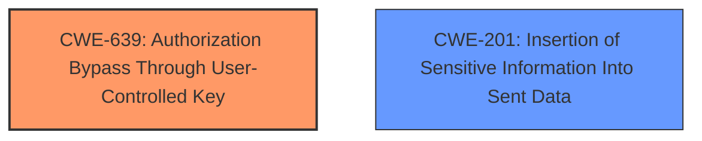

# Analysis Report for CVE-2024-29120

# Vulnerability Analysis Report: CVE-2024-29120

## Description

In Streampark (version < 2.1.4), when a user logged in successfully, the Backend service would return Authorization as the front-end authentication credential. User can use this credential to request other users information, including the administrators username, password, salt value, etc. Mitigation all users should upgrade to 2.1.4

## Vulnerability Description Key Phrases

- **Rootcause:** improper authentication
- **Impact:** information disclosure
- **Attacker:** authenticated user
- **Product:** Streampark
- **Version:** < 2.1.4
- **Component:** Backend service

## Analysis (with Relationship Data)

# Summary
| CWE ID | CWE Name | Confidence | CWE Abstraction Level | CWE Vulnerability Mapping Label | CWE-Vulnerability Mapping Notes |
|---|---|---|---|---|---|
| CWE-639 | Authorization Bypass Through User-Controlled Key | 0.8 | Base | Allowed | Primary CWE |
| CWE-201 | Insertion of Sensitive Information Into Sent Data | 0.6 | Base | Allowed | Secondary Candidate |

## Evidence and Confidence

*   **Confidence Score:** 0.7
*   **Evidence Strength:** HIGH

## Relationship Analysis
The primary CWE selected is CWE-639, which is at the Base level. CWE-201 is a peer and was considered as a secondary issue for inserting the credentials. The selection was guided by the principle of identifying the root cause of the vulnerability, focusing on the authorization bypass through user-controlled keys.



## Vulnerability Chain
The vulnerability chain starts with the **improper authentication** where the "Authorization" header is returned as the authentication credential. This leads to **authorization bypass** as the user can use this credential to request other users' information (CWE-639). Finally, the sensitive information is disclosed (CWE-201).

## Summary of Analysis
The initial analysis considered several CWEs related to authentication and authorization. However, the key aspect of this vulnerability is that the existing authentication mechanism, while present, **incorrectly** authorizes the user. The system's authorization functionality does not prevent one user from gaining access to another user's data by using the same key value, which fits CWE-639 perfectly. The **rootcause** is that after a successful login, the Apache StreamPark backend service returns the "Authorization" header as the authentication credential to the frontend. This credential is not scoped to the logged-in user and can be used to access other users' information. The evidence is from "**CVE Reference Links Content Summary**". The "Vulnerability Description Key Phrases" also calls out "**improper authentication**".

The selection is based on the provided evidence and the guidance on authentication vs. authorization. The chosen CWE is at the optimal level of specificity (Base) and accurately reflects the vulnerability.

Relevant CWE Information:

# Enhanced Context (25 CWEs)
The following CWEs were identified as potentially relevant to this vulnerability:

## CWE-639: Authorization Bypass Through User-Controlled Key
**Abstraction Level**: Base
**Similarity Score**: 0.74
**Source**: dense

**Description**:
The system's authorization functionality does not prevent one user from gaining access to another user's data or record by modifying the key value identifying the data.

**Mapping Guidance**:
- Usage: Allowed
- Rationale: This CWE entry is at the Base level of abstraction, which is a preferred level of abstraction for mapping to the root causes of vulnerabilities.

## CWE-201: Insertion of Sensitive Information Into Sent Data
**Abstraction Level**: base
**Similarity Score**: 4.33
**Source**: graph

**Description**:
CWE-201: Insertion of Sensitive Information Into Sent Data

**Mapping Guidance**:
- Usage: Allowed
- Rationale: This CWE entry is at the Base level of abstraction, which is a preferred level of abstraction for mapping to the root causes of vulnerabilities.

**Relationships**:
- PARENTOF -> CWE-598
- CANFOLLOW -> CWE-226
- CANFOLLOW -> CWE-212
- CANALSOBE -> CWE-202
- CANALSOBE -> CWE-209

## CWE-639: Authorization Bypass Through User-Controlled Key
**Abstraction Level**: Base
**Similarity Score**: 1715.26
**Source**: sparse

**Description**:
The system's authorization functionality does not prevent one user from gaining access to another user's data or record by modifying the key value identifying the data.

**Mapping Guidance**:
- Usage: Allowed
- Rationale: This CWE entry is at the Base level of abstraction, which is a preferred level of abstraction for mapping to the root causes of vulnerabilities.

## CWE-863: Incorrect Authorization
**Abstraction Level**: Class
**Similarity Score**: 1701.47
**Source**: sparse

**Description**:
The product performs an authorization check when an actor attempts to access a resource or perform an action, but it does not correctly perform the check.

**Mapping Guidance**:
- Usage: Allowed-with-Review
- Rationale: This CWE entry is a Class and might have Base-level children that would be more appropriate

## CWE-287: Improper Authentication
**Abstraction Level**: Class
**Similarity Score**: 1668.30
**Source**: sparse

**Description**:
The product does not perform or incorrectly performs an authorization check when an actor attempts to access a resource or perform an action.

**Mapping Guidance**:
- Usage: Discouraged
- Rationale: CWE-285 is high-level and lower-level CWEs can frequently be used instead. It is a level-1 Class (i.e., a child of a Pillar).

## CWE-306: Missing Authentication for Critical Function
**Abstraction Level**: base
**Similarity Score**: 2.47
**Source**: graph

**Description**:
CWE-306: Missing Authentication for Critical Function

**Mapping Guidance**:
- Usage: Allowed
- Rationale: This CWE entry is at the Base level of abstraction, which is a preferred level of abstraction for mapping to the root causes of vulnerabilities.

---

**CWE-639: Authorization Bypass Through User-Controlled Key**

*   **Technical Explanation:** The vulnerability allows an authenticated user to access other users' information due to the **incorrect** handling of the "Authorization" header. The system fails to validate if the authenticated user is authorized to access the requested data, leading to an authorization bypass.
*   **Security Implications:** Unauthorized access to sensitive information, including usernames, passwords, and salt values, leading to potential privilege escalation and full control over the application.
*   **Relationships:** This CWE is at the Base level, providing a specific description of the authorization bypass.
*   **Primary/Secondary:** Primary. This is the root cause of the vulnerability.
*   **Mapping Guidance:** The MITRE mapping guidance allows the use of this CWE as it is at the Base level.
*   **Confidence:** 0.8

**CWE-201: Insertion of Sensitive Information Into Sent Data**

*   **Technical Explanation:** The vulnerability involves the inclusion of sensitive information (usernames, passwords, salt values) in the response, which can be intercepted and used by attackers.
*   **Security Implications:** Potential for credential theft, privilege escalation, and unauthorized access to sensitive data.
*   **Relationships:** At the Base level.
*   **Primary/Secondary:** Secondary. This is a consequence of the authorization bypass.
*   **Mapping Guidance:** The MITRE mapping guidance allows the use of this CWE as it is at the Base level.
*   **Confidence:** 0.6

**CWEs Considered But Not Used:**

*   **CWE-863 Incorrect Authorization:** While related, CWE-639 is more specific as it highlights the user-controlled key aspect of the bypass.
*   **CWE-287 Improper Authentication:** This is a Class-level CWE and not as specific as CWE-639. The vulnerability isn't about a complete lack of authentication but an **improper** authorization after successful authentication.
*   **CWE-306 Missing Authentication for Critical Function:** This CWE is about a complete lack of authentication, which is not the case here. Authentication does exist, but authorization is bypassed.
*   **CWE-798 Use of Hard-coded Credentials:** This is not about hardcoded credentials, but the **improper** handling of authentication and authorization.
*   **CWE-259 Use of Hard-coded Password:** Similar to CWE-798, this doesn't apply as the issue isn't about using hardcoded passwords.
*   **CWE-532 Insertion of Sensitive Information into Log File:** The sensitive information is being returned to the user, not inserted into a log file.
*   **CWE-1390 Weak Authentication:** This is a general class and not as precise as CWE-639. This is an authorization problem.
*   **CWE-256 Plaintext Storage of a Password:** The passwords are not stored in plaintext.
*   **CWE-321 Use of Hard-coded Cryptographic Key:** Not applicable as there's no hard-coded cryptographic key involved.


## CWE Relationship Analysis

Current CWEs represent these abstraction levels: .


### Vulnerability Chain Analysis

**Chain starting from CWE-1390:**
- 1390 (Weak Authentication) - ROOT


**Chain starting from CWE-863:**
- 863 (Incorrect Authorization) - ROOT


### CWE Relationship Diagram

```mermaid
graph TD
    classDef primary fill:#f96,stroke:#333,stroke-width:2px
    classDef secondary fill:#69f,stroke:#333
    classDef tertiary fill:#9e9,stroke:#333
```


*Report generated on 2025-07-13 06:59:32*
