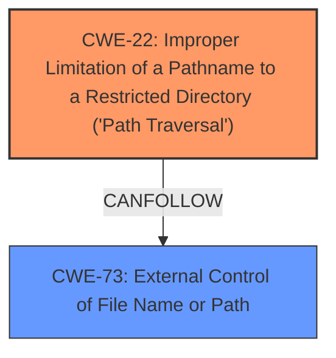

# Analysis Report for CVE-2024-29511

# Vulnerability Analysis Report: CVE-2024-29511

## Description

Artifex Ghostscript before 10.03.1, when Tesseract is used for OCR, has a **directory traversal** issue that allows arbitrary file reading (and writing of error messages to arbitrary files) via OCRLanguage. For example, exploitation can use debug_file /tmp/out and user_patterns_file /etc/passwd.

## Vulnerability Description Key Phrases

- **Weakness:** directory traversal
- **Impact:** arbitrary file reading and writing
- **Vector:** OCR input
- **Product:** Artifex Ghostscript
- **Version:** before 10.03.1

## Analysis (with Relationship Data)

# Summary
| CWE ID | CWE Name | Confidence | CWE Abstraction Level | CWE Vulnerability Mapping Label | CWE-Vulnerability Mapping Notes |
|---|---|---|---|---|---|
| CWE-22 | Improper Limitation of a Pathname to a Restricted Directory ('Path Traversal') | 1.0 | Base | Allowed | Primary CWE |
| CWE-73 | External Control of File Name or Path | 0.7 | Base | Allowed | Secondary Candidate |

## Evidence and Confidence

*   **Confidence Score:** 0.9
*   **Evidence Strength:** HIGH

## Relationship Analysis
The primary relationship that impacts the CWE selection is the parent-child relationship between CWE-119 (Improper Restriction of Operations within the Bounds of a Memory Buffer) and CWE-22. While CWE-73 (External Control of File Name or Path) is related, CWE-22 is a more specific instance of a path traversal vulnerability, making it a better fit. CWE-22 is a base level CWE, which is the preferred level of abstraction.



## Vulnerability Chain
The vulnerability chain starts with the **improper handling of the OCRLanguage parameter**, leading to **directory traversal** (CWE-22), which allows an attacker to control the files used by Tesseract. This then allows for arbitrary file read and write.

## Summary of Analysis
The analysis is based on the provided evidence, specifically the vulnerability description key phrases highlighting "**directory traversal**" and the CVE Reference Links Content Summary detailing the **root cause** related to the `OCRLanguage` parameter. The retriever results also strongly suggest CWE-22 as the primary candidate.

CWE-22 is chosen because it directly addresses the **path traversal** issue stemming from the **improper limitation of a pathname to a restricted directory**. This is the **root cause** of the vulnerability, enabling the subsequent arbitrary file operations.

CWE-73 is considered as a secondary candidate since the user input (`OCRLanguage` parameter) influences the file path. However, CWE-22 is a more precise description of the core vulnerability, which is the **failure to properly restrict the pathname**.

Relevant CWE Information:

# Enhanced Context (25 CWEs)
The following CWEs were identified as potentially relevant to this vulnerability:

## Vulnerability Description
Artifex Ghostscript before 10.03.1, when Tesseract is used for OCR, has a **directory traversal** issue that allows arbitrary file reading (and writing of error messages to arbitrary files) via OCRLanguage. For example, exploitation can use debug_file /tmp/out and user_patterns_file /etc/passwd.

### Vulnerability Description Key Phrases
- **weakness:** **directory traversal**
- **impact:** arbitrary file reading and writing
- **vector:** OCR input
- **product:** Artifex Ghostscript
- **version:** before 10.03.1

## CVE Reference Links Content Summary
Based on the provided information, here's a breakdown of CVE-2024-29511:

**Root Cause:**

The vulnerability stems from the way Ghostscript's `ocr` device interacts with Tesseract, an OCR engine. The `OCRLanguage` parameter, used to specify the language for OCR, allows for path traversal. By using a path like `../../../../../tmp/test`, an attacker can force Tesseract to load a language data file from an arbitrary location, such as `/tmp/test.traineddata`, instead of the expected location within the Ghostscript installation. Tesseract `traineddata` files can contain configuration values, `user_patterns_file` and `debug_file` parameters that are used to load a pattern file and write debug information to a given path respectively. An attacker can create a custom traineddata file with these parameters to perform arbitrary file read and write.

**Weaknesses/Vulnerabilities Present:**

1.  **Path Traversal:** The `OCRLanguage` parameter in Ghostscript's `ocr` device does not properly sanitize or validate the provided path, allowing for directory traversal to access arbitrary files.
2.  **Unvalidated Tesseract Configuration:** Tesseract's configuration files (`traineddata`) include parameters that allow for loading of external files and outputting debug information to arbitrary file paths.
3.  **Lack of Input Validation/Sanitization**: The combination of these allows an attacker to effectively control which files Tesseract will use and output, leading to arbitrary file read and write.

**Impact of Exploitation:**

An attacker can achieve arbitrary file read and write capabilities:
*   **Arbitrary File Read:** By crafting a malicious Tesseract `traineddata` file that specifies a `user_patterns_file`, the attacker can force Tesseract to attempt to load patterns from an arbitrary file (e.g., `/etc/passwd`). The verbose debug output will then contain the contents of that file prefixed by "Error: failed to insert pattern".
*   **Arbitrary File Write:** By crafting a malicious `traineddata` file that specifies a `debug_file`, the attacker can write debug output, which includes contents of the pattern file, to any location the Ghostscript process has write access to.

**Attack Vectors:**

*   The attacker crafts a malicious Tesseract `traineddata` file.
*   The attacker then crafts a PostScript file using the `ocr` device, specifying `OCRLanguage` with a path traversal to the location of the malicious `traineddata` file.
*   When Ghostscript processes the PostScript file, it uses the path-traversal-modified `OCRLanguage` parameter to load the malicious `traineddata` file.
*   Tesseract, based on configuration in the malicious traineddata file, loads and processes the attacker specified `user_patterns_file` and outputs its contents to the attacker specified `debug_file`.

**Required Attacker Capabilities/Position:**

*   The attacker needs the ability to provide a PostScript file that will be processed by Ghostscript with Tesseract support enabled.
*   The attacker needs to have write access to a location where they can store the malicious `traineddata` file (e.g., `/tmp`).
*   The attacker needs to be able to specify a path with path traversal through the `OCRLanguage` parameter in the PostScript file to force the use of the malicious Tesseract config.
*   The attacker needs to have read access to the Ghostscript output file to extract data that was read by the Tesseract library.
*   Ghostscript must be compiled with Tesseract support.

**Additional Notes**

*   The vulnerability does not lead to Remote Code Execution (RCE) directly, as stated in the changelog, despite being initially stated as a possible RCE vector.
*   The vulnerability is a partial SAFER sandbox bypass, as it allows for file system access that is normally restricted.
*   The fix for this vulnerability was included in Ghostscript version 10.03.0.


## CWE Relationship Analysis

Current CWEs represent these abstraction levels: .


### Vulnerability Chain Analysis

**Chain starting from CWE-119:**
- 119 (Improper Restriction of Operations within the Bounds of a Memory Buffer) - ROOT


**Chain starting from CWE-73:**
- 73 (External Control of File Name or Path) - ROOT


### CWE Relationship Diagram

```mermaid
graph TD
    classDef primary fill:#f96,stroke:#333,stroke-width:2px
    classDef secondary fill:#69f,stroke:#333
    classDef tertiary fill:#9e9,stroke:#333
```


*Report generated on 2025-07-13 07:02:18*
