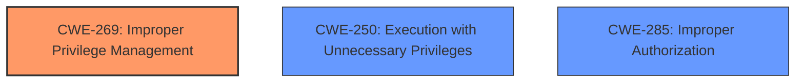

# Enhanced Analysis for CVE-2024-29975

# Summary
| CWE ID | CWE Name | Confidence | CWE Abstraction Level | CWE Vulnerability Mapping Label | CWE-Vulnerability Mapping Notes |
|---|---|---|---|---|---|
| CWE-269 | Improper Privilege Management | 0.8 | Class | Primary | Allowed-with-Review |
| CWE-250 | Execution with Unnecessary Privileges | 0.6 | Base | Secondary | Allowed |
| CWE-285 | Improper Authorization | 0.5 | Class | Secondary | Discouraged |

## Evidence and Confidence

*   **Confidence Score:** 0.8
*   **Evidence Strength:** HIGH

## Relationship Analysis

The primary relationship that influenced the decision was the hierarchical relationship between Class and Base level CWEs. While CWE-269 is a Class-level CWE, it directly addresses the **improper privilege management** described in the vulnerability. CWE-250 was considered as a Base-level CWE, because the SUID executable may have been running with more privileges than it needed, however there isn't enough evidence to support that. CWE-285 was also considered because authorization checks may have been missing or flawed but there isn't enough evidence to determine this.



## Vulnerability Chain

The vulnerability chain starts with **improper privilege management** in the SUID executable binary, leading to the ability for an authenticated local attacker with administrator privileges to execute system commands as the root user.

## Summary of Analysis

The initial analysis focused on identifying the root cause of the vulnerability, which was determined to be **improper privilege management**. This is supported by the vulnerability description, which explicitly states that the vulnerability is due to **improper privilege management** in the SUID executable binary. The CVE Reference Links Content Summary further reinforces this by stating that the core issue is that a SUID executable binary does not correctly restrict the privileges of the user executing the command.

The selection of CWE-269 is based on the direct match with the vulnerability description and the supporting evidence from the CVE Reference Links Content Summary. While CWE-269 is a Class-level CWE and the guidance suggests preferring Base-level CWEs, it is the most accurate representation of the weakness in this case.

The final decision is based on the available evidence and the understanding of CWE relationships. CWE-269 is selected as the primary CWE because it directly addresses the **improper privilege management** vulnerability. CWE-250 is considered as a secondary CWE since the SUID may have more privileges than required. CWE-285 is also considered as a secondary CWE since the authorization checks may be missing or flawed.

Relevant CWE Information:

# Enhanced Context (25 CWEs)
The following CWEs were identified as potentially relevant to this vulnerability:

## CWE-269: Improper Privilege Management
**Abstraction Level**: Class
**Similarity Score**: 0.75
**Source**: dense

**Description**:
The product does not properly assign, modify, track, or check privileges for an actor, creating an unintended sphere of control for that actor.

**Mapping Guidance**:
- Usage: Discouraged
- Rationale: CWE-269 is commonly misused. It can be conflated with "privilege escalation," which is a technical impact that is listed in many low-information vulnerability reports [REF-1287]. It is not useful for trend analysis.

**My Analysis:** This CWE is a good fit as the vulnerability lies in the **improper privilege management**. The description and key phrases mention this explicitly.

## CWE-269: Improper Privilege Management
**Abstraction Level**: Class
**Similarity Score**: 2215.83
**Source**: sparse

**Description**:
The product does not properly assign, modify, track, or check privileges for an actor, creating an unintended sphere of control for that actor.

**Mapping Guidance**:
- Usage: Discouraged
- Rationale: CWE-269 is commonly misused. It can be conflated with "privilege escalation," which is a technical impact that is listed in many low-information vulnerability reports [REF-1287]. It is not useful for trend analysis.

**My Analysis:** This CWE is a good fit as the vulnerability lies in the **improper privilege management**. The description and key phrases mention this explicitly.

## CWE-250: Execution with Unnecessary Privileges
**Abstraction Level**: Base
**Similarity Score**: 0.75
**Source**: dense

**Description**:
The product performs an operation at a privilege level that is higher than the minimum level required, which creates new weaknesses or amplifies the consequences of other weaknesses.

**Mapping Guidance**:
- Usage: Allowed
- Rationale: This CWE entry is at the Base level of abstraction, which is a preferred level of abstraction for mapping to the root causes of vulnerabilities.

**My Analysis:** The SUID binary running with root privileges when it might not require them aligns with this CWE.

## CWE-285: Improper Authorization
**Abstraction Level**: Class
**Similarity Score**: 2063.85
**Source**: sparse

**Description**:
The product does not perform or incorrectly performs an authorization check when an actor attempts to access a resource or perform an action.

**Mapping Guidance**:
- Usage: Discouraged
- Rationale: CWE-285 is high-level and lower-level CWEs can frequently be used instead. It is a level-1 Class (i.e., a child of a Pillar).

**My Analysis:** This CWE may be applicable if the SUID program lacks proper checks.

The other CWEs were considered but are not as directly relevant to the root cause.


## CWE Relationship Analysis

Current CWEs represent these abstraction levels: .


### Vulnerability Chain Analysis

**Chain starting from CWE-269:**
- 269 (Improper Privilege Management) - ROOT


**Chain starting from CWE-285:**
- 285 (Improper Authorization) - ROOT


### CWE Relationship Diagram

```mermaid
graph TD
    classDef primary fill:#f96,stroke:#333,stroke-width:2px
    classDef secondary fill:#69f,stroke:#333
    classDef tertiary fill:#9e9,stroke:#333
```