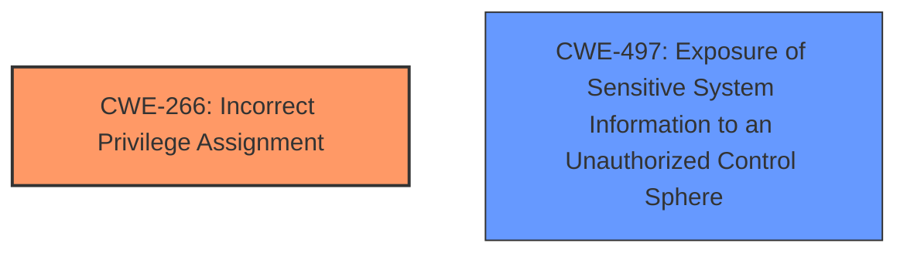

# Enhanced Analysis for CVE-2024-29976

# Summary

| CWE ID    | CWE Name                                                                                                                                | Confidence | CWE Abstraction Level | CWE Vulnerability Mapping Label | CWE-Vulnerability Mapping Notes |
| --------- | --------------------------------------------------------------------------------------------------------------------------------------- | ---------- | ----------------------- | ------------------------------- | ----------------------------- |
| CWE-266   | Incorrect Privilege Assignment                                                                                                        | 0.9        | Base                    | Primary CWE                   | Allowed                       |
| CWE-497 | Exposure of Sensitive System Information to an Unauthorized Control Sphere | 0.7        | Base                    | Secondary CWE                   | Allowed                       |

## Evidence and Confidence

*   **Confidence Score:** 0.8
*   **Evidence Strength:** HIGH

## Relationship Analysis

The primary relationship impacting the decision is the parent-child relationship where CWE-266 Incorrect Privilege Assignment is a base CWE. The guidance provided specifically calls out CWE-266 as a good fit for misconfigured roles. The other identified issue is **exposure of sensitive information** which is covered by CWE-497.



## Vulnerability Chain

The vulnerability chain starts with **improper privilege management**, which leads to an attacker gaining access to administrator session information. This session information contains cookies, allowing the attacker to potentially impersonate an administrator and compromise the device.

## Summary of Analysis

The initial assessment based on the provided evidence indicates that the **root cause** of the vulnerability is **improper privilege management**. The "Vulnerability Description Key Phrases" section identifies "**improper privilege management**" as the root cause. The "CVE Reference Links Content Summary" section further supports this by stating, "**Root Cause of Vulnerability:** - Improper privilege management in the `/cmd,/ck6fup6/system_main/show_allsessions` command."

The CWE guidance directs us to consider CWE-266, CWE-250, CWE-284, and CWE-285 for privilege-related issues. Given the vulnerability description, the system assigns incorrect privileges to a user and also exposes sensitive session information.

CWE-266 (Incorrect Privilege Assignment) is the most appropriate primary CWE because the **improper privilege management** allows an authenticated attacker to obtain administrator session information. The guidance provided specifically calls out CWE-266 as a good fit for misconfigured roles. The other identified issue is **exposure of sensitive information** which is covered by CWE-497.

Relevant CWE Information:

# Enhanced Context (25 CWEs)
The following CWEs were identified as potentially relevant to this vulnerability:

## CWE-266: Incorrect Privilege Assignment
**Abstraction Level**: Base
**Similarity Score**: 0.80
**Source**: dense

**Description**:
A product incorrectly assigns a privilege to a particular actor, creating an unintended sphere of control for that actor.

**Mapping Guidance**:
- Usage: Allowed
- Rationale: This CWE entry is at the Base level of abstraction, which is a preferred level of abstraction for mapping to the root causes of vulnerabilities.

**CWE-497: Exposure of Sensitive System Information to an Unauthorized Control Sphere**
**Abstraction Level**: Base
**Similarity Score**: 0.77
**Source**: dense

**Description**:
The product does not properly prevent sensitive system-level information from being accessed by unauthorized actors who do not have the same level of access to the underlying system as the product does.

**Mapping Guidance**:
- Usage: Allowed
- Rationale: This CWE entry is at the Base level of abstraction, which is a preferred level of abstraction for mapping to the root causes of vulnerabilities.

# Complete CWE Specifications

CWE-266: Incorrect Privilege Assignment

CWE-497: Exposure of Sensitive System Information to an Unauthorized Control Sphere


## CWE Relationship Analysis

Current CWEs represent these abstraction levels: .


### Vulnerability Chain Analysis

**Chain starting from CWE-285:**
- 285 (Improper Authorization) - ROOT


**Chain starting from CWE-250:**
- 250 (Execution with Unnecessary Privileges) - ROOT


### CWE Relationship Diagram

```mermaid
graph TD
    classDef primary fill:#f96,stroke:#333,stroke-width:2px
    classDef secondary fill:#69f,stroke:#333
    classDef tertiary fill:#9e9,stroke:#333
```