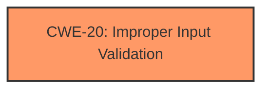

# Analysis Report for CVE-2024-30078

# Vulnerability Analysis Report: CVE-2024-30078

## Description

Windows Wi-Fi Driver Remote Code Execution Vulnerability

## Vulnerability Description Key Phrases

- **Impact:** Remote Code Execution
- **Product:** Windows
- **Component:** Wi-Fi Driver

## Analysis (with Relationship Data)

# Summary
| CWE ID | CWE Name | Confidence | CWE Abstraction Level | CWE Vulnerability Mapping Label | CWE-Vulnerability Mapping Notes |
|---|---|---|---|---|---|
| CWE-20 ([CWE-20: Improper Input Validation](https://cwe.mitre.org/data/definitions/20.html)) | Improper Input Validation | 0.4 | Class | Allowed-with-Review | Primary CWE |

## Evidence and Confidence

*   **Confidence Score:** 0.4
*   **Evidence Strength:** LOW

## Relationship Analysis
The primary relationship to consider is that CWE-20 ([CWE-20: Improper Input Validation](https://cwe.mitre.org/data/definitions/20.html)) is a class-level CWE. It is a parent of many more specific CWEs that could potentially apply if more information were available. Without more information, I am choosing the higher level CWE.



## Vulnerability Chain
The chain of root cause and weaknesses for this vulnerability is not entirely clear due to limited information. The identified weakness is **improper input validation**, which leads to the **impact** of Remote Code Execution.

## Summary of Analysis
The analysis is heavily based on the limited information available in the provided vulnerability description. The description indicates a Remote Code Execution vulnerability in the Windows Wi-Fi Driver. The key weakness phrase is not present, and the CVE reference links content summary is not relevant.

Given the lack of specific details about the root cause, the most suitable CWE is CWE-20 ([CWE-20: Improper Input Validation](https://cwe.mitre.org/data/definitions/20.html)). This is a general class of weaknesses that covers scenarios where the product receives input but does not validate or incorrectly validates that the input has the properties required to process the data safely and correctly.

While the Retriever Results suggest more specific CWEs like CWE-1285 ([CWE-1285: Improper Validation of Specified Index, Position, or Offset in Input](https://cwe.mitre.org/data/definitions/1285.html)), CWE-1173 ([CWE-1173: Improper Use of Validation Framework](https://cwe.mitre.org/data/definitions/1173.html)), and CWE-1288 ([CWE-1288: Improper Validation of Consistency within Input](https://cwe.mitre.org/data/definitions/1288.html)), there isn't enough evidence to confirm these more specific classifications. Therefore, I opt for the broader CWE-20 ([CWE-20: Improper Input Validation](https://cwe.mitre.org/data/definitions/20.html)).

CWE-20 ([CWE-20: Improper Input Validation](https://cwe.mitre.org/data/definitions/20.html)) is at the Class level of abstraction, and the mapping guidance discourages its use when lower-level CWEs could be used instead, or when more details about the vulnerability are available. However, in this case, the limited information justifies using this higher-level CWE.

Other CWEs Considered:

*   CWE-1285 ([CWE-1285: Improper Validation of Specified Index, Position, or Offset in Input](https://cwe.mitre.org/data/definitions/1285.html)), CWE-1173 ([CWE-1173: Improper Use of Validation Framework](https://cwe.mitre.org/data/definitions/1173.html)), and CWE-1288 ([CWE-1288: Improper Validation of Consistency within Input](https://cwe.mitre.org/data/definitions/1288.html)): These are more specific input validation issues, but there's no evidence to suggest these specific types of validation errors.
*   CWE-78 ([CWE-78: Improper Neutralization of Special Elements used in an OS Command ('OS Command Injection')](https://cwe.mitre.org/data/definitions/78.html)): This is related to OS Command Injection, but there is no evidence that this vulnerability involves command injection.
*   CWE-781 ([CWE-781: Improper Address Validation in IOCTL with METHOD_NEITHER I/O Control Code](https://cwe.mitre.org/data/definitions/781.html)): This is a variant related to address validation in IOCTLs, but there is no evidence to suggest this vulnerability involves IOCTLs.


## CWE Relationship Analysis

Current CWEs represent these abstraction levels: .


### Vulnerability Chain Analysis

**Chain starting from CWE-1173:**
- 1173 (Improper Use of Validation Framework) - ROOT


**Chain starting from CWE-1288:**
- 1288 (Improper Validation of Consistency within Input) - ROOT


### CWE Relationship Diagram

```mermaid
graph TD
    classDef primary fill:#f96,stroke:#333,stroke-width:2px
    classDef secondary fill:#69f,stroke:#333
    classDef tertiary fill:#9e9,stroke:#333
```


*Report generated on 2025-07-13 07:06:08*
