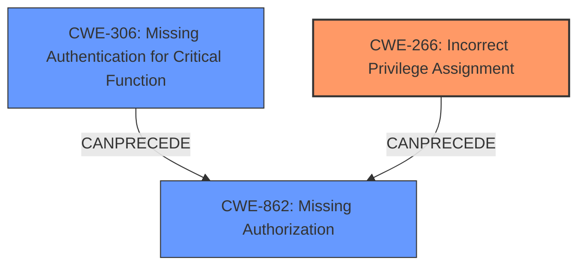

# Raw Analyzer Response for CVE-2024-30150

# Summary
| CWE ID | CWE Name | Confidence | CWE Abstraction Level | CWE Vulnerability Mapping Label | CWE-Vulnerability Mapping Notes |
|---|---|---|---|---|---|
| CWE-266 | Incorrect Privilege Assignment | 0.8 | Base | Primary | Allowed |
| CWE-306 | Missing Authentication for Critical Function | 0.6 | Base | Secondary | Allowed |
| CWE-862 | Missing Authorization | 0.5 | Class | Secondary | Allowed-with-Review |

## Evidence and Confidence

*   **Confidence Score:** 0.7
*   **Evidence Strength:** MEDIUM

## Relationship Analysis
The primary weakness is identified as CWE-266 (**Incorrect Privilege Assignment**), representing the root cause of the vulnerability. This is further supported by the vulnerability description mentioning "unauthenticated privilege escalation". CWE-306 (**Missing Authentication for Critical Function**) and CWE-862 (**Missing Authorization**) are considered secondary because the root cause seems to be **incorrect privilege assignment**, leading to unauthenticated users gaining elevated privileges.

## Vulnerability Chain
The vulnerability chain starts with **Improper Access Control** due to an **Incorrect Privilege Assignment** (CWE-266). This leads to an **unauthenticated privilege escalation**, potentially resulting in information disclosure, Server-Side Request Forgery (SSRF), and Denial of Service (DoS) attacks. Depending on how the **privilege assignment** is implemented, a **Missing Authentication** (CWE-306) or **Missing Authorization** (CWE-862) could be present.

## Summary of Analysis
The initial assessment focused on **Improper Access Control** due to the "unauthenticated privilege escalation vulnerability." The selection of CWE-266 (**Incorrect Privilege Assignment**) as the primary weakness is based on the vulnerability description explicitly mentioning "**Improper Access Control** - an **unauthenticated privilege escalation vulnerability**". This indicates a problem with how privileges are assigned to unauthenticated users. The retriever results also highlighted CWE-266 as a relevant candidate. While CWE-306 (**Missing Authentication for Critical Function**) and CWE-862 (**Missing Authorization**) are also considered, CWE-266 more accurately captures the root cause of the vulnerability.

The graph relationships and mapping guidance were instrumental in selecting the most appropriate CWE. By considering the hierarchical relationships and the specific characteristics of each CWE, I was able to narrow down the options and select CWE-266 as the primary weakness.

The selected CWEs are at the optimal level of specificity because they directly address the root cause of the vulnerability, which is the incorrect assignment of privileges.
# Enhanced Context (25 CWEs)
The following CWEs were identified as potentially relevant to this vulnerability:

## CWE-266: Incorrect Privilege Assignment
**Abstraction Level**: Base
**Similarity Score**: 0.76
**Source**: dense

**Description**:
A product incorrectly assigns a privilege to a particular actor, creating an unintended sphere of control for that actor.

**Mapping Guidance**:
- Usage: Allowed
- Rationale: This CWE entry is at the Base level of abstraction, which is a preferred level of abstraction for mapping to the root causes of vulnerabilities.

## Technical explanation for CWE-266

*   How the vulnerability's details match the CWE's characteristics: The vulnerability description states "unauthenticated privilege escalation" suggesting that unauthenticated users are assigned privileges they should not have. This aligns with CWE-266, which describes a product incorrectly assigning a privilege to an actor.
*   The security implications and potential impact: Incorrect privilege assignment can lead to unauthorized access to sensitive resources, data breaches, and system compromise.
*   Any parent-child relationships or chain patterns that influenced your mapping: CWE-266 can lead to CWE-285 (**Improper Authorization**) because the incorrect privilege assignment can lead to flawed permission checking.
*   Whether the weakness is primary or secondary in the vulnerability: Primary.
*   How the official MITRE mapping guidance influenced your decision: The MITRE mapping guidance states that CWE-266 is at the Base level of abstraction, which is a preferred level for mapping to the root causes of vulnerabilities, and the usage is Allowed.

## CWE-306: Missing Authentication for Critical Function
**Abstraction Level**: Base
**Similarity Score**: 1913.84
**Source**: sparse

**Description**:
The product does not perform any authentication for functionality that requires a provable user identity or consumes a significant amount of resources.

**Mapping Guidance**:
- Usage: Allowed
- Rationale: This CWE entry is at the Base level of abstraction, which is a preferred level of abstraction for mapping to the root causes of vulnerabilities.

## Technical explanation for CWE-306

*   How the vulnerability's details match the CWE's characteristics: The vulnerability description mentions that the "**unauthenticated privilege escalation**" which may lead to information disclosure. This suggests that critical functions lack proper authentication mechanisms.
*   The security implications and potential impact: If critical functions lack authentication, unauthorized users can access sensitive data and perform actions they are not authorized to do, leading to information disclosure, data breaches, and system compromise.
*   Any parent-child relationships or chain patterns that influenced your mapping: CWE-306 is often a prerequisite for other vulnerabilities, such as CWE-285 (**Improper Authorization**). If authentication is missing, authorization checks are irrelevant.
*   Whether the weakness is primary or secondary in the vulnerability: Secondary.
*   How the official MITRE mapping guidance influenced your decision: The MITRE mapping guidance states that CWE-306 is at the Base level of abstraction, which is a preferred level for mapping to the root causes of vulnerabilities, and the usage is Allowed.

## CWE-862: Missing Authorization
**Abstraction Level**: Class
**Similarity Score**: 2114.61
**Source**: sparse

**Description**:
The product performs an authorization check when an actor attempts to access a resource or perform an action, but it does not correctly perform the check.

**Mapping Guidance**:
- Usage: Allowed-with-Review
- Rationale: This CWE entry is a Class and might have Base-level children that would be more appropriate

## Technical explanation for CWE-862

*   How the vulnerability's details match the CWE's characteristics: The vulnerability description mentions "Improper Access Control - an unauthenticated privilege escalation vulnerability". This suggests that after a user gains access to the system (or in this case, no authentication is required), the system fails to check whether the user is authorized to perform certain actions.
*   The security implications and potential impact: Missing authorization checks can lead to unauthorized access to sensitive resources, data breaches, and system compromise.
*   Any parent-child relationships or chain patterns that influenced your mapping: CWE-862 is often a consequence of missing authentication (CWE-306). If authentication is missing, authorization checks are often skipped.
*   Whether the weakness is primary or secondary in the vulnerability: Secondary.
*   How the official MITRE mapping guidance influenced your decision: The MITRE mapping guidance states that CWE-862 is a Class and might have Base-level children that would be more appropriate. However, in this case, the information provided is not detailed enough to determine a more specific Base-level CWE. The usage is Allowed-with-Review.

## Other CWEs Considered But Not Used:

*   **CWE-284 (Improper Access Control)**: This is a high-level CWE, and more specific CWEs like CWE-266, CWE-306, and CWE-862 are more appropriate.
*   **CWE-287 (Improper Authentication)**: This is a Class-level CWE, and CWE-306, a Base-level CWE, is more specific and relevant in this case.
*   **CWE-20 (Improper Input Validation)**: The vulnerability description doesn't provide any specific details related to input validation; therefore, this CWE is not applicable.
*   **CWE-918 (Server-Side Request Forgery (SSRF))**: While the vulnerability description mentions the potential for SSRF, it is a consequence of the **Improper Access Control** rather than the root cause.
*   **CWE-611 (Improper Restriction of XML External Entity Reference)**: This CWE is not relevant to the vulnerability description.