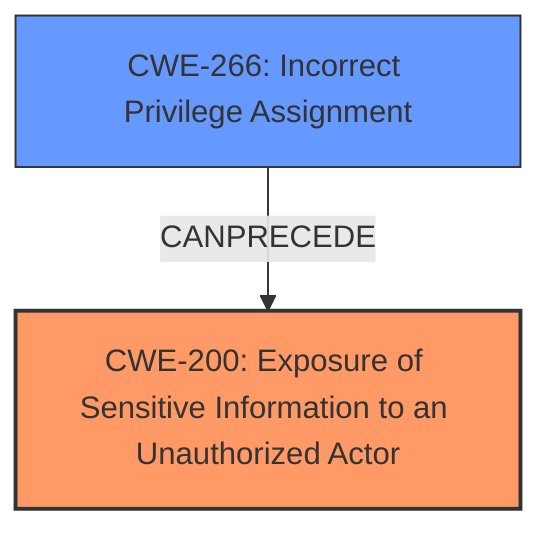

# Analysis Report for CVE-2024-30300

# Vulnerability Analysis Report: CVE-2024-30300

## Description

Adobe Framemaker Publishing Server versions 2020.3, 2022.2 and earlier are affected by an **Information Exposure** vulnerability (CWE-200) that could lead to privilege escalation. An attacker could exploit this vulnerability to gain access to sensitive information which may include system or user privileges. Exploitation of this issue does not require user interaction.

## Vulnerability Description Key Phrases

- **Weakness:** Information Exposure
- **Impact:** ['gain access to sensitive information', 'privilege escalation']
- **Attacker:** attacker
- **Product:** Adobe Framemaker Publishing Server
- **Version:** ['2020.3', '2022.2 and earlier']

## Analysis (with Relationship Data)

# Summary
| CWE ID | CWE Name | Confidence | CWE Abstraction Level | CWE Vulnerability Mapping Label | CWE-Vulnerability Mapping Notes |
|---|---|---|---|---|---|
| CWE-200 | Exposure of Sensitive Information to an Unauthorized Actor | 0.9 | Class | Primary | Allowed-with-Review |
| CWE-266 | Incorrect Privilege Assignment | 0.6 | Base | Secondary Candidate | Allowed |

## Evidence and Confidence

*   **Confidence Score:** 0.75
*   **Evidence Strength:** MEDIUM

## Relationship Analysis
The primary relationship influencing the decision is the parent-child relationship, specifically how CWE-200 acts as a high-level classification for information exposure issues. The retriever results also suggest related authorization and permission CWEs. However, the description explicitly states "Information Exposure," making CWE-200 the most direct match. Given the potential for privilege escalation, CWE-266 is considered as a possible secondary CWE if the information exposure directly leads to incorrect privilege assignments. The abstraction levels were considered, favoring the base level CWE when appropriate.



## Vulnerability Chain
The vulnerability chain starts with **Information Exposure** (CWE-200), which then leads to a privilege escalation. A possible contributing factor for the escalation of privilege could be **Incorrect Privilege Assignment** (CWE-266), if the exposed information is then used to incorrectly assign privileges.

## Summary of Analysis
The initial analysis focused on the explicit mention of "Information Exposure" in the vulnerability description, making CWE-200 the most obvious choice. The retriever results supported this selection. The potential for privilege escalation led to the consideration of privilege and permission-related CWEs, specifically CWE-266.

The analysis is primarily based on the provided evidence, particularly the vulnerability description and the CVE reference summary, where the root cause is explicitly stated as "Information Exposure (CWE-200)."

The relationship graph influenced the consideration of CWE-266 as a potential secondary weakness, recognizing that information exposure can often lead to authorization or privilege-related issues.

CWE-200 is at the class level, but given the direct statement in the description, it is an appropriate initial classification. Further investigation could potentially reveal a more specific variant of information exposure.

Relevant CWE Information:

# Enhanced Context (25 CWEs)
The following CWEs were identified as potentially relevant to this vulnerability:

## CWE-497: Exposure of Sensitive System Information to an Unauthorized Control Sphere
**Abstraction Level**: Base
**Similarity Score**: 0.79
**Source**: dense

**Description**:
The product does not properly prevent sensitive system-level information from being accessed by unauthorized actors who do not have the same level of access to the underlying system as the product does.

**Mapping Guidance**:
- Usage: Allowed
- Rationale: This CWE entry is at the Base level of abstraction, which is a preferred level of abstraction for mapping to the root causes of vulnerabilities.

**CWE-200:**

**Technical Explanation:** CWE-200 [Exposure of Sensitive Information to an Unauthorized Actor] describes a vulnerability where sensitive information is exposed to unauthorized parties. This can occur through various means, such as insecure storage, improper error handling, or insufficient access controls.

**Security Implications:** The exposure of sensitive information can have significant security implications, including identity theft, financial loss, and reputational damage. In this case, the vulnerability could lead to privilege escalation, which could allow an attacker to gain control of the affected system.

**Relationship Analysis:** CWE-200 is a class-level CWE, and it has several child CWEs that are more specific. Given the information provided, a more specific child CWE could be considered if more details emerge about the exact mechanism of information exposure.

**Mapping Guidance Analysis:** CWE-200 is discouraged for direct use as it's a high-level class. However, the description explicitly states "Information Exposure", therefore it is used as the primary CWE.

**CWE-266:**

**Technical Explanation:** CWE-266 [Incorrect Privilege Assignment] describes a situation where a user is assigned incorrect privileges, granting them unauthorized access to resources or functionality. This can occur due to misconfiguration, faulty logic, or inadequate security policies.

**Security Implications:** Incorrect privilege assignment can lead to privilege escalation, unauthorized access to sensitive data, and other security breaches. In this case, the vulnerability could allow an attacker to gain elevated privileges on the affected system.

**Relationship Analysis:** CWE-266 is a base-level CWE that can be related to other access control-related CWEs, such as CWE-285 [Improper Authorization].

**Mapping Guidance Analysis:** CWE-266 is allowed for usage and is at the Base level of abstraction, which is a preferred level of abstraction for mapping to the root causes of vulnerabilities.


## CWE Relationship Analysis

Current CWEs represent these abstraction levels: .


### Vulnerability Chain Analysis

**Chain starting from CWE-266:**
- 266 (Incorrect Privilege Assignment) - ROOT


**Chain starting from CWE-200:**
- 200 (Exposure of Sensitive Information to an Unauthorized Actor) - ROOT


### CWE Relationship Diagram

```mermaid
graph TD
    classDef primary fill:#f96,stroke:#333,stroke-width:2px
    classDef secondary fill:#69f,stroke:#333
    classDef tertiary fill:#9e9,stroke:#333
```


*Report generated on 2025-07-13 07:13:08*
