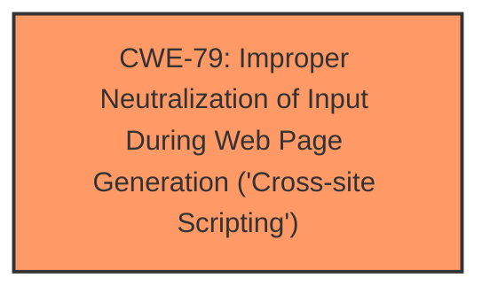

# Analysis Report for CVE-2024-3031

# Vulnerability Analysis Report: CVE-2024-3031

## Description

The Fluid Notification Bar plugin for WordPress is vulnerable to Stored Cross-Site Scripting via admin settings in all versions up to, and including, 3.2.3 due to **insufficient input sanitization and output escaping**. This makes it possible for authenticated attackers, with administrator-level permissions and above, to inject arbitrary web scripts in pages that will execute whenever a user accesses an injected page. This only affects multi-site installations and installations where unfiltered_html has been disabled.

## Vulnerability Description Key Phrases

- **Rootcause:** insufficient input sanitization and output escaping
- **Weakness:** cross-site scripting
- **Impact:** ['execute arbitrary web scripts', 'inject arbitrary web scripts']
- **Attacker:** authenticated attackers
- **Product:** Fluid Notification Bar plugin for WordPress
- **Version:** all versions up to and including 3.2.3
- **Component:** admin settings

## Analysis (with Relationship Data)

# Summary
| CWE ID | CWE Name | Confidence | CWE Abstraction Level | CWE Vulnerability Mapping Label | CWE-Vulnerability Mapping Notes |
|---|---|---|---|---|---|
| CWE-79 | Improper Neutralization of Input During Web Page Generation ('Cross-site Scripting') | 1.0 | Base | Primary CWE | Allowed |

## Evidence and Confidence

*   **Confidence Score:** 1.0
*   **Evidence Strength:** HIGH

## Relationship Analysis
The primary CWE identified is CWE-79, which is a Base level CWE. No parent-child or chain relationships directly influenced the selection because CWE-79 directly and completely represents the vulnerability.



## Vulnerability Chain
The vulnerability chain consists of:
1.  **Root Cause:** **insufficient input sanitization and output escaping**
2.  **Weakness:** CWE-79 Improper Neutralization of Input During Web Page Generation ('Cross-site Scripting')
3.  **Impact:** Arbitrary web scripts injected into pages, leading to their execution when a user accesses the injected page.

## Summary of Analysis
The primary weakness is the **insufficient input sanitization and output escaping**, which leads to a Cross-Site Scripting vulnerability. The vulnerability description clearly states that the plugin does not properly sanitize input and escape output, allowing an attacker to inject arbitrary web scripts.

The selection of CWE-79 is based on the following evidence:

*   The **Vulnerability Description Key Phrases** section explicitly mentions "**insufficient input sanitization and output escaping**" as the root cause and "**cross-site scripting**" as the weakness.
*   The **CVE Reference Links Content Summary** confirms that the vulnerability is due to insufficient input sanitization and output escaping, leading to Stored Cross-Site Scripting (XSS).
*   The "CWE for similar CVE Descriptions" section lists CWE-79 as the Primary CWE Match and Top CWE.
*   The Retriever Results list CWE-79 as the 4th best match.

The selection of CWE-79 is at the optimal level of specificity (Base) as it directly describes the weakness of improper neutralization of input during web page generation.

CWEs considered but not used:

*   CWE-116 (Improper Encoding or Escaping of Output): Considered, but CWE-79 is more specific to the context of web page generation and XSS.
*   CWE-352 (Cross-Site Request Forgery (CSRF)): Not applicable because the vulnerability is not related to CSRF.
*   CWE-862 (Missing Authorization), CWE-863 (Incorrect Authorization), CWE-285 (Improper Authorization): Authorization is not the primary issue; the main problem is the lack of proper input sanitization and output escaping.
*   CWE-89 (Improper Neutralization of Special Elements used in an SQL Command ('SQL Injection')): Not applicable because the vulnerability is not related to SQL injection.
*   CWE-78 (Improper Neutralization of Special Elements used in an OS Command ('OS Command Injection')): Not applicable because the vulnerability is not related to OS Command injection.


## CWE Relationship Analysis

Current CWEs represent these abstraction levels: .


### Vulnerability Chain Analysis

**Chain starting from CWE-863:**
- 863 (Incorrect Authorization) - ROOT


**Chain starting from CWE-89:**
- 89 (Improper Neutralization of Special Elements used in an SQL Command ('SQL Injection')) - ROOT


### CWE Relationship Diagram

```mermaid
graph TD
    classDef primary fill:#f96,stroke:#333,stroke-width:2px
    classDef secondary fill:#69f,stroke:#333
    classDef tertiary fill:#9e9,stroke:#333
```


*Report generated on 2025-07-13 07:13:22*
