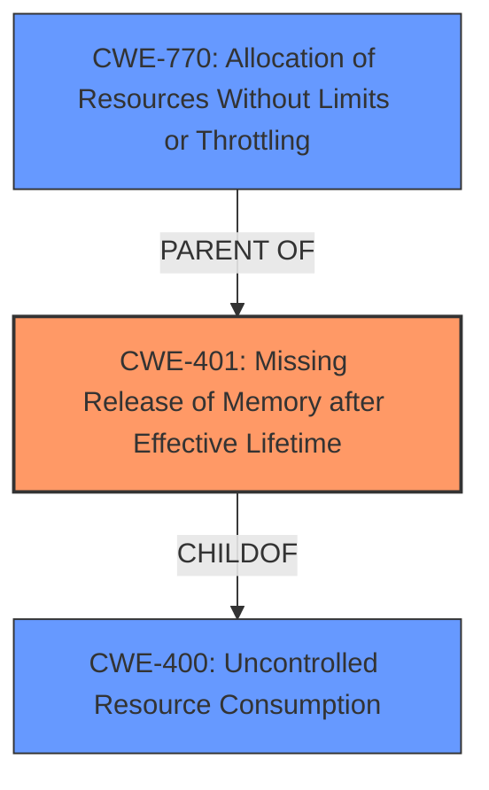

# Analysis Report for CVE-2024-3056

# Vulnerability Analysis Report: CVE-2024-3056

## Description

A flaw was found in Podman. This issue may allow an attacker to create a specially crafted container that, when configured to share the same IPC with at least one other container, can create a large number of IPC resources in /dev/shm. The malicious container will continue to exhaust resources until it is out-of-memory (OOM) killed. While the malicious containers cgroup will be removed, the IPC resources it created are not. Those resources are tied to the IPC namespace that will not be removed until all containers using it are stopped, and one non-malicious container is holding the namespace open. The malicious container is restarted, either automatically or by attacker control, repeating the process and increasing the amount of memory consumed. With a container configured to restart always, such as `podman run --restart=always`, this can result in a memory-based denial of service of the system.

## Vulnerability Description Key Phrases

- **Impact:** denial of service
- **Vector:** specially crafted container
- **Attacker:** attacker
- **Product:** Podman

## Analysis (with Relationship Data)

# Summary
| CWE ID | CWE Name | Confidence | CWE Abstraction Level | CWE Vulnerability Mapping Label | CWE-Vulnerability Mapping Notes |
|---|---|---|---|---|---|
| CWE-401 | Missing Release of Memory after Effective Lifetime | 0.9 | Variant | Allowed | Primary CWE |
| CWE-770 | Allocation of Resources Without Limits or Throttling | 0.7 | Base | Allowed | Secondary Candidate |
| CWE-400 | Uncontrolled Resource Consumption | 0.6 | Class | Discouraged | Secondary Candidate |

## Evidence and Confidence

*   **Confidence Score:** 0.8
*   **Evidence Strength:** HIGH

## Relationship Analysis
The primary CWE selected is CWE-401 (Missing Release of Memory after Effective Lifetime), which is a Variant. This choice reflects the specific issue of memory not being released. CWE-770 (Allocation of Resources Without Limits or Throttling) is a related Base CWE, as the vulnerability involves uncontrolled allocation. CWE-400 (Uncontrolled Resource Consumption) is a higher-level Class CWE that describes the impact of resource exhaustion.



## Vulnerability Chain
The vulnerability chain starts with the **missing release of memory** (CWE-401) after a container is terminated. This leads to an **uncontrolled allocation of resources** (CWE-770) as the malicious container is restarted, eventually resulting in **uncontrolled resource consumption** (CWE-400) and a denial-of-service condition.

## Summary of Analysis
The initial assessment focused on identifying the root cause of the vulnerability, which is the **failure to release shared memory resources** when a container terminates. The evidence provided in the "CVE Reference Links Content Summary" clearly supports this, stating that "Shared memory resources are not properly released when a container is terminated, leading to memory leaks." The retriever results highlighted CWE-401, CWE-770, and CWE-400 as potential candidates.

CWE-401 (Missing Release of Memory after Effective Lifetime) was selected as the primary CWE because it directly addresses the root cause. CWE-770 (Allocation of Resources Without Limits or Throttling) is a contributing factor, as the vulnerability relies on the ability to allocate resources without proper limits. CWE-400 (Uncontrolled Resource Consumption) describes the impact, but it is a discouraged CWE. The graph relationships helped clarify the sequence of events, with CWE-401 leading to CWE-400. The selected CWEs are at the optimal level of specificity, with CWE-401 being a Variant and CWE-770 being a Base.

Relevant CWE Information:

# Enhanced Context (25 CWEs)
The following CWEs were identified as potentially relevant to this vulnerability:

## CWE-789: Memory Allocation with Excessive Size Value
**Abstraction Level**: Variant
**Similarity Score**: 0.74
**Source**: dense

**Description**:
The product allocates memory based on an untrusted, large size value, but it does not ensure that the size is within expected limits, allowing arbitrary amounts of memory to be allocated.

**Mapping Guidance**:
- Usage: Allowed
- Rationale: This CWE entry is at the Variant level of abstraction, which is a preferred level of abstraction for mapping to the root causes of vulnerabilities.

## CWE-404: Improper Resource Shutdown or Release
**Abstraction Level**: Class
**Similarity Score**: 0.72
**Source**: dense

**Description**:
The product does not release or incorrectly releases a resource before it is made available for re-use.

**Mapping Guidance**:
- Usage: Allowed-with-Review
- Rationale: This CWE entry is a Class and might have Base-level children that would be more appropriate

## CWE-401: Missing Release of Memory after Effective Lifetime
**Abstraction Level**: Variant
**Similarity Score**: 0.71
**Source**: dense

**Description**:
The product does not sufficiently track and release allocated memory after it has been used, which slowly consumes remaining memory.

**Mapping Guidance**:
- Usage: Allowed
- Rationale: This CWE entry is at the Variant level of abstraction, which is a preferred level of abstraction for mapping to the root causes of vulnerabilities.

**Technical Explanation for CWE-401:**

*   How the vulnerability's details match the CWE's characteristics: The vulnerability involves a container allocating shared memory resources but failing to release them upon termination. This directly aligns with CWE-401's description of a **missing release of memory** after it has been used.
*   The security implications and potential impact: The impact is a memory leak that leads to resource exhaustion and a denial-of-service condition. This occurs because the allocated memory is not freed, eventually consuming all available system memory.
*   Any parent-child relationships or chain patterns that influenced your mapping: CWE-401 is a Variant of CWE-400 (Uncontrolled Resource Consumption), which describes the broader impact of resource exhaustion. It can also be related to CWE-770 (Allocation of Resources Without Limits or Throttling) as the **lack of resource management** contributes to the issue.
*   Whether the weakness is primary or secondary in the vulnerability: CWE-401 is the primary weakness because it is the root cause of the memory leak.
*   How the official MITRE mapping guidance influenced your decision: The MITRE mapping guidance allows for the use of Variant-level CWEs, which supports the selection of CWE-401.

**Technical Explanation for CWE-770:**

*   How the vulnerability's details match the CWE's characteristics: The container can allocate IPC resources without any restrictions on the amount, which leads to resource exhaustion.
*   The security implications and potential impact: This can lead to a denial of service.
*   Any parent-child relationships or chain patterns that influenced your mapping: CWE-770 is a Base level CWE.
*   Whether the weakness is primary or secondary in the vulnerability: CWE-770 is a secondary weakness because it is a condition that allows the primary weakness to happen.
*   How the official MITRE mapping guidance influenced your decision: The MITRE mapping guidance allows for the use of Base-level CWEs, which supports the selection of CWE-770.

**Technical Explanation for CWE-400:**

*   How the vulnerability's details match the CWE's characteristics: The vulnerability leads to an uncontrolled consumption of system memory, which aligns with CWE-400's description.
*   The security implications and potential impact: The impact is a denial-of-service condition due to resource exhaustion.
*   Any parent-child relationships or chain patterns that influenced your mapping: CWE-400 is a Class level CWE.
*   Whether the weakness is primary or secondary in the vulnerability: CWE-400 describes the impact of the primary weakness.
*   How the official MITRE mapping guidance influenced your decision: The MITRE mapping guidance discourages using CWE-400.

**CWEs Considered But Not Used:**

*   CWE-789 (Memory Allocation with Excessive Size Value): While the vulnerability does involve memory allocation, the root cause is not specifically related to the size of the allocation but rather the failure to release the allocated memory.
*   CWE-404 (Improper Resource Shutdown or Release): Similar to CWE-401, but more general. CWE-401 is more specific to memory and is thus a better fit.
*   CWE-190 (Integer Overflow or Wraparound): This CWE is not relevant as there is no integer overflow involved in the vulnerability.
*   CWE-212 (Improper Removal of Sensitive Information Before Storage or Transfer): This CWE is not relevant as the vulnerability does not involve sensitive information.
*   CWE-863 (Incorrect Authorization): This CWE is not relevant as the vulnerability is not related to authorization.
*   CWE-1325 (Improperly Controlled Sequential Memory Allocation): This CWE is not directly relevant because the core issue is the failure to release memory, rather than the sequential allocation itself.
*   CWE-22 (Improper Limitation of a Pathname to a Restricted Directory ('Path Traversal')): This CWE is not relevant as the vulnerability does not involve path traversal.


## CWE Relationship Analysis

Current CWEs represent these abstraction levels: .


### Vulnerability Chain Analysis

**Chain starting from CWE-863:**
- 863 (Incorrect Authorization) - ROOT


**Chain starting from CWE-400:**
- 400 (Uncontrolled Resource Consumption) - ROOT


### CWE Relationship Diagram

```mermaid
graph TD
    classDef primary fill:#f96,stroke:#333,stroke-width:2px
    classDef secondary fill:#69f,stroke:#333
    classDef tertiary fill:#9e9,stroke:#333
```


*Report generated on 2025-07-13 07:15:34*
