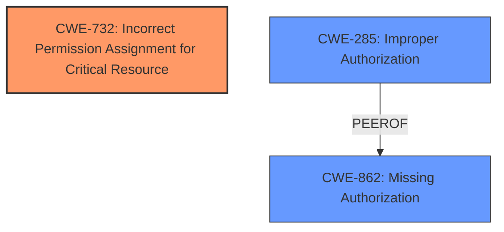

# Enhanced Analysis for CVE-2024-30961

# Summary
| CWE ID | CWE Name | Confidence | CWE Abstraction Level | CWE Vulnerability Mapping Label | CWE-Vulnerability Mapping Notes |
|---|---|---|---|---|---|
| CWE-732 | Incorrect Permission Assignment for Critical Resource | 0.75 | Class | Allowed-with-Review | Primary CWE |
| CWE-285 | Improper Authorization | 0.5 | Class | Discouraged | Secondary Candidate |
| CWE-862 | Missing Authorization | 0.5 | Class | Allowed-with-Review | Secondary Candidate |

## Evidence and Confidence

*   **Confidence Score:** 0.7
*   **Evidence Strength:** MEDIUM

## Relationship Analysis
The primary relationship that influenced the decision was the parent-child relationship between CWE-285, CWE-862 and CWE-732. Although CWE-732 is a Class, it still appears to be the most appropriate based on the description and guidance given about privileges and permissions. CWE-732 and its children are authorization issues, which is applicable to the root cause of the vulnerability. Since the issue is about **Insecure Permissions** assignment for a critical resource, CWE-732 provides the best fit.



## Vulnerability Chain
The vulnerability chain starts with an **Insecure Permissions** issue that leads to a use-after-free vulnerability, a race condition, improper error handling, and lack of synchronization when shutting down. The ultimate impact is the ability for a local attacker to execute arbitrary code.

`Insecure Permissions` -> `Use-After-Free (UAF)` -> `Race condition` -> `Improper error handling` -> `Lack of synchronization` -> `Arbitrary Code Execution`

## Summary of Analysis
The initial assessment identified **Insecure Permissions** as the root cause, leading to a use-after-free condition and ultimately arbitrary code execution. The primary CWE was selected based on the vulnerability description and the guidance about privileges and permissions. The relationship analysis reinforced the selection, as the authorization issues described by CWE-732 and its children are applicable to the root cause of the vulnerability.

The evidence from the "Vulnerability Description Key Phrases" section:
- **rootcause:** **Insecure Permissions**

The evidence from the "CVE Reference Links Content Summary" section:
- "The `SimpleActionServer` in `nav2_util` throws an exception during deactivation, leading to premature exit and use-after-free (UAF) vulnerability due to a race condition."

The selection of CWE-732 is at the optimal level of specificity, as it directly addresses the **incorrect permission assignment** for a critical resource, which is the root cause of the vulnerability.

CWEs considered but not used:
*   CWE-285 Improper Authorization: Initially considered, but deemed less specific than CWE-732.
*   CWE-862 Missing Authorization: Initially considered, but deemed less specific than CWE-732.
*   CWE-266 Incorrect Privilege Assignment: Ruled out as the issue is with permissions, not privileges.
*   CWE-250 Execution with Unnecessary Privileges: Ruled out as the issue is with permissions, not privileges.

Relevant CWE Information:

# Enhanced Context (25 CWEs)
The following CWEs were identified as potentially relevant to this vulnerability:

## CWE-266: Incorrect Privilege Assignment
**Abstraction Level**: Base

## CWE-280: Improper Handling of Insufficient Permissions or Privileges
**Abstraction Level**: Base

## CWE-267: Privilege Defined With Unsafe Actions
**Abstraction Level**: Base

## CWE-274: Improper Handling of Insufficient Privileges
**Abstraction Level**: Base

## CWE-276: Incorrect Default Permissions
**Abstraction Level**: Base

## CWE-668: Exposure of Resource to Wrong Sphere
**Abstraction Level**: Class

## CWE-59: Improper Link Resolution Before File Access ('Link Following')
**Abstraction Level**: Base

## CWE-41: Improper Resolution of Path Equivalence
**Abstraction Level**: Base

## CWE-281: Improper Preservation of Permissions
**Abstraction Level**: Base

## CWE-73: External Control of File Name or Path
**Abstraction Level**: Base

## CWE-863: Incorrect Authorization
**Abstraction Level**: Class
The product performs an authorization check when an actor attempts to access a resource or perform an action, but it does not correctly perform the check.
**Mapping Guidance**
Usage: Allowed-with-Review
Rationale: This CWE entry is a Class and might have Base-level children that would be more appropriate

## CWE-732: Incorrect Permission Assignment for Critical Resource
**Abstraction Level**: Class
The product specifies permissions for a security-critical resource in a way that allows that resource to be read or modified by unintended actors.
**Mapping Guidance**
Usage: Allowed-with-Review
Rationale: While the name itself indicates an assignment of permissions for resources, this is often misused for vulnerabilities in which "permissions" are not checked, which is an "authorization" weakness (CWE-285 or descendants) within CWE's model [REF-1287].

## CWE-285: Improper Authorization
**Abstraction Level**: Class
The product does not perform or incorrectly performs an authorization check when an actor attempts to access a resource or perform an action.
**Mapping Guidance**
Usage: Discouraged
Rationale: CWE-285 is high-level and lower-level CWEs can frequently be used instead. It is a level-1 Class (i.e., a child of a Pillar).

## CWE-269: Improper Privilege Management
**Abstraction Level**: Class

## CWE-59: Improper Link Resolution Before File Access ('Link Following')
**Abstraction Level**: Base

## CWE-782: Exposed IOCTL with Insufficient Access Control
**Abstraction Level**: variant

## CWE-781: Improper Address Validation in IOCTL with METHOD_NEITHER I/O Control Code
**Abstraction Level**: variant

## CWE-280: Improper Handling of Insufficient Permissions or Privileges
**Abstraction Level**: Base

## CWE-274: Improper Handling of Insufficient Privileges
**Abstraction Level**: Base

## CWE-250: Execution with Unnecessary Privileges
**Abstraction Level**: base

## CWE-379: Creation of Temporary File in Directory with Insecure Permissions
**Abstraction Level**: base

## CWE-378: Creation of Temporary File With Insecure Permissions
**Abstraction Level**: base

## CWE-306: Missing Authentication for Critical Function
**Abstraction Level**: base

## CWE-822: Untrusted Pointer Dereference
**Abstraction Level**: base

## CWE-363: Race Condition Enabling Link Following
**Abstraction Level**: base


## CWE Relationship Analysis

Current CWEs represent these abstraction levels: .


### Vulnerability Chain Analysis

**Chain starting from CWE-274:**
- 274 (Improper Handling of Insufficient Privileges) - ROOT


**Chain starting from CWE-862:**
- 862 (Missing Authorization) - ROOT


### CWE Relationship Diagram

```mermaid
graph TD
    classDef primary fill:#f96,stroke:#333,stroke-width:2px
    classDef secondary fill:#69f,stroke:#333
    classDef tertiary fill:#9e9,stroke:#333
```