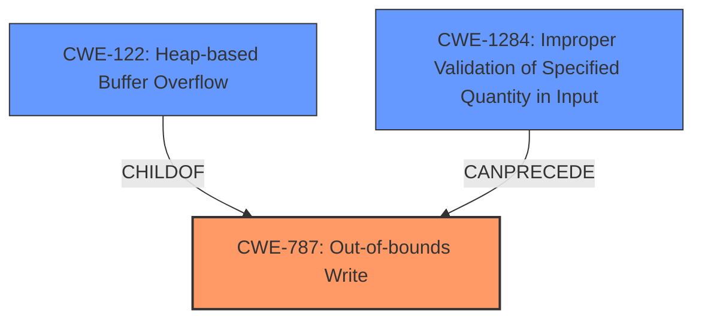

# Analysis for CVE-2024-30963

# Summary
| CWE ID | CWE Name | Confidence | CWE Abstraction Level | CWE Vulnerability Mapping Label | CWE-Vulnerability Mapping Notes |
|---|---|---|---|---|---|
| CWE-787 | Out-of-bounds Write | 0.9 | Base | Allowed | Primary CWE: Root cause is a heap buffer overflow due to a large `z_rand` parameter. |
| CWE-122 | Heap-based Buffer Overflow | 0.8 | Variant | Allowed | Secondary: More specific type of out-of-bounds write. |
| CWE-1284 | Improper Validation of Specified Quantity in Input | 0.7 | Base | Allowed | Secondary: The root cause is **lack of input validation** on the `z_rand` parameter. |

## Evidence and Confidence

*   **Confidence Score:** 0.9
*   **Evidence Strength:** HIGH

## Relationship Analysis
The primary weakness is CWE-787 (**Out-of-bounds Write**), which is a base-level CWE. CWE-122 (**Heap-based Buffer Overflow**) is a variant of buffer overflow, specifying that the overflow occurs on the heap. CWE-1284 (**Improper Validation of Specified Quantity in Input**) describes the **lack of input validation** that led to the vulnerability. The relationships are as follows: CWE-122 is a specific type of CWE-787. CWE-1284 can precede CWE-787 because **lack of validation** can lead to an out-of-bounds write.

## Vulnerability Chain
The vulnerability chain starts with **Improper Validation of Specified Quantity in Input** (CWE-1284) for the `z_rand` parameter. This leads to a **Heap-based Buffer Overflow** (CWE-122), which is a specific type of **Out-of-bounds Write** (CWE-787). The final impact is the ability to execute arbitrary code.

CWE-1284 (Improper Validation) -> CWE-122 (Heap-based Buffer Overflow) -> CWE-787 (Out-of-bounds Write) -> Arbitrary Code Execution.

## Summary of Analysis
The initial analysis identified a **buffer overflow** vulnerability. The CVE Reference Links Content Summary provided more details, stating that the root cause was user misconfiguration of the `z_rand` parameter, leading to a heap-buffer-overflow. This confirms the **buffer overflow** and points to a specific type (heap-based) and a root cause (**lack of input validation**).

CWE-787 (**Out-of-bounds Write**) is the most appropriate primary CWE because it describes the **buffer overflow** condition. CWE-122 (**Heap-based Buffer Overflow**) is a more specific variant of CWE-787 and is also relevant. CWE-1284 (**Improper Validation of Specified Quantity in Input**) is crucial because it identifies the root cause of the vulnerability.

The graph relationships helped clarify the chain of events, starting with the **lack of input validation** (CWE-1284), leading to the **heap-based buffer overflow** (CWE-122) and ultimately the **out-of-bounds write** (CWE-787). These CWEs are selected at the optimal level of specificity, with CWE-787 as the general condition and CWE-122 providing more detail.

Relevant CWE Information:

# Enhanced Context (25 CWEs)
The following CWEs were identified as potentially relevant to this vulnerability:

## CWE-193: Off-by-one Error
**Abstraction Level**: Base
**Similarity Score**: 0.73
**Source**: dense

**Description**:
A product calculates or uses an incorrect maximum or minimum value that is 1 more, or 1 less, than the correct value.

**Mapping Guidance**:
- Usage: Allowed
- Rationale: This CWE entry is at the Base level of abstraction, which is a preferred level of abstraction for mapping to the root causes of vulnerabilities.

*Not Used:* This is not an off-by-one error, but rather a **lack of input validation** that leads to a buffer overflow.

## CWE-131: Incorrect Calculation of Buffer Size
**Abstraction Level**: Base
**Similarity Score**: 0.73
**Source**: dense

**Description**:
The product does not correctly calculate the size to be used when allocating a buffer, which could lead to a buffer overflow.

**Mapping Guidance**:
- Usage: Allowed
- Rationale: This CWE entry is at the Base level of abstraction, which is a preferred level of abstraction for mapping to the root causes of vulnerabilities.

*Not Used:* While this could be a contributing factor, the primary issue is the **lack of validation** of the input that dictates the buffer size.

## CWE-126: Buffer Over-read
**Abstraction Level**: Variant
**Similarity Score**: 0.72
**Source**: dense

**Description**:
The product reads from a buffer using buffer access mechanisms such as indexes or pointers that reference memory locations after the targeted buffer.

**Mapping Guidance**:
- Usage: Allowed
- Rationale: This CWE entry is at the Variant level of abstraction, which is a preferred level of abstraction for mapping to the root causes of vulnerabilities.

*Not Used:* The vulnerability is a buffer overflow (write), not a buffer over-read.

## CWE-191: Integer Underflow (Wrap or Wraparound)
**Abstraction Level**: Base
**Similarity Score**: 0.71
**Source**: dense

**Description**:
The product subtracts one value from another, such that the result is less than the minimum allowable integer value, which produces a value that is not equal to the correct result.

**Mapping Guidance**:
- Usage: Allowed
- Rationale: This CWE entry is at the Base level of abstraction, which is a preferred level of abstraction for mapping to the root causes of vulnerabilities.

*Not Used:* This is not related to integer underflow.

## CWE-824: Access of Uninitialized Pointer
**Abstraction Level**: Base
**Similarity Score**: 0.71
**Source**: dense

**Description**:
The product accesses or uses a pointer that has not been initialized.

**Mapping Guidance**:
- Usage: Allowed
- Rationale: This CWE entry is at the Base level of abstraction, which is a preferred level of abstraction for mapping to the root causes of vulnerabilities.

*Not Used:* The vulnerability is not related to an uninitialized pointer.

## CWE-129: Improper Validation of Array Index
**Abstraction Level**: Variant
**Similarity Score**: 0.71
**Source**: dense

**Description**:
The product uses untrusted input when calculating or using an array index, but the product does not validate or incorrectly validates the index to ensure the index references a valid position within the array.

**Mapping Guidance**:
- Usage: Allowed
- Rationale: This CWE entry is at the Variant level of abstraction, which is a preferred level of abstraction for mapping to the root causes of vulnerabilities.

*Not Used:* While this involves improper validation, it's more specific to array indices, and the vulnerability description describes a general **lack of input validation** for the size parameter.

## CWE-119: Improper Restriction of Operations within the Bounds of a Memory Buffer
**Abstraction Level**: Class
**Similarity Score**: 0.71
**Source**: dense

**Description**:
The product performs operations on a memory buffer, but it reads from or writes to a memory location outside the buffer's intended boundary. This may result in read or write operations on unexpected memory locations that could be linked to other variables, data structures, or internal program data.

**Mapping Guidance**:
- Usage: Discouraged
- Rationale: CWE-119 is commonly misused in low-information vulnerability reports when lower-level CWEs could be used instead, or when more details about the vulnerability are available.

*Not Used:* While technically correct, it's too general. CWE-787 and CWE-122 provide a more accurate and specific description.

## CWE-125: Out-of-bounds Read
**Abstraction Level**: Base
**Similarity Score**: 0.70
**Source**: dense

**Description**:
The product reads data past the end, or before the beginning, of the intended buffer.

**Mapping Guidance**:
- Usage: Allowed
- Rationale: This CWE entry is at the Base level of abstraction, which is a preferred level of abstraction for mapping to the root causes of