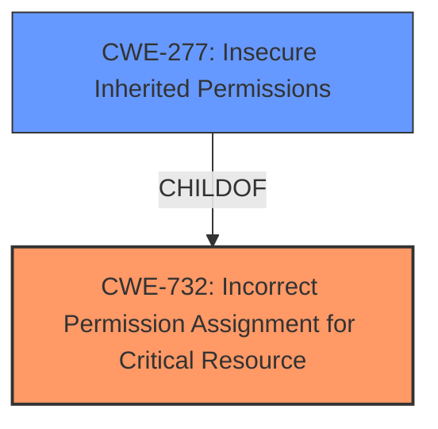

# Analysis Report for CVE-2024-30964

# Vulnerability Analysis Report: CVE-2024-30964

## Description

**Insecure Permissions** vulnerability in Open Robotics Robotic Operating System 2 (ROS2) navigation2- ROS2-humble and navigation 2-humble allows a local attacker to execute arbitrary code via the initial_pose_sub thread created by nav2_bt_navigator

## Vulnerability Description Key Phrases

- **Rootcause:** Insecure Permissions
- **Impact:** execute arbitrary code
- **Attacker:** local attacker
- **Product:** Open Robotics Robotic Operating System 2 (ROS2) navigation2- ROS2-humble and navigation 2-humble
- **Component:** nav2_bt_navigator

## Analysis (with Relationship Data)

# Summary
| CWE ID | CWE Name | Confidence | CWE Abstraction Level | CWE Vulnerability Mapping Label | CWE-Vulnerability Mapping Notes |
|---|---|---|---|---|---|
| CWE-732 | Incorrect Permission Assignment for Critical Resource | 0.8 | Class | Allowed-with-Review | Primary CWE |
| CWE-277 | Insecure Inherited Permissions | 0.6 | Variant | Allowed | Secondary Candidate |

## Evidence and Confidence

*   **Confidence Score:** 0.7
*   **Evidence Strength:** MEDIUM

## Relationship Analysis
The primary CWE, CWE-732 [Incorrect Permission Assignment for Critical Resource], is a class-level CWE. Its child CWE, CWE-277 [Insecure Inherited Permissions], is a variant-level CWE and is a more specific case of incorrect permission assignment, where the permissions are inherited.



## Vulnerability Chain
The vulnerability chain begins with **insecure permissions** which allows a local attacker to execute arbitrary code.
  - Root cause: **Insecure Permissions**
  - Impact: execute arbitrary code

## Summary of Analysis
The vulnerability description indicates an **insecure permissions** issue that allows a local attacker to execute arbitrary code. The key phrase "Insecure Permissions" directly aligns with CWE-732 [Incorrect Permission Assignment for Critical Resource]. This CWE covers scenarios where a critical resource has permissions assigned in a way that allows unintended actors to read or modify it. While the description is brief, the mention of "insecure permissions" as the root cause makes CWE-732 a reasonable initial choice.

CWE-277 [Insecure Inherited Permissions] is considered as a secondary candidate since inherited permissions could potentially be the underlying issue.

The evidence is limited, as the CVE Reference Links Content Summary section is marked "UNRELATED". Without more details about how the permissions are misconfigured, I am reasonably confident in selecting CWE-732 as the primary CWE, with CWE-277 as a secondary candidate.

Relevant CWE Information:

# Enhanced Context (25 CWEs)
The following CWEs were identified as potentially relevant to this vulnerability:

## CWE-732: Incorrect Permission Assignment for Critical Resource
**Abstraction Level**: Class
**Similarity Score**: 1289.55
**Source**: sparse

**Description**:
The product specifies permissions for a security-critical resource in a way that allows that resource to be read or modified by unintended actors.

**Mapping Guidance**:
- Usage: Allowed-with-Review
- Rationale: While the name itself indicates an assignment of permissions for resources, this is often misused for vulnerabilities in which "permissions" are not checked, which is an "authorization" weakness (CWE-285 or descendants) within CWE's model [REF-1287].

## CWE-277: Insecure Inherited Permissions
**Abstraction Level**: variant
**Similarity Score**: 2.16
**Source**: graph

**Description**:
CWE-277: Insecure Inherited Permissions

**Mapping Guidance**:
- Usage: Allowed
- Rationale: This CWE entry is at the Variant level of abstraction, which is a preferred level of abstraction for mapping to the root causes of vulnerabilities.

**Relationships**:
- CHILDOF -> CWE-732
- PARENTOF -> CWE-277


## CWE Relationship Analysis

Current CWEs represent these abstraction levels: .


### Vulnerability Chain Analysis

**Chain starting from CWE-277:**
- 277 (Insecure Inherited Permissions) - ROOT


**Chain starting from CWE-285:**
- 285 (Improper Authorization) - ROOT


### CWE Relationship Diagram

```mermaid
graph TD
    classDef primary fill:#f96,stroke:#333,stroke-width:2px
    classDef secondary fill:#69f,stroke:#333
    classDef tertiary fill:#9e9,stroke:#333
```


*Report generated on 2025-07-13 07:18:04*
