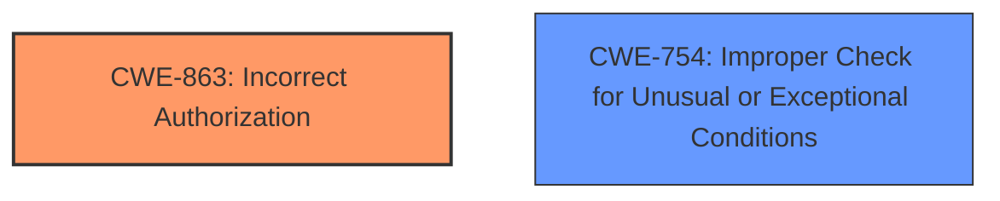

# Analysis Report for CVE-2024-31227

# Vulnerability Analysis Report: CVE-2024-31227

## Description

Redis is an open source, in-memory database that persists on disk. An authenticated with sufficient privileges may create a **malformed ACL selector** which, when accessed, triggers a server panic and subsequent denial of service. The problem exists in Redis 7 prior to versions 7.2.6 and 7.4.1. Users are advised to upgrade. There are no known workarounds for this vulnerability.

## Vulnerability Description Key Phrases

- **Weakness:** malformed ACL selector
- **Impact:** server panic and denial of service
- **Attacker:** authenticated with sufficient privileges
- **Product:** Redis
- **Version:** 7 prior to versions 7.2.6 and 7.4.1

## Analysis (with Relationship Data)

# Summary
| CWE ID | CWE Name | Confidence | CWE Abstraction Level | CWE Vulnerability Mapping Label | CWE-Vulnerability Mapping Notes |
|---|---|---|---|---|---|
| CWE-863 | Incorrect Authorization | 0.75 | Class | Allowed-with-Review | Primary CWE. While a child CWE might be more appropriate, the provided information is insufficient to identify one. |
| CWE-754 | Improper Check for Unusual or Exceptional Conditions | 0.6 | Class | Allowed-with-Review | Secondary candidate. |

## Evidence and Confidence

*   **Confidence Score:** 0.7
*   **Evidence Strength:** MEDIUM

## Relationship Analysis
The primary relationship that influenced the decision was the parent-child relationship between CWE-285 (Improper Authorization) and its children. While the vulnerability involves an authorization issue due to a **malformed ACL selector**, the specific type of authorization failure isn't detailed enough to choose a more specific child of CWE-285. I considered CWE-863, which is a sibling of CWE-285, and chose it because it better represents the situation where an authorization check exists, but is performed incorrectly.



## Vulnerability Chain
The vulnerability chain starts with the **malformed ACL selector** which leads to a server panic, ultimately resulting in a denial of service.

`Malformed ACL Selector` -> `Incorrect Authorization` -> `Server Panic` -> `Denial of Service`

The root cause is the **improper** handling of the **malformed ACL selector** during authorization, which triggers the server panic.

## Summary of Analysis
The initial analysis pointed towards authorization-related CWEs due to the involvement of ACL selectors and privileges. After reviewing the vulnerability description and the CVE reference content, it became clear that the **incorrect authorization** was the core issue. The system allows the creation of a **malformed ACL selector**, which then leads to a server panic.

The selection of CWE-863 is based on the fact that the system does perform an authorization check but it does not correctly perform the check. This is supported by the CVE Reference Links Content Summary: "The issue lies in the parsing logic of the ACL selector where it does not handle certain invalid combinations of read/write permissions properly".

CWE-863 is at the Class level, and a more specific Base or Variant CWE would be ideal. However, the information provided does not allow me to determine the underlying cause.

Relevant CWE Information:

# Enhanced Context (25 CWEs)
The following CWEs were identified as potentially relevant to this vulnerability:

## CWE-267: Privilege Defined With Unsafe Actions
**Abstraction Level**: Base
**Similarity Score**: 0.78
**Source**: dense

**Description**:
A particular privilege, role, capability, or right can be used to perform unsafe actions that were not intended, even when it is assigned to the correct entity.

**Mapping Guidance**:
- Usage: Allowed
- Rationale: This CWE entry is at the Base level of abstraction, which is a preferred level of abstraction for mapping to the root causes of vulnerabilities.

## CWE-280: Improper Handling of Insufficient Permissions or Privileges
**Abstraction Level**: Base
**Similarity Score**: 0.78
**Source**: dense

**Description**:
The product does not handle or incorrectly handles when it has insufficient privileges to access resources or functionality as specified by their permissions. This may cause it to follow unexpected code paths that may leave the product in an invalid state.

**Mapping Guidance**:
- Usage: Allowed
- Rationale: This CWE entry is at the Base level of abstraction, which is a preferred level of abstraction for mapping to the root causes of vulnerabilities.

## CWE-266: Incorrect Privilege Assignment
**Abstraction Level**: Base
**Similarity Score**: 0.78
**Source**: dense

**Description**:
A product incorrectly assigns a privilege to a particular actor, creating an unintended sphere of control for that actor.

**Mapping Guidance**:
- Usage: Allowed
- Rationale: This CWE entry is at the Base level of abstraction, which is a preferred level of abstraction for mapping to the root causes of vulnerabilities.

## CWE-274: Improper Handling of Insufficient Privileges
**Abstraction Level**: Base
**Similarity Score**: 0.77
**Source**: dense

**Description**:
The product does not handle or incorrectly handles when it has insufficient privileges to perform an operation, leading to resultant weaknesses.

**Mapping Guidance**:
- Usage: Discouraged
- Rationale: This CWE entry could be deprecated in a future version of CWE.

## CWE-41: Improper Resolution of Path Equivalence
**Abstraction Level**: Base
**Similarity Score**: 0.76
**Source**: dense

**Description**:
The product is vulnerable to file system contents disclosure through path equivalence. Path equivalence involves the use of special characters in file and directory names. The associated manipulations are intended to generate multiple names for the same object.

**Mapping Guidance**:
- Usage: Allowed
- Rationale: This CWE entry is at the Base level of abstraction, which is a preferred level of abstraction for mapping to the root causes of vulnerabilities.

## CWE-668: Exposure of Resource to Wrong Sphere
**Abstraction Level**: Class
**Similarity Score**: 0.76
**Source**: dense

**Description**:
The product exposes a resource to the wrong control sphere, providing unintended actors with inappropriate access to the resource.

**Mapping Guidance**:
- Usage: Discouraged
- Rationale: CWE-668 is high-level and is often misused as a catch-all when lower-level CWE IDs might be applicable. It is sometimes used for low-information vulnerability reports [REF-1287]. It is a level-1 Class (i.e., a child of a Pillar). It is not useful for trend analysis.

## CWE-212: Improper Removal of Sensitive Information Before Storage or Transfer
**Abstraction Level**: Base
**Similarity Score**: 0.76
**Source**: dense

**Description**:
The product stores, transfers, or shares a resource that contains sensitive information, but it does not properly remove that information before the product makes the resource available to unauthorized actors.

**Mapping Guidance**:
- Usage: Allowed
- Rationale: This CWE entry is at the Base level of abstraction, which is a preferred level of abstraction for mapping to the root causes of vulnerabilities.

## CWE-754: Improper Check for Unusual or Exceptional Conditions
**Abstraction Level**: Class
**Similarity Score**: 0.76
**Source**: dense

**Description**:
The product does not check or incorrectly checks for unusual or exceptional conditions that are not expected to occur frequently during day to day operation of the product.

**Mapping Guidance**:
- Usage: Allowed-with-Review
- Rationale: This CWE entry is a Class and might have Base-level children that would be more appropriate

**Justification for NOT using other CWEs:**

*   CWE-266, CWE-267, CWE-280, CWE-274: These are related to privileges and permissions, but the **incorrect authorization** (CWE-863) is a more direct representation of the **weakness**. The problem isn't necessarily about assigning incorrect privileges but about the **authorization** logic being flawed.
*   CWE-754: This Class level CWE "Improper Check for Unusual or Exceptional Conditions" could be a secondary factor, as the Redis server doesn't properly check for the unusual condition of a **malformed ACL selector**.


## CWE Relationship Analysis

Current CWEs represent these abstraction levels: .


### Vulnerability Chain Analysis

**Chain starting from CWE-274:**
- 274 (Improper Handling of Insufficient Privileges) - ROOT


**Chain starting from CWE-863:**
- 863 (Incorrect Authorization) - ROOT


### CWE Relationship Diagram

```mermaid
graph TD
    classDef primary fill:#f96,stroke:#333,stroke-width:2px
    classDef secondary fill:#69f,stroke:#333
    classDef tertiary fill:#9e9,stroke:#333
```


*Report generated on 2025-07-13 07:21:32*
