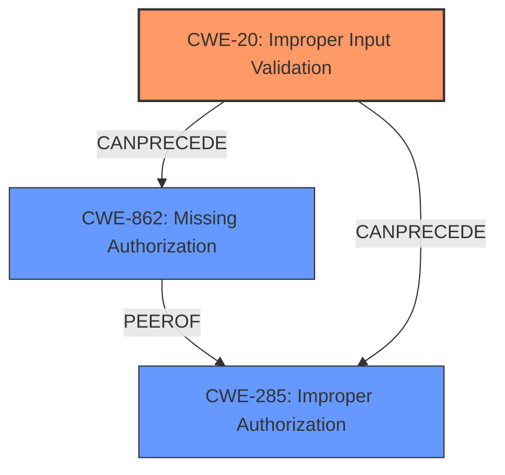

# Analysis Report for CVE-2024-31310

# Vulnerability Analysis Report: CVE-2024-31310

## Description

In newServiceInfoLocked of AutofillManagerServiceImpl.java, there is a possible way to hide an enabled Autofill service app in the Autofill service settings due to **improper input validation**. This could lead to local escalation of privilege with no additional execution privileges needed. User interaction is needed for exploitation.

## Vulnerability Description Key Phrases

- **Rootcause:** improper input validation
- **Impact:** ['hide enabled Autofill service app in settings', 'local escalation of privilege']
- **Product:** Android
- **Component:** newServiceInfoLocked of AutofillManagerServiceImpl.java

## Analysis (with Relationship Data)

# Summary

| CWE ID   | CWE Name                                                                      | Confidence | CWE Abstraction Level | CWE Vulnerability Mapping Label | CWE-Vulnerability Mapping Notes |
| :------- | :---------------------------------------------------------------------------- | :--------- | :-------------------- | :------------------------------ | :------------------------------ |
| CWE-20   | CWE-20: Improper Input Validation                                            | 0.9        | Class                 | Primary CWE                     | Allowed-with-Review           |
| CWE-862  | CWE-862: Missing Authorization                                                | 0.6        | Class                 | Secondary Candidate             | Allowed-with-Review           |
| CWE-285  | CWE-285: Improper Authorization                                               | 0.5        | Class                 | Secondary Candidate             | Discouraged                     |

## Evidence and Confidence

*   **Confidence Score:** 0.7
*   **Evidence Strength:** MEDIUM

## Relationship Analysis

The primary relationship that influenced the CWE selection is the parent-child relationship. CWE-20: Improper Input Validation is a general class, and while more specific variants might exist, the description doesn't provide enough detail to pinpoint one. CWE-862 and CWE-285 were considered because the vulnerability involves a service potentially bypassing security checks, but the root cause is the **improper input validation** itself. The abstraction level influenced the selection by favoring the Class level due to the lack of specific details pointing to a Base or Variant level weakness.



## Vulnerability Chain

The vulnerability chain starts with **improper input validation** (CWE-20) in the `newServiceInfoLocked` function. This leads to a scenario where an enabled Autofill service app can be hidden in the Autofill service settings, ultimately resulting in local escalation of privilege.

## Summary of Analysis

The initial assessment strongly points towards CWE-20 (Improper Input Validation) as the primary root cause. The vulnerability description states the issue is due to **improper input validation** in `newServiceInfoLocked` of `AutofillManagerServiceImpl.java`. This allows an attacker to potentially hide an enabled Autofill service app in the settings. The CVE Reference Links Content Summary confirms that the root cause lies in the insufficient checks performed on intent filters.

The selection of CWE-20 is primarily based on the explicit mention of **improper input validation** in the vulnerability description and the CVE summary. The relationship analysis considered that authorization issues (CWE-862, CWE-285) might arise as a consequence of the **improper input validation**, but the root cause is the initial validation failure.

The analysis also considered the privileges vs permissions guidance. While the impact involves local escalation of privilege, the root cause isn't a direct privilege assignment issue (CWE-266) or execution with unnecessary privileges (CWE-250). Instead, it stems from the **improper validation** allowing a malicious service to be registered or updated with incorrect filters.

The selected CWEs are at the optimal level of specificity given the available information. While a more specific variant of CWE-20 might exist, the current description doesn't provide enough details to pinpoint it.
The evidence from the vulnerability description is as follows: "In newServiceInfoLocked of AutofillManagerServiceImpl.java, there is a possible way to hide an enabled Autofill service app in the Autofill service settings due to **improper input validation**." The CVE summary also states: "The core issue lies in the insufficient checks performed on intent filters when setting or updating services."

Relevant CWE Information:

# Enhanced Context (25 CWEs)
The following CWEs were identified as potentially relevant to this vulnerability:

## CWE-20: Improper Input Validation
**CWE-20: Improper Input Validation** is selected as the primary CWE, because the **rootcause** of this vulnerability is **improper input validation**. This maps directly to the description of CWE-20. This is a Class-level CWE, and we allow it with review.

## CWE-862: Missing Authorization
**CWE-862: Missing Authorization** was considered because the **improper input validation** could potentially lead to bypassing authorization checks. However, the primary issue isn't the absence of authorization but the flawed validation process itself. The description for CWE-862 states: "The product does not perform an authorization check when an actor attempts to access a resource or perform an action." which isn't the core problem here.

## CWE-285: Improper Authorization
**CWE-285: Improper Authorization** was considered, because the product *does* perform some kind of authorization check, but it doesn't work properly. The primary issue isn't the absence of authorization but the flawed validation process itself. The description for CWE-285 states: "The product does not perform or incorrectly performs an authorization check when an actor attempts to access a resource or perform an action.". The usage is discouraged.

## CWE-1284: Improper Validation of Specified Quantity in Input
CWE-1284 was considered, but it is more specific to quantities. The vulnerability description doesn't specifically mention quantities, but rather **improper input validation** in general.


## CWE Relationship Analysis

Current CWEs represent these abstraction levels: .


### Vulnerability Chain Analysis

**Chain starting from CWE-1284:**
- 1284 (Improper Validation of Specified Quantity in Input) - ROOT


**Chain starting from CWE-862:**
- 862 (Missing Authorization) - ROOT


### CWE Relationship Diagram

```mermaid
graph TD
    classDef primary fill:#f96,stroke:#333,stroke-width:2px
    classDef secondary fill:#69f,stroke:#333
    classDef tertiary fill:#9e9,stroke:#333
```


*Report generated on 2025-07-13 07:22:25*
