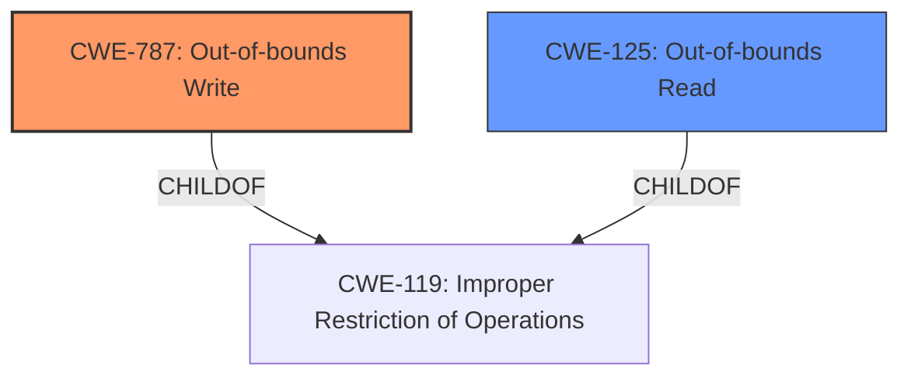

# Raw Analyzer Response for CVE-2024-31311

# Summary
| CWE ID | CWE Name | Confidence | CWE Abstraction Level | CWE Vulnerability Mapping Label | CWE-Vulnerability Mapping Notes |
|---|---|---|---|---|---|
| CWE-125 | Out-of-bounds Read | 1.0 | Base | Primary | Allowed |
| CWE-787 | Out-of-bounds Write | 1.0 | Base | Secondary | Allowed |

## Evidence and Confidence

*   **Confidence Score:** 1.0
*   **Evidence Strength:** HIGH

## Relationship Analysis
The primary relationship impacting the decision is the child-of relationship between CWE-125/CWE-787 and CWE-119 (Improper Restriction of Operations within the Bounds of a Memory Buffer). The vulnerability involves writing beyond the intended buffer, directly aligning with CWE-787. The **missing bounds check** is the root cause which leads to an out of bounds write. Since the description specifically mentions an **out of bounds write** vulnerability, CWE-787 is the most precise choice. Also because of the possibility of reading out of bounds, CWE-125 is included as a secondary candidate.

## Vulnerability Chain
The vulnerability chain starts with the **missing bounds check** which allows data to be written beyond the allocated buffer (CWE-787). This could lead to local privilege escalation.

## Summary of Analysis
The initial assessment focused on the provided vulnerability description and the additional context from the CVE reference. The description clearly states an **out of bounds write** due to a **missing bounds check** in `increment_annotation_count` function. This immediately points to CWE-787 (Out-of-bounds Write) as the primary weakness.

The relationship analysis reinforces this choice. CWE-787 is a child of CWE-119 (Improper Restriction of Operations within the Bounds of a Memory Buffer), which is a more general case of buffer overflow vulnerabilities. Since the description is specific about writing out of bounds, CWE-787 is the more accurate and specific choice. Also because of the possibility of reading out of bounds, CWE-125 is included as a secondary candidate.

The evidence from the "CVE Reference Links Content Summary" further supports this, mentioning "heap buffer overflow" as the weakness.

The selected CWEs are at the optimal level of specificity because they directly represent the **rootcause** and **weakness** described in the vulnerability report, making them the most accurate representation of the identified issue.

Relevant CWE Information:

# Enhanced Context (25 CWEs)

## CWE-125: Out-of-bounds Read
**Abstraction Level**: Base
**Similarity Score**: N/A

**Description**:
The product reads data past the end, or before the beginning, of the intended buffer. This can cause a crash, denial of service, or potentially the disclosure of sensitive information.

**Mapping Guidance**:
- Usage: Allowed
- Rationale: This CWE entry is at the Base level of abstraction, which is a preferred level of abstraction for mapping to the root causes of vulnerabilities.

## CWE-787: Out-of-bounds Write
**Abstraction Level**: Base
**Similarity Score**: N/A

**Description**:
The product writes data past the end, or before the beginning, of the intended buffer. This can cause a crash, denial of service, or potentially the execution of arbitrary code.

**Mapping Guidance**:
- Usage: Allowed
- Rationale: This CWE entry is at the Base level of abstraction, which is a preferred level of abstraction for mapping to the root causes of vulnerabilities.

## Other CWEs Considered and Rejected

*   CWE-863: Incorrect Authorization, CWE-266: Incorrect Privilege Assignment, CWE-250: Execution with Unnecessary Privileges, CWE-285: Improper Authorization: These CWEs relate to privilege and permission issues. While the impact of the vulnerability is local escalation of privilege, the root cause is not related to incorrect privilege management, but rather a buffer overflow due to a **missing bounds check**. Therefore, these CWEs are not appropriate.
*   CWE-131: Incorrect Calculation of Buffer Size: This CWE is related to calculating the buffer size incorrectly, which is not explicitly mentioned in the description. The issue is a **missing bounds check**, not necessarily an incorrect calculation.
*   CWE-20: Improper Input Validation and CWE-1284: Improper Validation of Specified Quantity in Input: While the **missing bounds check** can be seen as a form of improper input validation, the specific problem is writing beyond the buffer, making CWE-787 more accurate.
*   CWE-823: Use of Out-of-range Pointer Offset: This CWE is related to pointer offsets. It is related but the overall issue is an out of bounds write due to missing bounds check.
*   CWE-1260: Improper Handling of Overlap Between Protected Memory Ranges: This is not directly related to the **missing bounds check** and **out of bounds write** situation described.
*   CWE-367: Time-of-check Time-of-use (TOCTOU) Race Condition, CWE-362: Concurrent Execution using Shared Resource with Improper Synchronization ('Race Condition'): These CWEs involve race conditions, which are not mentioned or implied in the vulnerability description.
*   CWE-476: NULL Pointer Dereference: This CWE is not relevant as the vulnerability is about writing beyond the buffer, not dereferencing a null pointer.
*   CWE-609: Double-Checked Locking, CWE-667: Improper Locking: These CWEs are related to locking mechanisms, which are not relevant to the vulnerability.
*   CWE-703: Improper Check or Handling of Exceptional Conditions, CWE-754: Improper Check for Unusual or Exceptional Conditions: These CWEs are too high level and not specific to the **missing bounds check** that causes the **out of bounds write**.
*   CWE-129: Improper Validation of Array Index: This CWE is more specific to array indices, while the provided description is broader.
*   CWE-908: Use of Uninitialized Resource: This CWE does not apply because the vulnerability is related to writing beyond the boundaries of a buffer, not using an uninitialized resource.
*   CWE-191: Integer Underflow (Wrap or Wraparound): This CWE is not relevant because there's no mention of integer underflow or wraparound in the vulnerability description.