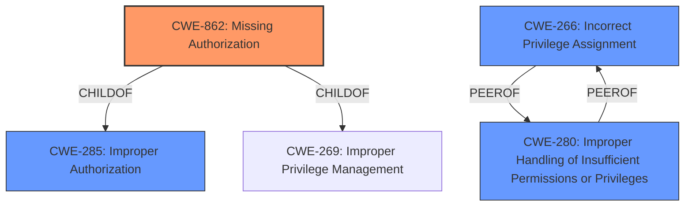

# Enhanced Analysis for CVE-2024-31318

# Summary

| CWE ID  | CWE Name                                                                | Confidence | CWE Abstraction Level | CWE Vulnerability Mapping Label | CWE-Vulnerability Mapping Notes |
| :------- | :---------------------------------------------------------------------- | :--------- | :-------------------- | :------------------------------ | :------------------------------ |
| CWE-862  | Missing Authorization                                                     | 0.9        | Class                 | Primary CWE                     | Allowed-with-Review             |
| CWE-266  | Incorrect Privilege Assignment                                          | 0.6        | Base                  | Secondary Candidate             | Allowed                         |
| CWE-280  | Improper Handling of Insufficient Permissions or Privileges             | 0.5        | Base                  | Secondary Candidate             | Allowed                         |
| CWE-285  | Improper Authorization                                                    | 0.5        | Class                 | Secondary Candidate             | Discouraged                     |

## Evidence and Confidence

*   **Confidence Score:** 0.8
*   **Evidence Strength:** HIGH

## Relationship Analysis

The primary relationship influencing the CWE selection is the hierarchical one. CWE-862 "Missing Authorization" is a Class-level CWE that describes the general absence of an authorization check. Several Base-level CWEs exist under the "Improper Authorization" Class (CWE-285) and "Improper Privilege Management" Class (CWE-269) that could have been more specific, but the evidence supports that authorization logic is completely missing as the **rootcause**.



## Vulnerability Chain

The vulnerability chain starts with the **missing permission check** in `CompanionDeviceManagerService.java`, which allows a companion device to be paired without user acceptance. This leads to a local escalation of privilege.

## Summary of Analysis

The initial analysis identified several potential CWEs, including CWE-862 (Missing Authorization), CWE-266 (Incorrect Privilege Assignment), CWE-280 (Improper Handling of Insufficient Permissions or Privileges), and CWE-285 (Improper Authorization). The evidence from the vulnerability description key phrases and CVE reference links content summary indicate that the **rootcause** is a **missing permission check**. This aligns well with CWE-862, which describes a situation where the product does not perform an authorization check when an actor attempts to access a resource or perform an action. The CVE reference summary confirms that the `onShellCommand` method was used without necessary permission checks.

The MITRE mapping guidance was reviewed, especially the section on Privileges vs Permissions. This helped differentiate between CWEs related to privilege assignment (CWE-266) and authorization checks (CWE-862, CWE-285). Since the vulnerability stems from the complete absence of an authorization check, CWE-862 is the most appropriate choice.

The other CWEs were considered but not selected as the primary CWE:

*   CWE-266 (Incorrect Privilege Assignment): While privilege escalation is an impact, the root cause is not an incorrect assignment of privileges but rather the lack of an authorization check.
*   CWE-280 (Improper Handling of Insufficient Permissions or Privileges): This CWE suggests that the product handles insufficient privileges incorrectly, but the vulnerability is due to a complete lack of a check.
*   CWE-285 (Improper Authorization): This CWE describes a scenario where an authorization check is performed incorrectly, but the evidence indicates that no check is performed at all.

Therefore, based on the provided evidence and the MITRE mapping guidance, CWE-862 is the most accurate and specific representation of the vulnerability's root cause.

Relevant CWE Information:

*   **CWE-862: Missing Authorization**
    *   **Technical Explanation:** The `CompanionDeviceManagerService.java` component lacks an authorization check before pairing a companion device, allowing the action to be performed without proper validation.
    *   **Security Implications:** An attacker can pair a companion device without user consent, leading to potential unauthorized access and control.
    *   **Parent-Child Relationships:** CWE-862 is a Class-level CWE, and more specific Base-level CWEs could exist, but the **missing permission check** is best described by CWE-862.
    *   **MITRE Mapping Guidance:** The guidance suggests using CWE-862 when authorization logic is completely missing, aligning with the vulnerability description.
*   **CWE-266: Incorrect Privilege Assignment**
    *   **Technical Explanation:** The system might be assigning incorrect privileges to the companion device, which is a possible but less direct cause than the **missing permission check** itself.
    *   **Security Implications:** This could lead to the companion device having more privileges than intended, potentially enabling unauthorized actions.
    *   **Parent-Child Relationships:** CWE-266 is a Base-level CWE.
    *   **MITRE Mapping Guidance:** The guidance suggests CWE-266 is for misconfigured roles but the **rootcause** is the **missing permission check**.
*   **CWE-280: Improper Handling of Insufficient Permissions or Privileges**
    *   **Technical Explanation:** The component does not properly handle situations where it lacks sufficient privileges, but this is a consequence of the **missing permission check**, not the primary cause.
    *   **Security Implications:** This could lead to the system entering an invalid state or performing unexpected actions when privileges are insufficient.
    *   **Parent-Child Relationships:** CWE-280 is a Base-level CWE.
    *   **MITRE Mapping Guidance:** The guidance suggests using CWE-280 when insufficient privileges are handled incorrectly.
*   **CWE-285: Improper Authorization**
    *   **Technical Explanation:** The authorization check, if present, is not correctly implemented, allowing unauthorized access. However, the vulnerability description indicates that no check is performed, making this less accurate.
    *   **Security Implications:** This could allow unauthorized users or devices to access resources or perform actions they should not be able to.
    *   **Parent-Child Relationships:** CWE-285 is a Class-level CWE.
    *   **MITRE Mapping Guidance:** The guidance suggests using CWE-285 when the authorization logic is flawed.


## CWE Relationship Analysis

Current CWEs represent these abstraction levels: .


### Vulnerability Chain Analysis

**Chain starting from CWE-280:**
- 280 (Improper Handling of Insufficient Permissions or Privileges ) - ROOT


**Chain starting from CWE-862:**
- 862 (Missing Authorization) - ROOT


### CWE Relationship Diagram

```mermaid
graph TD
    classDef primary fill:#f96,stroke:#333,stroke-width:2px
    classDef secondary fill:#69f,stroke:#333
    classDef tertiary fill:#9e9,stroke:#333
```