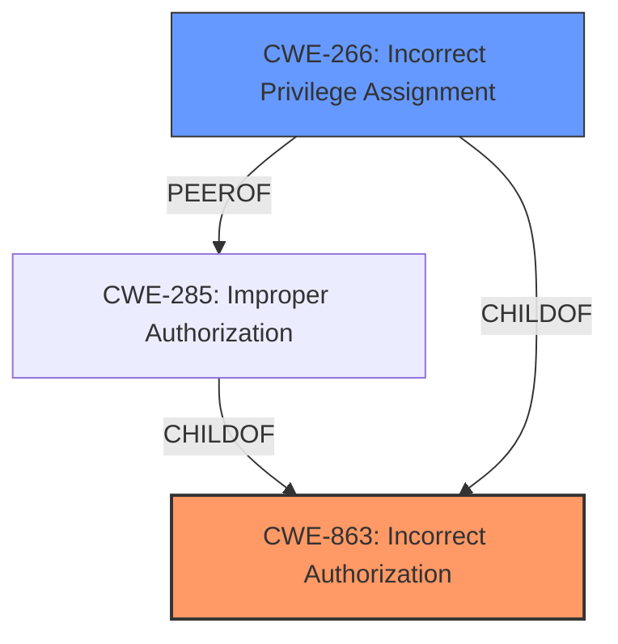

# Enhanced Analysis for CVE-2024-31325

# Summary
| CWE ID | CWE Name | Confidence | CWE Abstraction Level | CWE Vulnerability Mapping Label | CWE-Vulnerability Mapping Notes |
|---|---|---|---|---|---|
| CWE-863 | Incorrect Authorization | 0.9 | Class | Primary CWE | Allowed-with-Review |
| CWE-266 | Incorrect Privilege Assignment | 0.7 | Base | Secondary Candidate | Allowed |

## Evidence and Confidence

*   **Confidence Score:** 0.8
*   **Evidence Strength:** HIGH

## Relationship Analysis
The primary relationship influencing the decision is the hierarchical relationship between CWE-863 (Incorrect Authorization) as a Class and its potential Base-level children. The analysis considered CWE-266 (Incorrect Privilege Assignment) as a potential more specific mapping, but the evidence suggests a broader authorization issue. The guidance distinguishes between privilege and permission issues, with the root cause being a logic error suggesting an authorization flaw.



## Vulnerability Chain
The vulnerability chain starts with a **logic error in the code** leading to **incorrect authorization**, which results in local escalation of privilege and the potential to reveal images across users' data.

## Summary of Analysis
The initial analysis focused on identifying the root cause of the vulnerability based on the provided evidence. The key phrase "**logic error in the code**" pointed towards a potential authorization issue. The CVE Reference Links Content Summary confirmed that the vulnerability involves improper handling of user IDs when resolving image URIs, which directly relates to authorization. The high retriever score for CWE-863 (Incorrect Authorization) further supports this classification.

While CWE-266 (Incorrect Privilege Assignment) was considered, the evidence suggests that the issue is not merely about assigning the wrong privileges but about a broader failure in the authorization process that allows unauthorized access to resources. The decision to map CWE-863 is based on the understanding that the authorization check is present but flawed due to the **logic error**, leading to an incorrect determination of access rights.

Relevant CWE Information:

# Enhanced Context (25 CWEs)
The following CWEs were identified as potentially relevant to this vulnerability:

## Vulnerability Description
In multiple locations, there is a possible way to reveal images across users data due to a **logic error in the code**. This could lead to local escalation of privilege with no additional execution privileges needed. User interaction is not needed for exploitation.

### Vulnerability Description Key Phrases
- **rootcause:** **logic error in the code**
- **impact:** local escalation of privilege and reveal images across users data
- **component:** multiple locations

## CVE Reference Links Content Summary
Based on the provided information, here's an analysis of CVE-2024-31325:

**1. Verification:**
   - The provided content directly references CVE-2024-31325 within the Android Security Bulletin for June 2024.
   - The vulnerability is categorized under the "Framework" component.
   - A link to the specific AOSP commit that addresses the issue is also provided in the bulletin. This confirms the relevance of the content to the CVE.

**2. Root Cause of Vulnerability:**

   - The vulnerability lies in how message/conversation image URIs are resolved. The fix involves ensuring they are resolved with the correct user ID.
   - The commit message "Resolve message/conversation image Uris with the correct user id" describes the root cause.

**3. Weaknesses/Vulnerabilities Present:**

   - The core weakness is an issue with the handling of user IDs when resolving image URIs in message/conversation contexts. This suggests the possibility that incorrect user context may lead to unintended access or privilege escalation.
   - The commit message and the fact it is an "Elevation of Privilege" vulnerability suggests the incorrect user context may allow access to resources the user does not have access to, or actions the user is not authorized to perform.

**4. Impact of Exploitation:**

   - The vulnerability is classified as an "Elevation of Privilege (EoP)".
   - Exploiting this vulnerability could lead to a local escalation of privilege without needing any additional execution privileges.

**5. Attack Vectors:**

   - The attack vector is local, meaning an attacker would need to have some form of local access to the device to trigger this issue.
   - The exploit would be related to manipulating or triggering the handling of message/conversation image URIs in such a way that incorrect user IDs are used, thus leading to privilege escalation.

**6. Required Attacker Capabilities/Position:**

   - The attacker would require local access to the device.
   - The attacker would need to be able to trigger the code paths that handle message/conversation image URIs, and would need to be able to influence the user id associated with this context.
   - No additional execution privileges are needed to trigger the vulnerability, meaning it would be exploitable by a regular user or an app with minimal permissions.

**Additional Details:**
  - The Android Security Bulletin categorizes this vulnerability as "High" severity.
  - The fix was implemented in AOSP versions 12, 12L, 13, and 14.
  - A test for this fix was also introduced (ExpandableNotificationRowTest).

In summary, CVE-2024-31325 is a High severity EoP vulnerability within the Android framework caused by improper handling of user IDs when resolving message/conversation image URIs. It can be exploited locally without additional execution privileges, and the fix involves correcting the user ID resolution logic and has been applied to several versions of Android.

## Retriever Results

### Top Combined Results

| Rank | CWE ID | Name | Abstraction | Usage  | Retrievers | Individual Scores |
|------|--------|------|-------------|-------|------------|-------------------|
| 1 | 131 | Incorrect Calculation of Buffer Size | Base | Allowed | sparse | 0.337 |
| 2 | 862 | Missing Authorization | Class | Allowed-with-Review | sparse | 0.335 |
| 3 | 908 | Use of Uninitialized Resource | Base | Allowed | sparse | 0.334 |
| 4 | 667 | Improper Locking | Class | Allowed-with-Review | sparse | 0.329 |
| 5 | 1021 | Improper Restriction of Rendered UI Layers or Frames | Base | Allowed | sparse | 0.318 |
| 6 | 362 | Concurrent Execution using Shared Resource with Improper Synchronization ('Race Condition') | Class | Allowed-with-Review | sparse | 0.316 |
| 7 | 415 | Double Free | Variant | Allowed | sparse | 0.312 |
| 8 | 662 | Improper Synchronization | Class | Discouraged | sparse | 0.311 |
| 9 | 250 | Execution with Unnecessary Privileges | Base | Allowed | dense | 0.538 |
| 10 | 266 | Incorrect Privilege Assignment | Base | Allowed | graph | 0.002 |

CWE-863 (Incorrect Authorization) is selected because it aligns with the **logic error** leading to privilege escalation due to improper handling of user IDs. CWE-266 is a possible secondary candidate because the root cause could be due to privilege misconfiguration, but the information is too vague. Other CWEs were considered but were less relevant due to not aligning with the root cause of **logic error in the code** and the resulting privilege escalation.

Here's a summary of other considered CWEs and why they were not selected:

*   CWE-131 (Incorrect Calculation of Buffer Size): Not applicable as the vulnerability is not related to buffer size calculations.
*   CWE-862 (Missing Authorization): Not applicable because authorization exists, but is **incorrect**.
*   CWE-908 (Use of Uninitialized Resource): Not applicable as the vulnerability is not related to uninitialized resources.
*   CWE-667 (Improper Locking): Not applicable as the vulnerability is not related to locking mechanisms.
*   CWE-1021 (Improper Restriction of Rendered UI Layers or Frames): Not applicable as the vulnerability is not related to UI layer restrictions.
*   CWE-362 (Concurrent Execution using Shared Resource with Improper Synchronization ('Race Condition')): Not applicable as the vulnerability is not related to concurrent execution or race conditions.
*   CWE-415 (Double Free): Not applicable as the vulnerability is not related to memory management or double freeing.
*   CWE-662 (Improper Synchronization): Not applicable as the vulnerability is


## CWE Relationship Analysis

Current CWEs represent these abstraction levels: .


### Vulnerability Chain Analysis

**Chain starting from CWE-662:**
- 662 (Improper Synchronization) - ROOT


**Chain starting from CWE-863:**
- 863 (Incorrect Authorization) - ROOT


### CWE Relationship Diagram

```mermaid
graph TD
    classDef primary fill:#f96,stroke:#333,stroke-width:2px
    classDef secondary fill:#69f,stroke:#333
    classDef tertiary fill:#9e9,stroke:#333
```