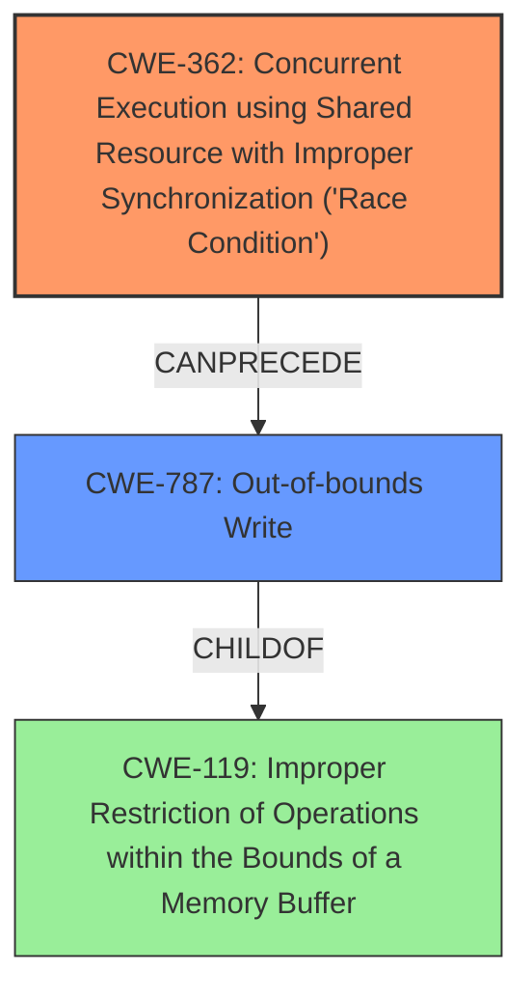

# Analysis Report for CVE-2024-31327

# Vulnerability Analysis Report: CVE-2024-31327

## Description

In multiple functions of MessageQueueBase.h, there is a possible **out of bounds write** due to a **race condition**. This could lead to local escalation of privilege with no additional execution privileges needed. User interaction is not needed for exploitation.

## Vulnerability Description Key Phrases

- **Rootcause:** race condition
- **Weakness:** out of bounds write
- **Impact:** local escalation of privilege
- **Component:** multiple functions of MessageQueueBase.h

## Analysis (with Relationship Data)

# Summary

| CWE ID  | CWE Name                                                                                  | Confidence | CWE Abstraction Level | CWE Vulnerability Mapping Label | CWE-Vulnerability Mapping Notes |
| :------- | :----------------------------------------------------------------------------------------- | :--------- | :-------------------- | :------------------------------ | :------------------------------ |
| CWE-362  | Concurrent Execution using Shared Resource with Improper Synchronization ('Race Condition') | 0.9        | Class                 | Primary                         | Allowed-with-Review             |
| CWE-787  | Out-of-bounds Write                                                                        | 0.8        | Base                  | Secondary                       | Allowed                         |

## Evidence and Confidence

*   **Confidence Score:** 0.85
*   **Evidence Strength:** HIGH

## Relationship Analysis

The primary weakness is a **race condition** (CWE-362), which can lead to an **out-of-bounds write** (CWE-787). CWE-362 is a Class, while CWE-787 is a Base. CWE-787 is a child of CWE-119 (Improper Restriction of Operations within the Bounds of a Memory Buffer). The race condition enables the out-of-bounds write.



## Vulnerability Chain

The vulnerability chain starts with a **race condition** (CWE-362). This **race condition** leads to an **out-of-bounds write** (CWE-787), which results in local escalation of privilege.

CWE-362 (Race Condition) -> CWE-787 (Out-of-bounds Write) -> Local Escalation of Privilege

## Summary of Analysis

The initial analysis identified a **race condition** leading to an **out-of-bounds write**. The primary CWE is CWE-362 because the **race condition** is the root cause that allows the **out-of-bounds write** to occur. The evidence from the vulnerability description and CVE reference links confirms this. The graph relationships show how these CWEs are connected, with CWE-362 potentially leading to CWE-787. The selected CWEs are at an appropriate level of specificity, with CWE-362 being a Class and CWE-787 being a Base.

**Evidence:**

*   Vulnerability Description Key Phrases:
    *   **rootcause:** **race condition**
    *   **weakness:** **out of bounds write**
*   CVE Reference Links Content Summary:
    *   "The vulnerability lies in the `libfmq` component...related to how pointers are handled during checks...suggests a potential issue with how the pointer values were previously used, possibly leading to an incorrect evaluation of the test."
    *   "...this vulnerability could lead to **local escalation of privilege** with no additional execution privileges needed."

**CWE Selection Justification:**

*   **CWE-362: Concurrent Execution using Shared Resource with Improper Synchronization ('Race Condition')**

    *   The vulnerability description explicitly mentions a **race condition** as the root cause.
    *   The CVE reference summary confirms the concurrency issue with pointer handling.
    *   The security implication is potential data corruption or unexpected behavior due to unsynchronized access.
    *   CWE-362 is a Class, and is the primary root cause weakness.
    *   The retriever results list CWE-362 with a high score.
*   **CWE-787: Out-of-bounds Write**

    *   The vulnerability description explicitly mentions an **out-of-bounds write** as a weakness.
    *   The CVE reference summary alludes to potential invalid memory access.
    *   The security implication is memory corruption, potentially leading to code execution or privilege escalation.
    *   CWE-787 is a Base.
    *   CWE-787 is a child of CWE-119.

**CWEs Considered But Not Used:**

*   CWE-667 (Improper Locking): While locking issues can contribute to **race conditions**, the description doesn't specify a locking problem directly, making CWE-362 a more precise fit.
*   CWE-367 (Time-of-check Time-of-use (TOCTOU) Race Condition): TOCTOU is a specific type of **race condition**. Without more details on how the resource's state changes, CWE-362 is a better fit.
*   CWE-863 (Incorrect Authorization): While privilege escalation is the impact, the root cause isn't related to authorization logic, making this CWE irrelevant.
*   CWE-476 (NULL Pointer Dereference): The description doesn't mention dereferencing a null pointer, making this CWE irrelevant.
*   CWE-131 (Incorrect Calculation of Buffer Size): While an **out-of-bounds write** is present, there is no mention of a buffer size miscalculation.


## CWE Relationship Analysis

Current CWEs represent these abstraction levels: .


### Vulnerability Chain Analysis

**Chain starting from CWE-863:**
- 863 (Incorrect Authorization) - ROOT


**Chain starting from CWE-476:**
- 476 (NULL Pointer Dereference) - ROOT


### CWE Relationship Diagram

```mermaid
graph TD
    classDef primary fill:#f96,stroke:#333,stroke-width:2px
    classDef secondary fill:#69f,stroke:#333
    classDef tertiary fill:#9e9,stroke:#333
```


*Report generated on 2025-07-13 07:25:25*
