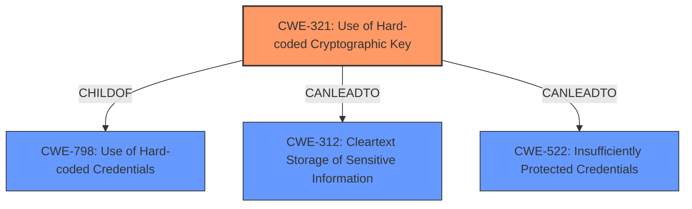

# Analysis for CVE-2024-31415

# Summary
| CWE ID | CWE Name | Confidence | CWE Abstraction Level | CWE Vulnerability Mapping Label | CWE-Vulnerability Mapping Notes |
|---|---|---|---|---|---|
| CWE-321 | Use of Hard-coded Cryptographic Key | 0.9 | Variant | Allowed | Primary CWE: The encryption keys were **insecurely stored** on the host machine. |
| CWE-312 | Cleartext Storage of Sensitive Information | 0.7 | Base | Allowed | Secondary Candidate: Keys were not properly protected. |
| CWE-522 | Insufficiently Protected Credentials | 0.6 | Class | Allowed-with-Review | Secondary Candidate: Because the crypto keys were **insecurely stored**. |

## Evidence and Confidence

*   **Confidence Score:** 0.8
*   **Evidence Strength:** HIGH

## Relationship Analysis
The primary CWE is CWE-321, which is a Variant of CWE-798 (Use of Hard-coded Credentials). CWE-312 and CWE-522 are also related as potential consequences of the insecure storage. The selection of CWE-321 as the primary weakness is influenced by its specificity and direct relevance to the **root cause**, which is the use of hard-coded cryptographic keys.

## Vulnerability Chain
The vulnerability chain starts with the **insecure storage of encryption keys** (CWE-321). This can lead to **cleartext storage of sensitive information** (CWE-312) if the keys are directly accessible. It also results in **insufficient protection of credentials** (CWE-522) because the encryption keys, which are a form of credential, are not adequately secured. The final impact is the ability to change or remove server configurations.

## Summary of Analysis
The analysis is primarily based on the provided evidence, which indicates that the encryption keys were **insecurely stored**.

The primary CWE is CWE-321 (Use of Hard-coded Cryptographic Key) because the vulnerability description mentions that the keys used for encryption were **insecurely stored**. This aligns with the definition of CWE-321, which focuses on the risks associated with using hard-coded cryptographic keys. This is the root cause of the vulnerability.

CWE-312 (Cleartext Storage of Sensitive Information) is considered because the keys were not properly protected. CWE-522 (Insufficiently Protected Credentials) is considered because the encryption keys were **insecurely stored**, which directly relates to insufficient protection of these credentials.

The selection of CWE-321 is based on the fact that it accurately represents the **root cause** of the vulnerability, which is the use of **insecurely stored encryption keys**. The abstraction level (Variant) is appropriate because it provides a specific characterization of the weakness.

Relevant CWE Information:
# Enhanced Context (25 CWEs)
The following CWEs were identified as potentially relevant to this vulnerability:

## CWE-1391: Use of Weak Credentials
**Abstraction Level**: Class
**Similarity Score**: 0.74
**Source**: dense

**Description**:
The product uses weak credentials (such as a default key or hard-coded password) that can be calculated, derived, reused, or guessed by an attacker.

**Mapping Guidance**:
- Usage: Allowed-with-Review
- Rationale: This CWE entry is a Class and might have Base-level children that would be more appropriate

CWE-1391 isn't suitable because the keys are not described as weak in the sense of being easily guessed, but rather **insecurely stored**.

## CWE-311: Missing Encryption of Sensitive Data
**Abstraction Level**: Class
**Similarity Score**: 0.74
**Source**: dense

**Description**:
The product does not encrypt sensitive or critical information before storage or transmission.

**Mapping Guidance**:
- Usage: Discouraged
- Rationale: CWE-311 is high-level with more precise children available. It is a level-1 Class (i.e., a child of a Pillar).

CWE-311 is not suitable because the product *does* encrypt the data; the problem is with the **insecure storage** of the keys.

## CWE-321: Use of Hard-coded Cryptographic Key
**Abstraction Level**: Variant
**Similarity Score**: 0.73
**Source**: dense

**Description**:
The use of a hard-coded cryptographic key significantly increases the possibility that encrypted data may be recovered.

**Mapping Guidance**:
- Usage: Allowed
- Rationale: This CWE entry is at the Variant level of abstraction, which is a preferred level of abstraction for mapping to the root causes of vulnerabilities.

CWE-321 is a good fit because the encryption keys were **insecurely stored**.

## CWE-312: Cleartext Storage of Sensitive Information
**Abstraction Level**: Base
**Similarity Score**: 0.73
**Source**: dense

**Description**:
The product stores sensitive information in cleartext within a resource that might be accessible to another control sphere.

**Mapping Guidance**:
- Usage: Allowed
- Rationale: This CWE entry is at the Base level of abstraction, which is a preferred level of abstraction for mapping to the root causes of vulnerabilities.

CWE-312 is a possible fit because **insecurely stored** keys could be equivalent to cleartext storage if the storage method provides no real protection.

## CWE-798: Use of Hard-coded Credentials
**Abstraction Level**: Base
**Similarity Score**: 0.72
**Source**: dense

**Description**:
The product contains hard-coded credentials, such as a password or cryptographic key.

**Mapping Guidance**:
- Usage: Allowed
- Rationale: This CWE entry is at the Base level of abstraction, which is a preferred level of abstraction for mapping to the root causes of vulnerabilities.

CWE-798 is related, but CWE-321 is more specific.

## CWE-1394: Use of Default Cryptographic Key
**Abstraction Level**: Base
**Similarity Score**: 0.72
**Source**: dense

**Description**:
The product uses a default cryptographic key for potentially critical functionality.

**Mapping Guidance**:
- Usage: Allowed
- Rationale: This CWE entry is at the Base level of abstraction, which is a preferred level of abstraction for mapping to the root causes of vulnerabilities.

CWE-1394 is not applicable because the description doesn't mention that the keys are default keys.

## CWE-807: Reliance on Untrusted Inputs in a Security Decision
**Abstraction Level**: Base
**Similarity Score**: 0.71
**Source**: dense

**Description**:
The product uses a protection mechanism that relies on the existence or values of an input, but the input can be modified by an untrusted actor in a way that bypasses the protection mechanism.

**Mapping Guidance**:
- Usage: Allowed
- Rationale: This CWE entry is at the Base level of abstraction, which is a preferred level of abstraction for mapping to the root causes of vulnerabilities.

CWE-807 is not relevant because the issue is not about relying on untrusted inputs.

## CWE-1392: Use of Default Credentials
**Abstraction Level**: Base
**Similarity Score**: 0.71
**Source**: dense

**Description**:
The product uses default credentials (such as passwords or cryptographic keys) for potentially critical functionality.

**Mapping Guidance**:
- Usage: Allowed
- Rationale: This CWE entry is at the Base level of abstraction, which is a preferred level of abstraction for mapping to the root causes of vulnerabilities.

CWE-1392 is not applicable because the description doesn't mention that the credentials are default.

## CWE-303: Incorrect Implementation of Authentication Algorithm
**Abstraction Level**: Base
**Similarity Score**: 0.71
**Source**: dense

**Description**:
The requirements for the product dictate the use of an established authentication algorithm, but the implementation of the algorithm is incorrect.

**Mapping Guidance**:
- Usage: Allowed
- Rationale: This CWE entry is at the Base level of abstraction, which is a preferred level of abstraction for mapping to the root causes of vulnerabilities.

CWE-303 is not applicable because the description doesn't say anything about the authentication algorithm.

## CWE-3