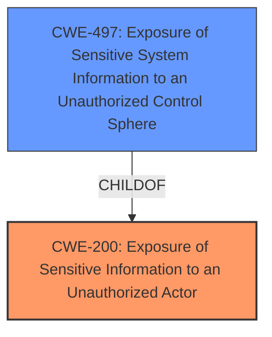

# Analysis Report for CVE-2024-31490

# Vulnerability Analysis Report: CVE-2024-31490

## Description

An exposure of sensitive information to an unauthorized actor in Fortinet FortiSandbox version 4.4.0 through 4.4.4 and 4.2.0 through 4.2.6 and 4.0.0 through 4.0.5 and 3.2.2 through 3.2.4 and 3.1.5 allows attacker to information disclosure via HTTP get requests.

## Vulnerability Description Key Phrases

- **Impact:** ['exposure of sensitive information to an unauthorized actor', 'information disclosure']
- **Vector:** HTTP get requests
- **Attacker:** attacker
- **Product:** Fortinet FortiSandbox
- **Version:** 4.4.0 through 4.4.4 and 4.2.0 through 4.2.6 and 4.0.0 through 4.0.5 and 3.2.2 through 3.2.4 and 3.1.5

## Analysis (with Relationship Data)

# Summary
| CWE ID | CWE Name | Confidence | CWE Abstraction Level | CWE Vulnerability Mapping Label | CWE-Vulnerability Mapping Notes |
|---|---|---|---|---|---|
| CWE-200 | Exposure of Sensitive Information to an Unauthorized Actor | 1.0 | Class | Primary | Allowed-with-Review |
| CWE-497 | Exposure of Sensitive System Information to an Unauthorized Control Sphere | 0.7 | Base | Secondary | Allowed |

## Evidence and Confidence

*   **Confidence Score:** 0.85
*   **Evidence Strength:** HIGH

## Relationship Analysis
The primary relationship considered was that of parent and child. CWE-200 is a class-level CWE, and several more specific CWEs could potentially apply. However, the information available doesn't give enough context to confidently select a more specific variant. CWE-497 is a base CWE and a potential child of CWE-668.



## Vulnerability Chain
The vulnerability chain starts with **improper access control**, leading to **sensitive information disclosure** via HTTP GET requests. The root cause is the **exposure of sensitive information** due to **improper access control**.

## Summary of Analysis
The initial analysis focused on the **exposure of sensitive information** due to the **lack of proper access control**, leading to information disclosure. The vulnerability description and CVE reference summary clearly indicate that an attacker can gain unauthorized access to sensitive information via HTTP GET requests.

CWE-200 (Exposure of Sensitive Information to an Unauthorized Actor) is a strong candidate because the vulnerability description explicitly mentions "exposure of sensitive information to an unauthorized actor". However, CWE-200 is a Class-level CWE, and the Retriever suggests it is often misused. The summary suggests this is the root cause of the vulnerability: "Root cause of vulnerability: An exposure of sensitive information vulnerability in FortiSandbox".

CWE-497 (Exposure of Sensitive System Information to an Unauthorized Control Sphere) is also a possibility, as the logs contain sensitive *system* information. The description provided indicates authenticated users with read-only permissions can download logs that include sensitive files, which aligns with the description of CWE-497.

I am choosing CWE-200 as the primary CWE due to the explicit mention in the vulnerability description, and I will include CWE-497 as a secondary CWE.

Relevant CWE Information:

*   **CWE-200 (Exposure of Sensitive Information to an Unauthorized Actor)**: This CWE is chosen as the primary weakness because the vulnerability description clearly states "An **exposure of sensitive information to an unauthorized actor**". The **impact** is also listed as "information disclosure". The CVE reference summary also states: "Root cause of vulnerability: An **exposure of sensitive information** vulnerability in FortiSandbox." This clearly matches the description of CWE-200. However, it's a Class-level CWE, so I've looked for more specific options. The mapping guidance discourages using it, but the explicit match in the description makes it the most appropriate initial choice.
*   **CWE-497 (Exposure of Sensitive System Information to an Unauthorized Control Sphere)**: This CWE is included because the sensitive information being exposed appears to be system-related (diagnostic logs). The description says, "Specifically, authenticated users with read-only permissions can download diagnostic logs containing sensitive files via HTTP GET requests." This suggests the information relates to the system's operation. The relationship to CWE-668 was considered, but CWE-497 is more specific.
*   **CWE-532 (Insertion of Sensitive Information into Log File)**: This was considered, as the logs are the vector of information disclosure. However, the root cause is not that the information is being logged, but that it is being exposed.
*   **CWE-306 (Missing Authentication for Critical Function)**: This was considered because access to the logs should require proper authentication/authorization. However, the description indicates that the attacker needs to be authenticated with at least read-only access. This implies the problem isn't a *missing* authentication, but **improper access control** for authenticated users with read-only access.
*   **CWE-639 (Authorization Bypass Through User-Controlled Key)**: This was considered as there is an authorization issue. The description says, "Weaknesses/vulnerabilities present: Improper access control leading to sensitive information disclosure. Specifically, authenticated users with read-only permissions can download diagnostic logs containing sensitive files via HTTP GET requests."
*   **CWE-22 (Improper Limitation of a Pathname to a Restricted Directory ('Path Traversal'))** and **CWE-23 (Relative Path Traversal)** These were considered because the vulnerability involves HTTP GET requests, which might involve file paths. However, the root cause is not related to path traversal, but **exposure of information**.

I am confident that CWE-200 is the most appropriate primary CWE and CWE-497 is a valid secondary CWE.


## CWE Relationship Analysis

Current CWEs represent these abstraction levels: .


### Vulnerability Chain Analysis

**Chain starting from CWE-639:**
- 639 (Authorization Bypass Through User-Controlled Key) - ROOT


**Chain starting from CWE-22:**
- 22 (Improper Limitation of a Pathname to a Restricted Directory ('Path Traversal')) - ROOT


### CWE Relationship Diagram

```mermaid
graph TD
    classDef primary fill:#f96,stroke:#333,stroke-width:2px
    classDef secondary fill:#69f,stroke:#333
    classDef tertiary fill:#9e9,stroke:#333
```


*Report generated on 2025-07-13 07:27:25*
