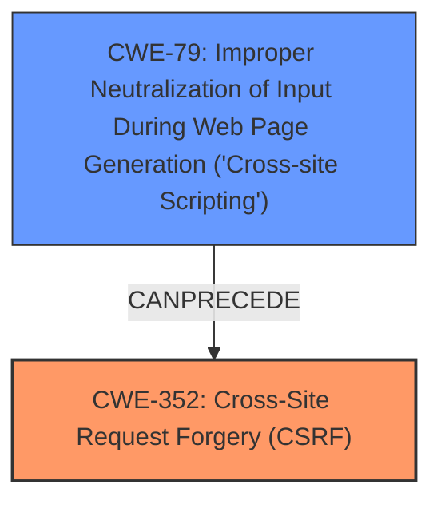

# Raw Analyzer Response for CVE-2024-31612

# Summary
| CWE ID | CWE Name | Confidence | CWE Abstraction Level | CWE Vulnerability Mapping Label | CWE-Vulnerability Mapping Notes |
|---|---|---|---|---|---|
| CWE-352 | Cross-Site Request Forgery (CSRF) | 1.0 | Compound | Primary | Allowed |
| CWE-79 | Improper Neutralization of Input During Web Page Generation ('Cross-site Scripting') | 1.0 | Base | Secondary | Allowed |

## Evidence and Confidence

*   **Confidence Score:** 1.0
*   **Evidence Strength:** HIGH

## Relationship Analysis
The primary weakness is **CWE-352: Cross-Site Request Forgery (CSRF)**, a compound weakness. The vulnerability description explicitly states a **lack of CSRF protection**. The description also mentions a **XSS vulnerability (CWE-79)**, which can be used in conjunction with the CSRF vulnerability to access administrator information. Therefore, **CWE-79** is included as a secondary weakness.

## Vulnerability Chain
The vulnerability chain starts with the **lack of CSRF protection (CWE-352)**. An attacker can exploit this by crafting a malicious request that, when triggered by an authenticated user, performs unintended actions. The presence of a **XSS vulnerability (CWE-79)** allows the attacker to potentially steal cookies or inject malicious JavaScript, which further facilitates the CSRF attack, ultimately leading to unauthorized access of administrator information.
  - Root Cause: **CWE-352: Cross-Site Request Forgery (CSRF)**
  - Contributing Factor: **CWE-79: Improper Neutralization of Input During Web Page Generation ('Cross-site Scripting')**
  - Impact: Access administrator information

## Summary of Analysis
The analysis is based on the explicit statements in the vulnerability description, which identifies a **lack of CSRF protection** and an **XSS vulnerability**. The key phrases point directly to **CWE-352 (CSRF)** and **CWE-79 (XSS)**. The relationship analysis confirms that these two weaknesses can be chained together, where XSS can be used to facilitate a CSRF attack. The selection of CWEs is based on direct evidence and the optimal level of specificity.

The evidence for **CWE-352** is the explicit mention of "Cross Site Request Forgery (CSRF)" and "lack of CSRF protection."
The evidence for **CWE-79** is the explicit mention of "XSS vulnerability" and "cross-site scripting."

The retriever results strongly support **CWE-352** and **CWE-79**, making them the most suitable choices.

Other CWEs considered but not selected:
*   CWE-434, CWE-89, CWE-116, CWE-942, CWE-1004, CWE-425, CWE-453: These CWEs were suggested by the retriever but were not directly supported by the vulnerability description. While they could potentially be related, there isn't enough explicit evidence to justify including them.
*   CWE-918, CWE-601: These CWEs are related to request forgery and redirection, but they are not the primary issue described in the vulnerability.
Relevant CWE Information: