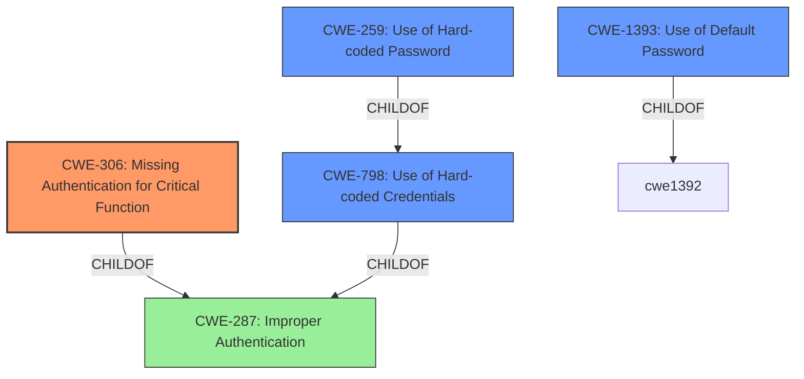

# Analysis for CVE-2024-31800

# Summary
| CWE ID | CWE Name | Confidence | CWE Abstraction Level | CWE Vulnerability Mapping Label | CWE-Vulnerability Mapping Notes |
|---|---|---|---|---|---|
| CWE-306 | Missing Authentication for Critical Function | 0.9 | Base | Primary CWE | Allowed |
| CWE-798 | Use of Hard-coded Credentials | 0.7 | Base | Secondary Candidate | Allowed |
| CWE-259 | Use of Hard-coded Password | 0.6 | Variant | Secondary Candidate | Allowed |
| CWE-1393 | Use of Default Password | 0.6 | Base | Secondary Candidate | Allowed |

## Evidence and Confidence

*   **Confidence Score:** 0.8
*   **Evidence Strength:** HIGH

## Relationship Analysis
The primary CWE selected is CWE-306 (Missing Authentication for Critical Function), as the vulnerability stems from the **lack of authentication** on the UART debugging port, allowing unauthorized access. CWE-798 (Use of Hard-coded Credentials), CWE-259 (Use of Hard-coded Password), and CWE-1393 (Use of Default Password) are considered as secondary because the provided information indicates the presence of either weak or hardcoded credentials, which are related to the authentication bypass.

## Vulnerability Chain
The vulnerability chain starts with the **lack of authentication** on the UART Debugging Port (CWE-306). This allows an attacker with physical access to bypass the login prompt. The presence of **weak or hard-coded credentials** (CWE-798, CWE-259, CWE-1393) further facilitates gaining privileged command shell access.

## Summary of Analysis
The primary vulnerability is the **authentication bypass** due to the **lack of authentication** on the UART Debugging Port, which is best represented by CWE-306. The evidence for this is present in the "Vulnerability Description Key Phrases" and the "CVE Reference Links Content Summary" section, which explicitly states the **lack of authentication** on the UART port. The use of weak or hard-coded credentials, as indicated by the retriever results and CVE details, are contributing factors, hence the selection of CWE-798, CWE-259, and CWE-1393 as secondary. The selection of CWE-306 is at the base level of abstraction, providing sufficient specificity for the vulnerability.

Relevant CWE Information:

CWE-306: Missing Authentication for Critical Function
The product does not perform any authentication for functionality that requires a provable user identity or consumes a significant amount of resources. This aligns directly with the vulnerability description where physical access to the UART debugging port allows bypassing authentication and gaining a privileged command shell.

CWE-798: Use of Hard-coded Credentials
The product contains hard-coded credentials, such as a password or cryptographic key. The CVE summary mentions the use of the same root password across multiple devices, which could be a hardcoded credential.

CWE-259: Use of Hard-coded Password
The product contains a hard-coded password that is used for authentication or other security purposes. This is a specific instance of CWE-798.

CWE-1393: Use of Default Password
The product is shipped with a default password that is intended to be changed by the user, but is not. This is another specific instance of CWE-798.

CWE-287: Improper Authentication was considered but not used as the description is more accurately represented by the more specific CWE-306 "Missing Authentication for Critical Function".