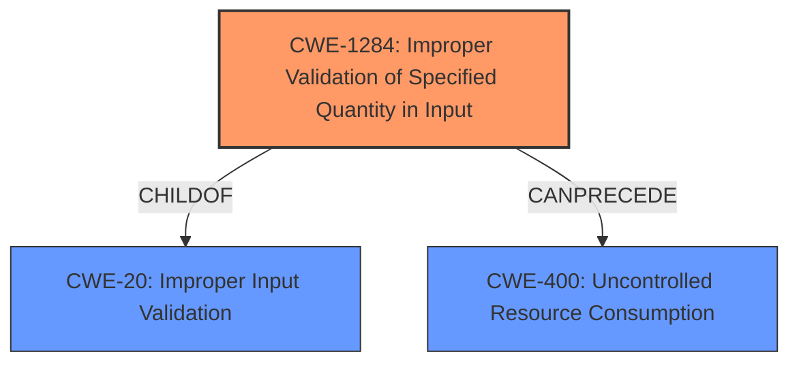

# Analysis Report for CVE-2024-32007

# Vulnerability Analysis Report: CVE-2024-32007

## Description

An **improper input validation** of the p2c parameter in the Apache CXF JOSE code before 4.0.5, 3.6.4 and 3.5.9 allows an attacker to perform a denial of service attack by specifying a large value for this parameter in a token.

## Vulnerability Description Key Phrases

- **Rootcause:** improper input validation
- **Impact:** denial of service
- **Vector:** large value for p2c parameter in token
- **Attacker:** attacker
- **Product:** Apache CXF JOSE
- **Version:** before 4.0.5, 3.6.4 and 3.5.9
- **Component:** p2c parameter

## Analysis (with Relationship Data)

# Summary
| CWE ID | CWE Name | Confidence | CWE Abstraction Level | CWE Vulnerability Mapping Label | CWE-Vulnerability Mapping Notes |
|---|---|---|---|---|---|
| CWE-1284 | Improper Validation of Specified Quantity in Input | 0.9 | Base | Primary | Allowed |
| CWE-400 | Uncontrolled Resource Consumption | 0.7 | Class | Secondary | Discouraged |
| CWE-20 | Improper Input Validation | 0.6 | Class | Secondary | Discouraged |

## Evidence and Confidence

*   **Confidence Score:** 0.8
*   **Evidence Strength:** HIGH

## Relationship Analysis
The primary relationship influencing the selection was the child-of relationship between CWE-1284 and CWE-20. CWE-1284 is a more specific type of **improper input validation**, dealing specifically with the validation of quantities. The vulnerability description highlights an **improper input validation** of a parameter that represents a quantity, justifying the selection of CWE-1284. CWE-1284 can also precede CWE-400, Uncontrolled Resource Consumption, when the **improperly validated** quantity leads to resource exhaustion. This relationship strengthens the argument for including CWE-400 as a secondary weakness.



## Vulnerability Chain
The vulnerability chain begins with the **improper input validation** of the `p2c` parameter (CWE-1284). This leads to the acceptance of a large value, which subsequently causes a denial-of-service attack due to excessive resource consumption (CWE-400). The chain is: CWE-1284 (Root Cause) -> CWE-400 (Impact).

## Summary of Analysis
The initial analysis identified **improper input validation** as the root cause. The retriever results suggested CWE-20 (Improper Input Validation) as a candidate, but it is a Class-level CWE and is discouraged. The description mentions a "large value" for a parameter, so CWE-1284 (Improper Validation of Specified Quantity in Input) is a better, more specific match because it deals with the validation of quantities. The vulnerability description clearly states that the **improper input validation** of the `p2c` parameter leads to a denial-of-service attack. This suggests that the large value leads to excessive resource consumption, making CWE-400 (Uncontrolled Resource Consumption) a relevant secondary CWE. The final selection of CWEs is based on the evidence provided in the vulnerability description and the relationships between the CWEs. The selected CWEs are at the optimal level of specificity, with CWE-1284 being a Base-level CWE and a specific type of **improper input validation**.

Relevant CWE Information:

# Enhanced Context (25 CWEs)
The following CWEs were identified as potentially relevant to this vulnerability:

## CWE-303: Incorrect Implementation of Authentication Algorithm
**Abstraction Level**: Base
**Similarity Score**: 0.74
**Source**: dense

**Description**:
The requirements for the product dictate the use of an established authentication algorithm, but the implementation of the algorithm is incorrect.

**Mapping Guidance**:
- Usage: Allowed
- Rationale: This CWE entry is at the Base level of abstraction, which is a preferred level of abstraction for mapping to the root causes of vulnerabilities.

*Not chosen because the vulnerability is not related to an authentication algorithm implementation.*

## CWE-20: Improper Input Validation
**Abstraction Level**: Class
**Similarity Score**: 0.73
**Source**: dense

**Description**:
The product receives input or data, but it does
        not validate or incorrectly validates that the input has the
        properties that are required to process the data safely and
        correctly.

**Mapping Guidance**:
- Usage: Discouraged
- Rationale: CWE-20 is commonly misused in low-information vulnerability reports when lower-level CWEs could be used instead, or when more details about the vulnerability are available [REF-1287]. It is not useful for trend analysis. It is also a level-1 Class (i.e., a child of a Pillar).

*Included as a secondary CWE as it is a general description of the vulnerability, but is a Class level CWE and is discouraged.*

## CWE-755: Improper Handling of Exceptional Conditions
**Abstraction Level**: Class
**Similarity Score**: 0.73
**Source**: dense

**Description**:
The product does not handle or incorrectly handles an exceptional condition.

**Mapping Guidance**:
- Usage: Discouraged
- Rationale: This CWE entry is a level-1 Class (i.e., a child of a Pillar). It might have lower-level children that would be more appropriate

*Not chosen because the vulnerability is specifically about **improper input validation**, not a general exceptional condition.*

## CWE-696: Incorrect Behavior Order
**Abstraction Level**: Class
**Similarity Score**: 0.73
**Source**: dense

**Description**:
The product performs multiple related behaviors, but the behaviors are performed in the wrong order in ways which may produce resultant weaknesses.

**Mapping Guidance**:
- Usage: Allowed-with-Review
- Rationale: This CWE entry is a Class and might have Base-level children that would be more appropriate

*Not chosen because the vulnerability is not related to the order of operations.*

## CWE-74: Improper Neutralization of Special Elements in Output Used by a Downstream Component ('Injection')
**Abstraction Level**: Class
**Similarity Score**: 0.72
**Source**: dense

**Description**:
The product constructs all or part of a command, data structure, or record using externally-influenced input from an upstream component, but it does not neutralize or incorrectly neutralizes special elements that could modify how it is parsed or interpreted when it is sent to a downstream component.

**Mapping Guidance**:
- Usage: Discouraged
- Rationale: CWE-74 is high-level and often misused when lower-level weaknesses are more appropriate.

*Not chosen because the vulnerability does not involve injection.*

## CWE-754: Improper Check for Unusual or Exceptional Conditions
**Abstraction Level**: Class
**Similarity Score**: 0.72
**Source**: dense

**Description**:
The product does not check or incorrectly checks for unusual or exceptional conditions that are not expected to occur frequently during day to day operation of the product.

**Mapping Guidance**:
- Usage: Allowed-with-Review
- Rationale: This CWE entry is a Class and might have Base-level children that would be more appropriate

*Not chosen because the vulnerability is specifically about **improper input validation**, not a general unusual condition.*

## CWE-1286: Improper Validation of Syntactic Correctness of Input
**Abstraction Level**: Base
**Similarity Score**: 0.72
**Source**: dense

**Description**:
The product receives input that is expected to be well-formed - i.e., to comply with a certain syntax - but it does not validate or incorrectly validates that the input complies with the syntax.

**Mapping Guidance**:
- Usage: Allowed
- Rationale: This CWE entry is at the Base level of abstraction, which is a preferred level of abstraction for mapping to the root causes of vulnerabilities.

*Not chosen because the vulnerability involves an **improper validation** of the size (quantity) of input and not syntactic correctness.*

## CWE-138: Improper Neutralization of Special Elements
**Abstraction Level**: Class
**Similarity Score**: 0.72
**Source**: dense

**Description**:
The product receives input from an upstream component, but it does not neutralize or incorrectly neutralizes special elements that could be interpreted as control elements or syntactic markers when they are sent to a downstream component.

**Mapping Guidance**:
- Usage: Discouraged
- Rationale: This CWE entry is a level-1 Class (i.e., a child of a Pillar). It might have lower-level children that would be more appropriate

*Not chosen because the vulnerability does not involve neutralization of special elements.*

## CWE-294: Authentication Bypass by Capture-replay
**Abstraction Level**: Base
**Similarity Score**: 0.72
**Source**: dense

**Description**:
A capture-replay flaw exists when the design of the product makes it possible for a malicious user to sniff network traffic and bypass authentication by replaying it to the server in question to the same effect as the original message (or with minor changes).

**Mapping Guidance**:
- Usage: Allowed
- Rationale: This CWE entry is at the Base level of abstraction, which is a preferred level of abstraction for mapping


## CWE Relationship Analysis

Current CWEs represent these abstraction levels: .


### Vulnerability Chain Analysis

**Chain starting from CWE-1284:**
- 1284 (Improper Validation of Specified Quantity in Input) - ROOT


**Chain starting from CWE-400:**
- 400 (Uncontrolled Resource Consumption) - ROOT


### CWE Relationship Diagram

```mermaid
graph TD
    classDef primary fill:#f96,stroke:#333,stroke-width:2px
    classDef secondary fill:#69f,stroke:#333
    classDef tertiary fill:#9e9,stroke:#333
```


*Report generated on 2025-07-13 07:32:51*
