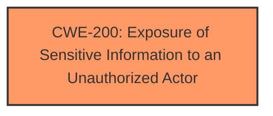

# Analysis Report for CVE-2024-32037

# Vulnerability Analysis Report: CVE-2024-32037

## Description

GeoNetwork is a catalog application to manage spatially referenced resources. In versions prior to 4.2.10 and 4.4.5, the search end-point response headers contain information about Elasticsearch software in use. This information is valuable from a security point of view because it allows software used by the server to be easily identified. GeoNetwork 4.4.5 and 4.2.10 fix this issue. No known workarounds are available.

## Vulnerability Description Key Phrases

- **Impact:** information leak
- **Product:** GeoNetwork
- **Version:** prior to 4.2.10 and 4.4.5
- **Component:** search end-point

## Analysis (with Relationship Data)

# Summary

| CWE ID | CWE Name | Confidence | CWE Abstraction Level | CWE Vulnerability Mapping Label | CWE-Vulnerability Mapping Notes |
|---|---|---|---|---|---|
| CWE-200 | Exposure of Sensitive Information to an Unauthorized Actor | 0.9 | Class | Allowed | The vulnerability results in the exposure of sensitive information about the Elasticsearch software being used. |

## Evidence and Confidence

*   **Confidence Score:** 0.9
*   **Evidence Strength:** HIGH

## Relationship Analysis
The primary CWE is CWE-200, which is a Class-level CWE. While it is generally discouraged to use Class-level CWEs, in this case, it accurately describes the vulnerability as the exposure of sensitive information without a more specific root cause being evident. The other CWEs considered were related to more specific types of information exposure or related to authorization or resource management, which do not directly apply to this case.



## Vulnerability Chain
The vulnerability chain consists of the **root cause** which is the **search endpoint's response headers revealing details about the Elasticsearch software**, leading to the impact of **information disclosure**, specifically the exposure of sensitive information about the Elasticsearch software to unauthorized actors.

## Summary of Analysis
The vulnerability description clearly indicates that the search endpoint response headers contain information about the Elasticsearch software in use, leading to information disclosure. The CVE Reference Links Content Summary explicitly mentions **"Weaknesses/vulnerabilities present: Information Disclosure (CWE-200)"**. This strong evidence supports the selection of CWE-200. While CWE-200 is a Class-level CWE and is generally discouraged, it accurately captures the essence of the vulnerability, as the root cause is the presence of sensitive information in the response headers.

The Retriever Results listed several other CWEs, including:
*   CWE-201 (Insertion of Sensitive Information Into Sent Data): This is similar but implies a deliberate insertion, which isn't necessarily the case here.
*   CWE-639 (Authorization Bypass Through User-Controlled Key): This relates to authorization bypass, which is not relevant to this vulnerability.
*   CWE-863 (Incorrect Authorization): Similar to CWE-639, this is about authorization issues.
*   CWE-770 (Allocation of Resources Without Limits or Throttling): This concerns resource management and is not relevant.
*   CWE-319 (Cleartext Transmission of Sensitive Information): This relates to cleartext transmission, which is not the issue here.
*   CWE-209 (Generation of Error Message Containing Sensitive Information): This relates to error messages, which is not the case here.
*   CWE-306 (Missing Authentication for Critical Function): This relates to missing authentication, which is not relevant.

Given the available information and the explicit mention of Information Disclosure in the CVE summary, CWE-200 is the most appropriate choice. Although it is a Class-level CWE, the evidence does not point to a more specific Base or Variant CWE.


## CWE Relationship Analysis

Current CWEs represent these abstraction levels: .


### Vulnerability Chain Analysis

**Chain starting from CWE-863:**
- 863 (Incorrect Authorization) - ROOT


**Chain starting from CWE-770:**
- 770 (Allocation of Resources Without Limits or Throttling) - ROOT


### CWE Relationship Diagram

```mermaid
graph TD
    classDef primary fill:#f96,stroke:#333,stroke-width:2px
    classDef secondary fill:#69f,stroke:#333
    classDef tertiary fill:#9e9,stroke:#333
```


*Report generated on 2025-07-13 07:33:04*
