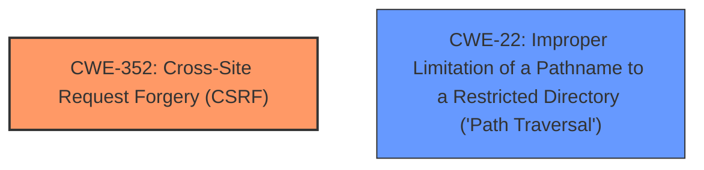

# Enhanced Analysis for CVE-2024-3238

# Summary
| CWE ID | CWE Name | Confidence | CWE Abstraction Level | CWE Vulnerability Mapping Label | CWE-Vulnerability Mapping Notes |
|---|---|---|---|---|---|
| CWE-352 | Cross-Site Request Forgery (CSRF) | 0.9 | Compound | Primary | Allowed |
| CWE-22 | Improper Limitation of a Pathname to a Restricted Directory ('Path Traversal') | 0.8 | Base | Secondary | Allowed |

## Evidence and Confidence

*   **Confidence Score:** 0.85
*   **Evidence Strength:** HIGH

## Relationship Analysis
The primary weakness is CWE-352 [Cross-Site Request Forgery (CSRF)], a compound weakness that arises from **missing or incorrect nonce validation**. The secondary weakness is CWE-22 [Improper Limitation of a Pathname to a Restricted Directory ('Path Traversal')], due to the **directory traversal** vulnerability when deleting files. These two are independent vulnerabilities that co-exist.



## Vulnerability Chain
The vulnerability chain starts with **missing or incorrect nonce validation** leading to a CSRF vulnerability that could allow an attacker to delete arbitrary files through **directory traversal**.

CWE-352 (Root Cause: Missing Nonce Validation) -> Arbitrary File Deletion & CWE-22 (Improper Pathname Limitation).

## Summary of Analysis
The initial assessment identified CWE-352 [Cross-Site Request Forgery (CSRF)] as the primary root cause due to the **missing or incorrect nonce validation** in the `ajax_handle_delete_icons()` function. Evidence for this includes the vulnerability description key phrases and the CVE reference links summary that highlights "Missing or incorrect nonce validation...allows Cross-Site Request Forgery (CSRF) attacks." Additionally, CWE-22 [Improper Limitation of a Pathname to a Restricted Directory ('Path Traversal')] was identified as a secondary vulnerability because of the **directory traversal** issue when deleting files. This is supported by the description key phrases and the CVE reference links, stating that "adequate **directory traversal** protection wasn't introduced until 5.0.30" and "Insufficient checks allow directory traversal attacks when deleting files until version 5.0.30."

The retriever results supported this assessment, with CWE-352 [Cross-Site Request Forgery (CSRF)] and CWE-22 [Improper Limitation of a Pathname to a Restricted Directory ('Path Traversal')] listed as top candidates.

The selection of CWE-352 [Cross-Site Request Forgery (CSRF)] and CWE-22 [Improper Limitation of a Pathname to a Restricted Directory ('Path Traversal')] is at the optimal level of specificity. Both are Base level CWEs, as recommended in the mapping guidance.

CWE-79 [Improper Neutralization of Input During Web Page Generation ('Cross-site Scripting')] was considered but not selected. While the description mentions the possibility of tricking a user into clicking a link, it doesn't directly involve injecting malicious scripts into a web page. The core issue is the **missing or incorrect nonce validation**, which aligns more directly with CWE-352 [Cross-Site Request Forgery (CSRF)].

CWE-425 [Direct Request ('Forced Browsing')] was considered but not selected. The primary issue is not the lack of authorization checks, but rather the **missing or incorrect nonce validation**, which allows an attacker to bypass the existing authorization mechanism using CSRF.

CWE-434 [Unrestricted Upload of File with Dangerous Type] was considered but not selected. The vulnerability does not involve uploading files.

CWE-471 [Modification of Assumed-Immutable Data (MAID)] was considered but not selected, as there is no modification of data assumed to be immutable.


## CWE Relationship Analysis

Current CWEs represent these abstraction levels: .


### Vulnerability Chain Analysis

**Chain starting from CWE-471:**
- 471 (Modification of Assumed-Immutable Data (MAID)) - ROOT


**Chain starting from CWE-22:**
- 22 (Improper Limitation of a Pathname to a Restricted Directory ('Path Traversal')) - ROOT


### CWE Relationship Diagram

```mermaid
graph TD
    classDef primary fill:#f96,stroke:#333,stroke-width:2px
    classDef secondary fill:#69f,stroke:#333
    classDef tertiary fill:#9e9,stroke:#333
```