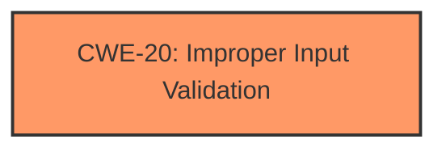

# Raw Analyzer Response for CVE-2024-32485

# Summary
| CWE ID  | CWE Name                                                        | Confidence | CWE Abstraction Level | CWE Vulnerability Mapping Label | CWE-Vulnerability Mapping Notes |
|---------|-----------------------------------------------------------------|------------|-----------------------|---------------------------------|-----------------------------------|
| CWE-20  | Improper Input Validation                                       | 0.9        | Class                 | Primary                           | Discouraged                      |

## Evidence and Confidence

*   **Confidence Score:** 0.9
*   **Evidence Strength:** HIGH

## Relationship Analysis
The primary identified weakness is CWE-20, which is a Class-level CWE. There are no direct child CWEs identified in the provided data that offer a more specific classification for the **improper input validation**. The retriever results suggest other potential CWEs, but none provide a more precise fit based on the available evidence. The hierarchical relationships don't significantly influence the selection in this case, as the vulnerability description focuses solely on the **improper input validation** aspect.

## Vulnerability Chain
The vulnerability chain consists of the **Improper Input Validation** (CWE-20) leading directly to a denial-of-service impact. The chain is relatively short and direct.

## Summary of Analysis
The initial analysis strongly points to CWE-20 (**Improper Input Validation**) as the primary weakness. This assessment is based on the explicit statement in the "Vulnerability Description Key Phrases" section: "**rootcause:** **Improper Input Validation**". The "CVE Reference Links Content Summary" also confirms this: "**Root cause of vulnerability:** Improper Input Validation in Intel® VROC software."

While CWE-20 is a Class-level CWE and generally discouraged when more specific options exist, the provided information lacks the granularity needed to select a more precise Base or Variant level CWE. The retriever results offer several alternatives, such as CWE-1285 (Improper Validation of Specified Index, Position, or Offset in Input), but there's no evidence to suggest that the **improper input validation** relates specifically to indexes, positions, or offsets. Similarly, other suggestions like CWE-807 (Reliance on Untrusted Inputs in a Security Decision) and CWE-1288 (Improper Validation of Consistency within Input) lack supporting evidence in the provided description. Therefore, sticking with CWE-20 is the most appropriate choice, given the available information.
# Enhanced Context (25 CWEs)
The following CWEs were identified as potentially relevant to this vulnerability:

## CWE-807: Reliance on Untrusted Inputs in a Security Decision
**Abstraction Level**: Base
**Similarity Score**: 0.75
**Source**: dense

**Description**:
The product uses a protection mechanism that relies on the existence or values of an input, but the input can be modified by an untrusted actor in a way that bypasses the protection mechanism.

**Mapping Guidance**:
- Usage: Allowed
- Rationale: This CWE entry is at the Base level of abstraction, which is a preferred level of abstraction for mapping to the root causes of vulnerabilities.

**Why not selected**: There is no evidence to suggest the input is being used as part of a protection mechanism.

## CWE-1285: Improper Validation of Specified Index, Position, or Offset in Input
**Abstraction Level**: Base
**Similarity Score**: 0.75
**Source**: dense

**Description**:
The product receives input that is expected to specify an index, position, or offset into an indexable resource such as a buffer or file, but it does not validate or incorrectly validates that the specified index/position/offset has the required properties.

**Mapping Guidance**:
- Usage: Allowed
- Rationale: This CWE entry is at the Base level of abstraction, which is a preferred level of abstraction for mapping to the root causes of vulnerabilities.

**Why not selected**: While potentially relevant, there's no specific indication that the **improper input validation** relates to an index, position, or offset.

## CWE-20: Improper Input Validation
**Abstraction Level**: Class
**Similarity Score**: 0.75
**Source**: dense

**Description**:
The product receives input or data, but it does
        not validate or incorrectly validates that the input has the
        properties that are required to process the data safely and
        correctly.

**Mapping Guidance**:
- Usage: Discouraged
- Rationale: CWE-20 is commonly misused in low-information vulnerability reports when lower-level CWEs could be used instead, or when more details about the vulnerability are available [REF-1287]. It is not useful for trend analysis. It is also a level-1 Class (i.e., a child of a Pillar).

**Why Selected**: This aligns directly with the stated root cause of **Improper Input Validation**. Even though it is discouraged, no other CWEs are more specific.

## CWE-755: Improper Handling of Exceptional Conditions
**Abstraction Level**: Class
**Similarity Score**: 0.74
**Source**: dense

**Description**:
The product does not handle or incorrectly handles an exceptional condition.

**Mapping Guidance**:
- Usage: Discouraged
- Rationale: This CWE entry is a level-1 Class (i.e., a child of a Pillar). It might have lower-level children that would be more appropriate

**Why not selected**: There is no evidence the **improper input validation** leads to unhandled or improperly handled exceptional conditions.

## CWE-303: Incorrect Implementation of Authentication Algorithm
**Abstraction Level**: Base
**Similarity Score**: 0.74
**Source**: dense

**Description**:
The requirements for the product dictate the use of an established authentication algorithm, but the implementation of the algorithm is incorrect.

**Mapping Guidance**:
- Usage: Allowed
- Rationale: This CWE entry is at the Base level of abstraction, which is a preferred level of abstraction for mapping to the root causes of vulnerabilities.

**Why not selected**: There is no information to indicate the vulnerability involves any kind of authentication algorithm.

## CWE-280: Improper Handling of Insufficient Permissions or Privileges
**Abstraction Level**: Base
**Similarity Score**: 0.74
**Source**: dense

**Description**:
The product does not handle or incorrectly handles when it has insufficient privileges to access resources or functionality as specified by their permissions. This may cause it to follow unexpected code paths that may leave the product in an invalid state.

**Mapping Guidance**:
- Usage: Allowed
- Rationale: This CWE entry is at the Base level of abstraction, which is a preferred level of abstraction for mapping to the root causes of vulnerabilities.

**Why not selected**: There is no indication the **improper input validation** relates to permissions or privilege handling.

## CWE-1289: Improper Validation of Unsafe Equivalence in Input
**Abstraction Level**: Base
**Similarity Score**: 0.73
**Source**: dense

**Description**:
The product receives an input value that is used as a resource identifier or other type of reference, but it does not validate or incorrectly validates that the input is equivalent to a potentially-unsafe value.

**Mapping Guidance**:
- Usage: Allowed
- Rationale: This CWE entry is at the Base level of abstraction, which is a preferred level of abstraction for mapping to the root causes of vulnerabilities.

**Why not selected**: There is no evidence that the **improper input validation** involves checking for unsafe equivalences.

## CWE-252: Unchecked Return Value
**Abstraction Level**: Base
**Similarity Score**: 0.73
**Source**: dense

**Description**:
The product does not check the return value from a method or function, which can prevent it from detecting unexpected states and conditions.

**Mapping Guidance**:
- Usage: Allowed
- Rationale: This CWE entry is at the Base level of abstraction, which is a preferred level of abstraction for mapping to the root causes of vulnerabilities.

**Why not selected**: The description does not mention anything about unchecked return values.

## CWE-274: Improper Handling of Insufficient Privileges
**Abstraction Level**: Base
**Similarity Score**: 0.73
**Source**: dense

**Description**:
The product does not handle or incorrectly handles when it has insufficient privileges to perform an operation, leading to resultant weaknesses.

**Mapping Guidance**:
- Usage: Discouraged
- Rationale: This CWE entry could be deprecated in a future version of CWE.

**Why not selected**: This is related to privilege issues, and the description doesn't mention anything about privileges.

## CWE-824: Access of Uninitialized Pointer
**Abstraction Level**: Base
**Similarity Score**: 0.73
**Source**: dense

**Description**:
The product accesses or uses a pointer that has not been initialized.

**Mapping Guidance**:
- Usage: Allowed
- Rationale: This CWE entry is at the Base level of abstraction, which is a preferred level of abstraction for mapping to the root causes of vulnerabilities.

**Why not selected**: The description does not mention anything about pointers.

## CWE-347: Improper Verification of Cryptographic Signature
**Abstraction Level**: Base
**Similarity Score**: 494.59
**Source**: sparse

**Description**:
The product does not verify, or incorrectly verifies, the