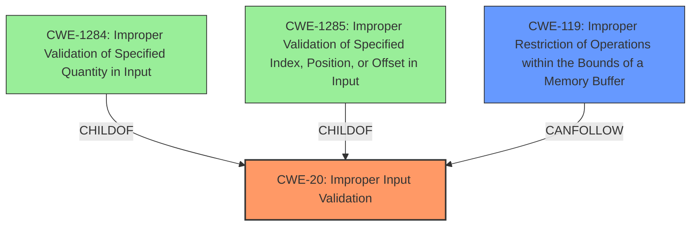

# Enhanced Analysis for CVE-2024-32858

# Summary
| CWE ID    | CWE Name                                                                  | Confidence | CWE Abstraction Level | CWE Vulnerability Mapping Label | CWE-Vulnerability Mapping Notes |
| --------- | ------------------------------------------------------------------------- | ---------- | ----------------------- | ------------------------------- | ------------------------------- |
| CWE-20    | Improper Input Validation                                                 | 0.8        | Class                   | Primary CWE                     | Discouraged                    |
| CWE-119   | Improper Restriction of Operations within the Bounds of a Memory Buffer | 0.6        | Class                   | Secondary Candidate             | Discouraged                    |

## Evidence and Confidence

*   **Confidence Score:** 0.7
*   **Evidence Strength:** MEDIUM

## Relationship Analysis

The primary relationship that influenced the selection was the hierarchical one. While more specific CWEs exist for input validation issues, the provided description doesn't give enough information to pinpoint the exact type of improper validation. Therefore, the higher-level **CWE-20 (Improper Input Validation)** is chosen. **CWE-119 (Improper Restriction of Operations within the Bounds of a Memory Buffer)** is considered as a secondary candidate since improper input validation often leads to out-of-bounds writes, but there isn't enough information to say that it is the case here.



## Vulnerability Chain

The vulnerability chain starts with **Improper Input Validation (CWE-20)**, which allows an attacker to supply malicious input. If successful, this leads to code execution. The exact mechanism of how **CWE-20** leads to code execution isn't specified, so it is not possible to find intermediate CWEs to add to the chain.

## Summary of Analysis

The analysis is based on the provided vulnerability description, which highlights an **Improper Input Validation** vulnerability. The description clearly states, "Dell Client Platform BIOS contains an **Improper Input Validation** vulnerability in an externally developed component. A high privileged attacker with local access could potentially exploit this vulnerability, leading to Code execution." The **root cause** is clearly the **Improper Input Validation**, making **CWE-20** the most appropriate primary CWE.

While other CWEs like **CWE-119 (Improper Restriction of Operations within the Bounds of a Memory Buffer)**, **CWE-1284 (Improper Validation of Specified Quantity in Input)**, and **CWE-1285 (Improper Validation of Specified Index, Position, or Offset in Input)** were considered, they represent more specific cases of input validation. Since the provided information lacks details about the exact nature of the **improper input validation**, choosing **CWE-20** is the most accurate and safe approach. **CWE-20** is a Class-level CWE, but it's more appropriate than using a more specific Base or Variant CWE without enough information.


## CWE Relationship Analysis

Current CWEs represent these abstraction levels: .


### Vulnerability Chain Analysis

**Chain starting from CWE-119:**
- 119 (Improper Restriction of Operations within the Bounds of a Memory Buffer) - ROOT


**Chain starting from CWE-1284:**
- 1284 (Improper Validation of Specified Quantity in Input) - ROOT


### CWE Relationship Diagram

```mermaid
graph TD
    classDef primary fill:#f96,stroke:#333,stroke-width:2px
    classDef secondary fill:#69f,stroke:#333
    classDef tertiary fill:#9e9,stroke:#333
```