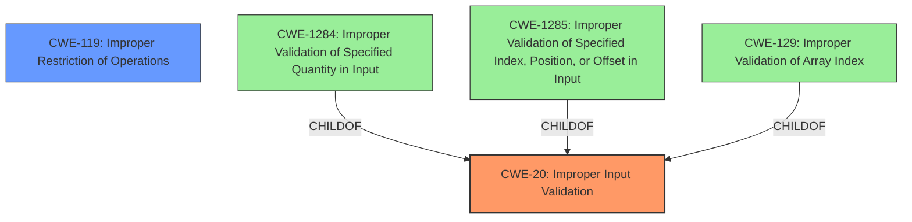

# Analysis for CVE-2024-32859

# Summary
| CWE ID | CWE Name | Confidence | CWE Abstraction Level | CWE Vulnerability Mapping Label | CWE-Vulnerability Mapping Notes |
|---|---|---|---|---|---|
| CWE-20 | Improper Input Validation | 1.0 | Class | Primary | Allowed |
| CWE-119 | Improper Restriction of Operations within the Bounds of a Memory Buffer | 0.6 | Class | Secondary | Discouraged |

## Evidence and Confidence

*   **Confidence Score:** 0.8
*   **Evidence Strength:** MEDIUM

## Relationship Analysis
The primary relationship to consider is the parent-child relationship. CWE-20 is a class-level CWE, while more specific CWEs like CWE-129 (Improper Validation of Array Index), CWE-1284 (Improper Validation of Specified Quantity in Input), and CWE-1285 (Improper Validation of Specified Index, Position, or Offset in Input) are variants or bases. The evidence is not detailed enough to select a more specific variant, so the class level is appropriate. CWE-119 is related because it can be a consequence of improper input validation.

## Vulnerability Chain
The vulnerability chain starts with **improper input validation** (CWE-20). This **weakness** allows a high privileged attacker with local access to potentially exploit the system, leading to code execution. If the improper input validation leads to writing outside the bounds of a memory buffer, CWE-119 would be applicable.

## Summary of Analysis
The vulnerability description explicitly states "**Improper Input Validation** vulnerability". Given this direct statement, CWE-20 is the most appropriate primary CWE. The description also mentions that a high privileged attacker with local access could potentially exploit this vulnerability, leading to code execution. This could be a consequence of writing outside the bounds of a memory buffer as a result of the **improper input validation**.

The evidence is somewhat limited, as there is no specific detail on *how* the input validation is improper, but the vulnerability description key phrases focuses on the rootcause and weakness which is **Improper Input Validation**.

CWE-119 is considered as a secondary CWE because **Improper Input Validation** could lead to writing outside the bounds of memory buffer.

Relevant CWE Information:
*   CWE-20: Improper Input Validation
*   CWE-119: Improper Restriction of Operations within the Bounds of a Memory Buffer
*   CWE-1284: Improper Validation of Specified Quantity in Input
*   CWE-1285: Improper Validation of Specified Index, Position, or Offset in Input
*   CWE-129: Improper Validation of Array Index