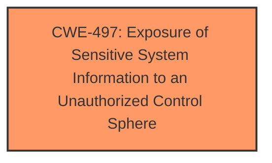

# Enhanced Analysis for CVE-2024-32870

# Summary
| CWE ID | CWE Name | Confidence | CWE Abstraction Level | CWE Vulnerability Mapping Label | CWE-Vulnerability Mapping Notes |
|---|---|---|---|---|---|
| CWE-497 | Exposure of Sensitive System Information to an Unauthorized Control Sphere | 0.9 | Base | Allowed | Primary CWE |

## Evidence and Confidence

*   **Confidence Score:** 0.9
*   **Evidence Strength:** HIGH

## Relationship Analysis
The primary relationship considered was the direct match of the vulnerability description to the definition of CWE-497 [**Exposure of Sensitive System Information**]. There were no parent-child or chain relationships that significantly altered the decision. The choice of CWE-497 was favored for its direct relevance to the vulnerability.



## Vulnerability Chain
The vulnerability chain is straightforward:
1.  **Root Cause:** The iTop Hub connector **exposes sensitive information**.
2.  **Weakness:** **Exposure of Sensitive System Information** (CWE-497).
3.  **Impact:** An attacker can read server, OS, DBMS, PHP, and iTop info (name, version, and parameters), which could lead to further exploitation.

## Summary of Analysis
The initial assessment focused on identifying the root cause of the vulnerability based on the provided evidence. The key phrase from the CVE Reference Links Content Summary, "The iTop Hub connector is **exposing sensitive information**," strongly suggests an information exposure issue. This, coupled with the description that "Server, OS, DBMS, PHP, and iTop info (name, version and parameters) can be read by anyone having access to iTop URI," directly aligns with the definition of CWE-497 [**Exposure of Sensitive System Information to an Unauthorized Control Sphere**].

The Retriever Results listed several candidate CWEs, but most were related to injection or authorization bypass, which are not the primary issue here. CWE-201 [**Insertion of Sensitive Information Into Sent Data**] was also considered, but it implies that sensitive information is being actively inserted, whereas CWE-497 focuses on the **exposure** of existing sensitive information.

CWE-497 is at the Base level of abstraction, which is preferred. The MITRE mapping guidance indicates that its usage is "Allowed." This further reinforces the choice of CWE-497 as the most appropriate CWE for this vulnerability.

Relevant CWE Information:

# Enhanced Context (25 CWEs)
The following CWEs were identified as potentially relevant to this vulnerability:

## CWE-497: Exposure of Sensitive System Information to an Unauthorized Control Sphere
**Abstraction Level**: Base
**Similarity Score**: 0.77
**Source**: dense

**Description**:
The product does not properly prevent sensitive system-level information from being accessed by unauthorized actors who do not have the same level of access to the underlying system as the product does.

**Mapping Guidance**:
- Usage: Allowed
- Rationale: This CWE entry is at the Base level of abstraction, which is a preferred level of abstraction for mapping to the root causes of vulnerabilities.


## CWE Relationship Analysis

Current CWEs represent these abstraction levels: .


### Vulnerability Chain Analysis

**Chain starting from CWE-201:**
- 201 (Insertion of Sensitive Information Into Sent Data) - ROOT


**Chain starting from CWE-497:**
- 497 (Exposure of Sensitive System Information to an Unauthorized Control Sphere) - ROOT


### CWE Relationship Diagram

```mermaid
graph TD
    classDef primary fill:#f96,stroke:#333,stroke-width:2px
    classDef secondary fill:#69f,stroke:#333
    classDef tertiary fill:#9e9,stroke:#333
```