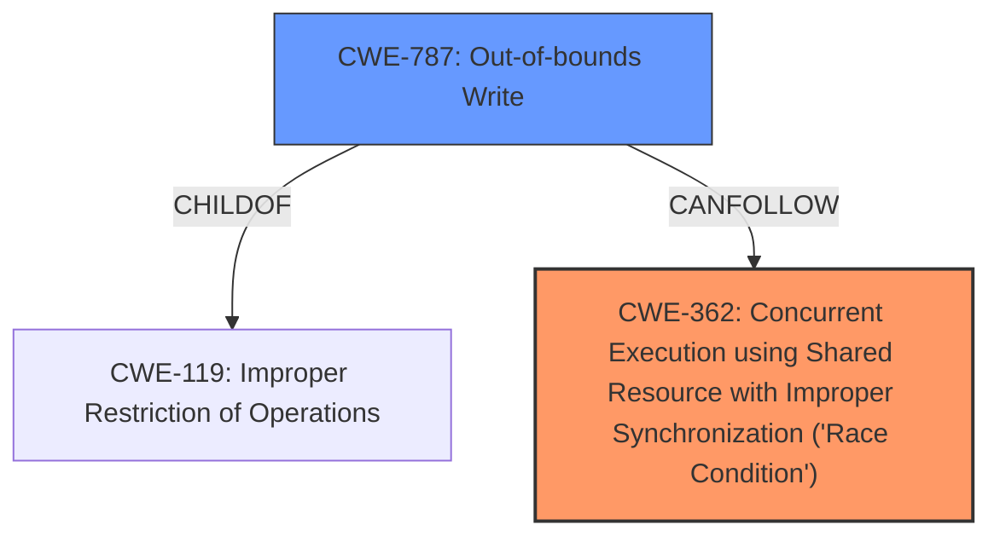

# Raw Analyzer Response for CVE-2024-32891

# Summary
| CWE ID | CWE Name | Confidence | CWE Abstraction Level | CWE Vulnerability Mapping Label | CWE-Vulnerability Mapping Notes |
|---|---|---|---|---|---|
| CWE-362 | Concurrent Execution using Shared Resource with Improper Synchronization ('Race Condition') | 1.0 | Class | Allowed-with-Review | Primary CWE. The vulnerability is due to a **race condition** which falls under the definition of CWE-362. |
| CWE-787 | Out-of-bounds Write | 0.75 | Base | Allowed | Secondary candidate. The **memory corruption** mentioned in the description could manifest as an out-of-bounds write. |

## Evidence and Confidence

*   **Confidence Score:** 0.85
*   **Evidence Strength:** MEDIUM

## Relationship Analysis
The primary weakness is a **race condition** (CWE-362). The potential impact of this **race condition** is **memory corruption**, which could manifest as an out-of-bounds write (CWE-787). CWE-787 is a child of CWE-119 (Improper Restriction of Operations within the Bounds of a Memory Buffer), representing a more specific case of memory corruption. CWE-362 is a Class level CWE, with more specific Base level CWEs, but none of them clearly fit.

## Vulnerability Chain
The vulnerability chain starts with a **race condition** (CWE-362), which leads to **memory corruption**, potentially an out-of-bounds write (CWE-787). The impact is a local escalation of privilege.

## Summary of Analysis
The vulnerability description clearly states that the root cause is a **race condition**. The **memory corruption** is a consequence of the **race condition**. Therefore, CWE-362 is the primary CWE. The **memory corruption** could manifest as an out-of-bounds write, so CWE-787 is a secondary candidate.

The evidence supporting the primary CWE is the phrase "**race condition**" in the "Vulnerability Description Key Phrases" and the full vulnerability description mentioning a **race condition**. The evidence supporting CWE-787 is the "**memory corruption**" phrase in the vulnerability description.

The selected CWEs are at the optimal level of specificity, as CWE-362 is a Class-level CWE that directly matches the root cause, and CWE-787 is a Base-level CWE that describes a potential manifestation of the **memory corruption**.

Other CWEs considered but not used:

*   CWE-667 (Improper Locking) and CWE-662 (Improper Synchronization): These are related to concurrency issues, but the description specifically mentions a **race condition**, making CWE-362 a more direct match.
*   CWE-415 (Double Free): While **memory corruption** is mentioned, there is no specific mention of a double free, so this CWE is not as relevant.
*   CWE-863 (Incorrect Authorization): The description mentions local escalation of privilege, but the root cause is a **race condition** leading to **memory corruption**, not an authorization issue.
*   CWE-266 (Incorrect Privilege Assignment), CWE-250 (Execution with Unnecessary Privileges), CWE-284 (Improper Access Control), CWE-285 (Improper Authorization): The root cause is a **race condition** leading to **memory corruption**, not a privilege or permission issue.