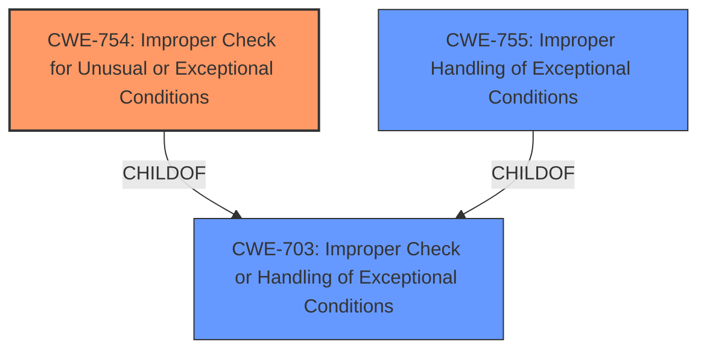

# Analysis for CVE-2024-32902

# Summary
| CWE ID | CWE Name | Confidence | CWE Abstraction Level | CWE Vulnerability Mapping Label | CWE-Vulnerability Mapping Notes |
|---|---|---|---|---|---|
| CWE-754 | Improper Check for Unusual or Exceptional Conditions | 0.75 | Class | Primary | Allowed-with-Review |
| CWE-755 | Improper Handling of Exceptional Conditions | 0.60 | Class | Secondary | Discouraged |
| CWE-703 | Improper Check or Handling of Exceptional Conditions | 0.50 | Pillar | Secondary | Discouraged |

## Evidence and Confidence

*   **Confidence Score:** 0.70
*   **Evidence Strength:** MEDIUM

## Relationship Analysis
The primary relationship considered was the parent-child relationship between CWE-754, CWE-755, and CWE-703. CWE-754 (Improper Check for Unusual or Exceptional Conditions) and CWE-755 (Improper Handling of Exceptional Conditions) are both children of CWE-703 (Improper Check or Handling of Exceptional Conditions). Since the vulnerability involves a malformed packet causing a denial-of-service, the improper handling or check for this unusual condition is the core issue. CWE-754 was selected as the primary because the description explicitly mentions the "check" aspect.

## Vulnerability Chain
The vulnerability chain begins with the receipt of a **malformed packet**. The **cellular radio service** then **fails to properly check for unusual or exceptional conditions** (CWE-754), or **improperly handles the exceptional condition** (CWE-755), leading to a **denial-of-service** (impact).

## Summary of Analysis
The initial assessment focused on identifying the root cause of the denial-of-service vulnerability. The **Vulnerability Description Key Phrases** pointed to a "malformed packet" as the vector and the "cellular radio service" as the component. The **CVE Reference Links Content Summary** confirmed the root cause as a denial-of-service in the Modem component.

The Retriever Results suggested several CWEs, including CWE-754, CWE-755, and CWE-703. After reviewing the definitions and relationships, CWE-754 (Improper Check for Unusual or Exceptional Conditions) was chosen as the primary CWE. This choice is based on the evidence suggesting that the **cellular radio service** does not properly **check** the incoming packet for malformed data, leading to the denial-of-service. CWE-755 was considered a close secondary mapping, as the **improper handling** of the **exceptional condition** is also a valid view.

The choice of CWE-754 is supported by the CWE description, which states: "The product does not check or incorrectly checks for unusual or exceptional conditions that are not expected to occur frequently during day to day operation of the product." A malformed packet would be considered an unusual or exceptional condition.

I am confident in the mapping based on the available evidence, although the specific details of the packet parsing and handling are not provided.

Relevant CWE Information:

# Enhanced Context (25 CWEs)
The following CWEs were identified as potentially relevant to this vulnerability:

## CWE-754: Improper Check for Unusual or Exceptional Conditions
**Abstraction Level**: Class
**Similarity Score**: 0.72
**Source**: dense

**Description**:
The product does not check or incorrectly checks for unusual or exceptional conditions that are not expected to occur frequently during day to day operation of the product.

**Mapping Guidance**:
- Usage: Allowed-with-Review
- Rationale: This CWE entry is a Class and might have Base-level children that would be more appropriate

## CWE-755: Improper Handling of Exceptional Conditions
**Abstraction Level**: Class
**Similarity Score**: 0.71
**Source**: dense

**Description**:
The product does not handle or incorrectly handles an exceptional condition.

**Mapping Guidance**:
- Usage: Discouraged
- Rationale: This CWE entry is a level-1 Class (i.e., a child of a Pillar). It might have lower-level children that would be more appropriate

## CWE-703: Improper Check or Handling of Exceptional Conditions
**Abstraction Level**: Pillar
**Similarity Score**: 0.70
**Source**: dense

**Description**:
The product does not properly anticipate or handle exceptional conditions that rarely occur during normal operation of the product.

**Mapping Guidance**:
- Usage: Discouraged
- Rationale: This CWE entry is extremely high-level, a Pillar.