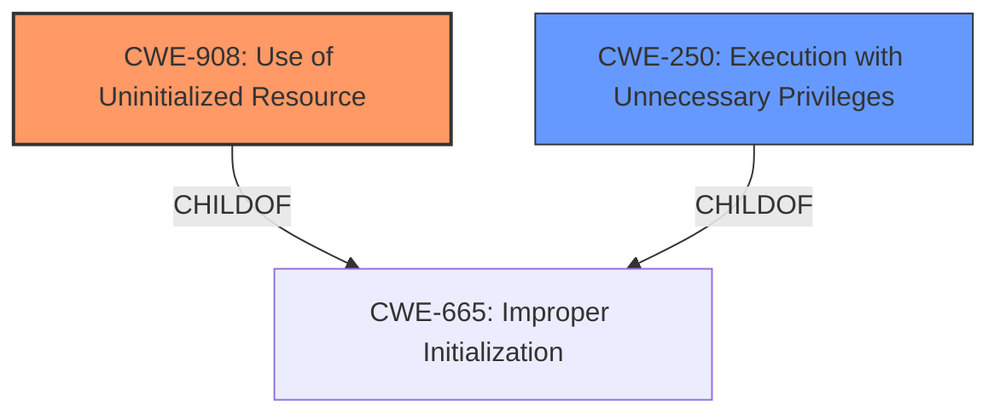

# Enhanced Analysis for CVE-2024-32906

# Summary
| CWE ID | CWE Name | Confidence | CWE Abstraction Level | CWE Vulnerability Mapping Label | CWE-Vulnerability Mapping Notes |
|---|---|---|---|---|---|
| CWE-908 | Use of Uninitialized Resource | 0.9 | Base | Primary | Allowed |
| CWE-250 | Execution with Unnecessary Privileges | 0.5 | Base | Secondary | Allowed |

## Evidence and Confidence

*   **Confidence Score:** 0.7
*   **Evidence Strength:** MEDIUM

## Relationship Analysis
The primary relationship that influenced the decision was the hierarchical relationship between CWE-665 (Improper Initialization) and its child CWE-908 (Use of Uninitialized Resource) and CWE-909 (Missing Initialization of Resource). Since the vulnerability description specifically mentions the "use" of **uninitialized data**, CWE-908 was chosen over the more general CWE-665 and the more specific CWE-909. Also considered and included was CWE-250 (Execution with Unnecessary Privileges) due to the "escalation of privilege" impact, although this is a weaker association and therefore a secondary candidate.



## Vulnerability Chain
The vulnerability chain starts with the **uninitialized data** (CWE-908), which leads to a possible Elevation of Privilege (EOP). Because the vulnerable component is running with privileges to escalate privileges, CWE-250 (Execution with Unnecessary Privileges) is added to the chain.
  - CWE-908 (Use of Uninitialized Resource) - Root Cause
  - CWE-250 (Execution with Unnecessary Privileges) - Vulnerable component is running with privileges that can be exploited.
  - Elevation of Privilege (EOP) - Impact

## Summary of Analysis
The primary CWE was chosen based on the clear indication of **uninitialized data** being used, as stated in the vulnerability description: "In AcvpOnMessage of avcp.cpp, there is a possible EOP due to **uninitialized data**." This directly aligns with CWE-908 (Use of Uninitialized Resource). The "escalation of privilege" impact suggested a secondary weakness related to privilege management, leading to the consideration of CWE-250 (Execution with Unnecessary Privileges).

The evidence supports CWE-908 as the primary weakness because it is explicitly mentioned in the vulnerability description. The relationship analysis confirms that CWE-908 is a more specific child of CWE-665, making it a more precise fit. The "escalation of privilege" impact also suggests a secondary weakness, CWE-250, because the vulnerable component must have sufficient privileges to permit privilege escalation, although there is no hard evidence to support that claim.

The chosen CWEs are at the optimal level of specificity, with CWE-908 being a Base-level CWE that accurately represents the **uninitialized data** issue.

# Relevant CWE Information:

## Vulnerability Description
In AcvpOnMessage of avcp.cpp, there is a possible EOP due to **uninitialized data**. This could lead to local escalation of privilege with no additional execution privileges needed. User interaction is not needed for exploitation.

### Vulnerability Description Key Phrases
- **rootcause:** **uninitialized data**
- **impact:** local escalation of privilege
- **vector:** EOP due to uninitialized data
- **component:** AcvpOnMessage of avcp.cpp

## CVE Reference Links Content Summary
- **Root cause of vulnerability**: The provided document indicates that the vulnerability exists within the 'avcp' subcomponent.
- **Weaknesses/vulnerabilities present**: The vulnerability is classified as an Elevation of Privilege (EoP).
-  **Impact of exploitation**: Successful exploitation of the vulnerability could allow an attacker to gain elevated privileges.
- **Attack vectors**: The document does not specify the attack vector, but the 'avcp' subcomponent suggests that the vulnerability may exist in the audio/video codec processing.
- **Required attacker capabilities/position**: The document does not specify the required attacker capabilities or position, only that the exploitation results in EoP.

## Retriever Results

### Top Combined Results

| Rank | CWE ID | Name | Abstraction | Usage  | Retrievers | Individual Scores |
|------|--------|------|-------------|-------|------------|-------------------|
| 1 | 908 | Use of Uninitialized Resource | Base | Allowed | sparse | 0.314 |
| 2 | 665 | Improper Initialization | Class | Discouraged | sparse | 0.274 |
| 3 | 1021 | Improper Restriction of Rendered UI Layers or Frames | Base | Allowed | sparse | 0.263 |
| 4 | 667 | Improper Locking | Class | Allowed-with-Review | sparse | 0.260 |
| 5 | 862 | Missing Authorization | Class | Allowed-with-Review | sparse | 0.260 |
| 6 | 362 | Concurrent Execution using Shared Resource with Improper Synchronization ('Race Condition') | Class | Allowed-with-Review | sparse | 0.256 |
| 7 | 909 | Missing Initialization of Resource | Class | Allowed-with-Review | sparse | 0.255 |
| 8 | 131 | Incorrect Calculation of Buffer Size | Base | Allowed | sparse | 0.249 |
| 9 | 1421 | Exposure of Sensitive Information in Shared Microarchitectural Structures during Transient Execution | Base | Allowed | dense | 0.514 |
| 10 | 1422 | Exposure of Sensitive Information caused by Incorrect Data Forwarding during Transient Execution | Base | Allowed | graph | 0.002 |

### CWE Analysis and Selection

1.  **CWE-908: Use of Uninitialized Resource**
    *   **Explanation:** This CWE is a direct match for the vulnerability description, which states that there is a possible EOP due to **uninitialized data**. The product uses data that has not been properly initialized, leading to a vulnerability.
    *   **Security Implications:** Using **uninitialized data** can lead to unpredictable behavior, information leakage, or, as in this case, elevation of privilege.
    *   **Relationships:** Child of CWE-665 (Improper Initialization).
    *   **Mapping Guidance:** Usage is ALLOWED.
    *   **Confidence:** 0.9

2.  **CWE-250: Execution with Unnecessary Privileges**
    *   **Explanation:** The vulnerability leads to a local escalation of privilege with no additional execution privileges needed. This suggests that the vulnerable component is already running with elevated privileges that it does not need, which allows an attacker to escalate privileges further.
    *   **Security Implications:** Running code with unnecessary privileges increases the potential impact of a vulnerability, as an attacker can leverage those privileges to perform unauthorized actions.
    *   **Relationships:** Child of CWE-269 (Improper Privilege Management).
    *   **Mapping Guidance:** Usage is ALLOWED.
    *   **Confidence:** 0.5

### Rejected CWEs

*   **CWE-665: Improper Initialization:** While related, CWE-908 is a more specific description of the actual problem, which is the *use* of the uninitialized resource, not just the lack of initialization.
*   **CWE-1021: Improper Restriction of Rendered UI Layers or Frames:** This CWE is not relevant as the vulnerability does not involve UI layers or frames.
*   **CWE-667: Improper Locking:** This CWE is not relevant as the vulnerability does not involve concurrent execution or locking issues.
*   **CWE-862: Missing Authorization:** This CWE is not relevant as the vulnerability does not involve missing authorization checks.
*   **CWE-362: Concurrent Execution using Shared Resource with Improper Synchronization ('Race Condition'):** This CWE is not relevant as the vulnerability does not involve concurrent execution or race conditions.
*   **CWE-909: Missing Initialization of Resource:** While related to initialization, CWE-908 is a better fit because it highlights the *use* of the uninitialized data, which is the direct cause of the vulnerability.
*   **CWE-131: Incorrect Calculation of Buffer Size:** This CWE is not relevant as the vulnerability does not involve buffer size calculations.
*   **CWE-1421: Exposure of Sensitive Information in Shared Microarchitectural Structures during Transient Execution:** This CWE is not relevant as there is no evidence of microarchitectural structures or transient execution being involved in the vulnerability.
*   **CWE


## CWE Relationship Analysis

Current CWEs represent these abstraction levels: .


### Vulnerability Chain Analysis

**Chain starting from CWE-1421:**
- 1421 (Exposure of Sensitive Information in Shared Microarchitectural Structures during Transient Execution) - ROOT


**Chain starting from CWE-862:**
- 862 (Missing Authorization) - ROOT


### CWE Relationship Diagram

```mermaid
graph TD
    classDef primary fill:#f96,stroke:#333,stroke-width:2px
    classDef secondary fill:#69f,stroke:#333
    classDef tertiary fill:#9e9,stroke:#333
```