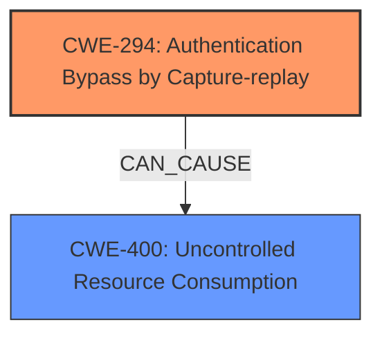

# Analysis for CVE-2024-3297

# Summary
| CWE ID | CWE Name | Confidence | CWE Abstraction Level | CWE Vulnerability Mapping Label | CWE-Vulnerability Mapping Notes |
|---|---|---|---|---|---|
| CWE-294 | Authentication Bypass by Capture-replay | 0.9 | Base | Allowed | Primary CWE. The vulnerability is due to the lack of proper handling of replayed messages, allowing an attacker to bypass authentication by replaying captured messages. |
| CWE-400 | Uncontrolled Resource Consumption | 0.7 | Class | Allowed-with-Review | The replay attack leads to device unresponsiveness, effectively a denial-of-service, which can be seen as uncontrolled resource consumption. |

## Evidence and Confidence

*   **Confidence Score:** 0.8
*   **Evidence Strength:** HIGH

## Relationship Analysis
The primary relationship that influenced the decision was the direct applicability of CWE-294 Authentication Bypass by Capture-replay. The description clearly indicates a **replay attack** (**weakness**), where manipulated messages are replayed to cause a denial-of-service. CWE-400 Uncontrolled Resource Consumption is a consequence of the replay attack. The hierarchical relationship between CWE-400 as a Class and potential Base-level children highlights that CWE-400 is a broader category, while CWE-294 more specifically captures the **replay attack** (**weakness**) mechanism.

## Vulnerability Chain
The vulnerability chain starts with the **lack of replay protection** (**weakness**) in the Certificate Authenticated Session Establishment (CASE) protocol. This **weakness** allows an attacker to replay manipulated CASE Sigma1 messages. The replay attack leads to device unresponsiveness, resulting in a denial-of-service condition.
  - **Root Cause:** Missing replay protection in the CASE protocol
  - **Weakness:** Susceptibility to replay attacks
  - **Impact:** Device unresponsiveness (Denial of Service)

## Summary of Analysis
The initial analysis focused on identifying the root cause and the attack mechanism. The vulnerability description and the CVE reference links content summary both point to a **replay attack** (**weakness**) due to **lack of replay protection** (**weakness**) in the CASE protocol.

The selection of CWE-294 Authentication Bypass by Capture-replay is primarily based on the evidence of the **replay attack** (**weakness**). The "CVE Reference Links Content Summary" clearly states that the vulnerability arises from the **lack of proper handling of replayed CASE Sigma1 messages**. The "Vulnerability Description Key Phrases" also highlights the **replay attack** (**weakness**).

The alternative CWEs were considered but not used because they did not directly address the specific **replay attack** (**weakness**) mechanism. CWE-400 is a secondary CWE because the device becomes unresponsive, which can be seen as uncontrolled resource consumption.

The selected CWEs are at the optimal level of specificity because they accurately represent the root cause and the immediate consequence of the vulnerability, with CWE-294 as the primary root cause and CWE-400 as the direct impact.