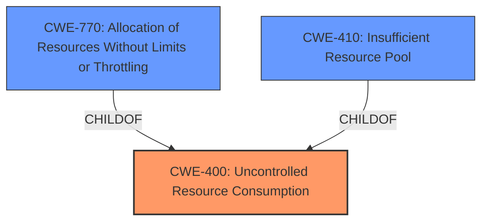

# Raw Analyzer Response for CVE-2024-33001

# Summary
| CWE ID | CWE Name | Confidence | CWE Abstraction Level | CWE Vulnerability Mapping Label | CWE-Vulnerability Mapping Notes |
|---|---|---|---|---|---|
| CWE-400 | Uncontrolled Resource Consumption | 0.7 | Class |  | Discouraged |
| CWE-770 | Allocation of Resources Without Limits or Throttling | 0.6 | Base |  | Allowed |
| CWE-410 | Insufficient Resource Pool | 0.5 | Base |  | Allowed |

## Evidence and Confidence

*   **Confidence Score:** 0.7
*   **Evidence Strength:** LOW

## Relationship Analysis
The primary CWE considered is CWE-400, which represents uncontrolled resource consumption. CWE-770 (Allocation of Resources Without Limits or Throttling) is a child of CWE-400 and a potential refinement. CWE-410 (Insufficient Resource Pool) is also related, representing a specific type of resource limitation. These relationships help refine the classification towards more specific weaknesses, but the high-level nature of the description limits a precise mapping.

## Vulnerability Chain
The vulnerability chain starts with an attacker action that leads to **uncontrolled resource consumption**, ultimately resulting in a denial-of-service condition. The chain is: Attacker -> **Uncontrolled Resource Consumption** -> Denial of Service (Impact). There are no specifics to make a distinction between consumption, allocation, or resource pool.

## Summary of Analysis
The vulnerability description indicates a Denial of Service (DoS) condition in SAP NetWeaver and ABAP platform due to an attacker's ability to crash or flood the service, impacting availability.

Initially, CWE-400 (Uncontrolled Resource Consumption) was considered due to its broad applicability to resource exhaustion scenarios. However, the retriever results also suggested CWE-770 (Allocation of Resources Without Limits or Throttling) and CWE-410 (Insufficient Resource Pool).

CWE-400 is a Class-level CWE and is generally discouraged. It's also misused in low-information vulnerability reports. The description doesn't provide enough information to pinpoint the exact root cause, but the possibility of uncontrolled allocation is present.

CWE-770 is a Base level and allowed for mapping. The **uncontrolled resource consumption** could be due to allocation without limits.

CWE-410 is a Base level and allowed for mapping. The **uncontrolled resource consumption** could be due to an insufficient resource pool.

The evidence is weak because the "CVE Reference Links Content Summary" section is empty, providing no specific technical details. The "Vulnerability Description Key Phrases" section only mentions impact and attacker, but not the **root cause** other than **impact:** Denial of Service and availability and crash or flood the service.

Given the limited information, CWE-400 is chosen as the primary weakness due to its relevance to DoS caused by resource exhaustion. However, it's a high-level classification. CWE-770 and CWE-410 are listed as other potential candidates. The confidence is moderate due to the lack of detailed information.

Relevant CWE Information: