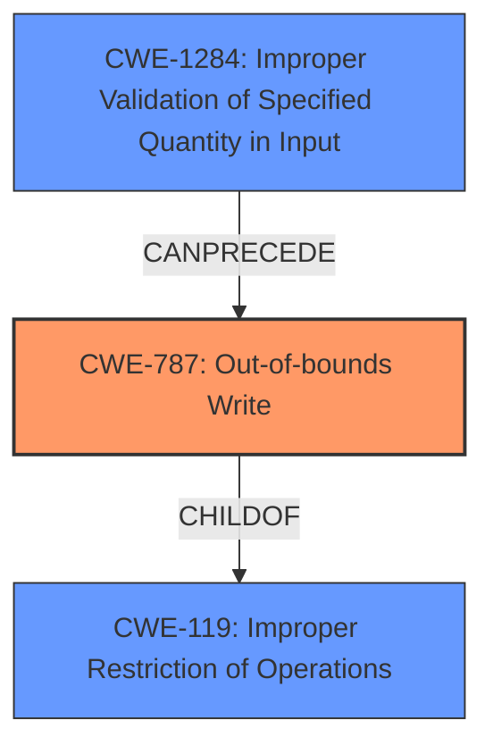

# Analysis Report for CVE-2024-33036

# Vulnerability Analysis Report: CVE-2024-33036

## Description

**Memory corruption** while parsing sensor packets in camera driver, user-space variable is used while allocating memory in kernel and parsing which can lead to huge allocation or invalid memory access.

## Vulnerability Description Key Phrases

- **Rootcause:** use-after-free
- **Weakness:** ['Memory corruption', 'heap-buffer-overflow']
- **Component:** camera driver

## Analysis (with Relationship Data)

# Summary

| CWE ID    | CWE Name                                                                       | Confidence | CWE Abstraction Level | CWE Vulnerability Mapping Label | CWE-Vulnerability Mapping Notes |
| :---------- | :----------------------------------------------------------------------------- | :--------- | :---------------------- | :------------------------------ | :------------------------------ |
| CWE-787     | Out-of-bounds Write                                                            | 0.95       | Base                    | Primary                         | Allowed                         |
| CWE-1284    | Improper Validation of Specified Quantity in Input                             | 0.80       | Base                    | Secondary                       | Allowed                         |
| CWE-119     | Improper Restriction of Operations within the Bounds of a Memory Buffer        | 0.70       | Class                   | Secondary                       | Allowed                         |

## Evidence and Confidence

*   **Confidence Score:** 0.85
*   **Evidence Strength:** MEDIUM

## Relationship Analysis

The primary weakness is CWE-787, which is a base-level CWE and a child of CWE-119. CWE-1284 can precede CWE-787, indicating a potential chain where improper input validation leads to an out-of-bounds write. CWE-119 is a class-level CWE that provides a broader categorization, but CWE-787 is more specific to the described vulnerability.



## Vulnerability Chain

The vulnerability chain starts with **improper validation of the specified quantity in the input** (CWE-1284), which leads to a **heap-based buffer overflow** or **memory corruption**, manifesting as an **out-of-bounds write** (CWE-787). The root cause is the **user-space variable is used while allocating memory in kernel and parsing which can lead to huge allocation or invalid memory access**.

CWE-1284 (Improper Validation of Specified Quantity in Input) -> CWE-787 (Out-of-bounds Write)

## Summary of Analysis

The analysis identifies CWE-787 (Out-of-bounds Write) as the primary CWE, supported by the vulnerability description indicating memory corruption due to improper handling of sensor packets in the camera driver. The description states that a user-space variable is used while allocating memory in the kernel, which can lead to a huge allocation or invalid memory access, pointing directly to an out-of-bounds write condition.

CWE-1284 (Improper Validation of Specified Quantity in Input) is a secondary CWE because the vulnerability involves using a user-space variable without proper validation when allocating memory in the kernel, which can lead to an out-of-bounds write if the quantity specified by the user is not validated.

CWE-119 (Improper Restriction of Operations within the Bounds of a Memory Buffer) is included as a more general, higher-level CWE that encompasses the out-of-bounds write.

The retriever scores and keyphrase analysis were used to identify candidate CWEs. The final selection was influenced by the need to represent the root cause and the specific manifestation of the vulnerability.

Other CWEs considered but not used:

*   CWE-122 (Heap-based Buffer Overflow): While related, CWE-787 is more general and accurately describes the out-of-bounds write condition.
*   CWE-190 (Integer Overflow or Wraparound): While an integer overflow could lead to an incorrect buffer size calculation, the primary issue is the out-of-bounds write, making CWE-787 more appropriate.
*   CWE-416 (Use After Free): The vulnerability description does not explicitly mention a use-after-free condition.
*   CWE-667 (Improper Locking): The vulnerability description does not explicitly mention locking issues.

Relevant CWE Information:
# Enhanced Context (25 CWEs)
The following CWEs were identified as potentially relevant to this vulnerability:

## CWE-667: Improper Locking
**Abstraction Level**: Class
**Similarity Score**: 0.74
**Source**: dense

**Description**:
The product does not properly acquire or release a lock on a resource, leading to unexpected resource state changes and behaviors.

**Mapping Guidance**:
- Usage: Allowed-with-Review
- Rationale: This CWE entry is a Class and might have Base-level children that would be more appropriate

## CWE-131: Incorrect Calculation of Buffer Size
**Abstraction Level**: Base
**Similarity Score**: 0.73
**Source**: dense

**Description**:
The product does not correctly calculate the size to be used when allocating a buffer, which could lead to a buffer overflow.

**Mapping Guidance**:
- Usage: Allowed
- Rationale: This CWE entry is at the Base level of abstraction, which is a preferred level of abstraction for mapping to the root causes of vulnerabilities.

## CWE-824: Access of Uninitialized Pointer
**Abstraction Level**: Base
**Similarity Score**: 0.73
**Source**: dense

**Description**:
The product accesses or uses a pointer that has not been initialized.

**Mapping Guidance**:
- Usage: Allowed
- Rationale: This CWE entry is at the Base level of abstraction, which is a preferred level of abstraction for mapping to the root causes of vulnerabilities.

## CWE-703: Improper Check or Handling of Exceptional Conditions
**Abstraction Level**: Pillar
**Similarity Score**: 0.72
**Source**: dense

**Description**:
The product does not properly anticipate or handle exceptional conditions that rarely occur during normal operation of the product.

**Mapping Guidance**:
- Usage: Discouraged
- Rationale: This CWE entry is extremely high-level, a Pillar.

## CWE-129: Improper Validation of Array Index
**Abstraction Level**: Variant
**Similarity Score**: 0.72
**Source**: dense

**Description**:
The product uses untrusted input when calculating or using an array index, but the product does not validate or incorrectly validates the index to ensure the index references a valid position within the array.

**Mapping Guidance**:
- Usage: Allowed
- Rationale: This CWE entry is at the Variant level of abstraction, which is a preferred level of abstraction for mapping to the root causes of vulnerabilities.

## CWE-665: Improper Initialization
**Abstraction Level**: Class
**Similarity Score**: 0.71
**Source**: dense

**Description**:
The product does not initialize or incorrectly initializes a resource, which might leave the resource in an unexpected state when it is accessed or used.

**Mapping Guidance**:
- Usage: Discouraged
- Rationale: This CWE entry is a level-1 Class (i.e., a child of a Pillar). It might have lower-level children that would be more appropriate

## CWE-1391: Use of Weak Credentials
**Abstraction Level**: Class
**Similarity Score**: 0.71
**Source**: dense

**Description**:
The product uses weak credentials (such as a default key or hard-coded password) that can be calculated, derived, reused, or guessed by an attacker.

**Mapping Guidance**:
- Usage: Allowed-with-Review
- Rationale: This CWE entry is a Class and might have Base-level children that would be more appropriate

## CWE-696: Incorrect Behavior Order
**Abstraction Level**: Class
**Similarity Score**: 0.71
**Source**: dense

**Description**:
The product performs multiple related behaviors, but the behaviors are performed in the wrong order in ways which may produce resultant weaknesses.

**Mapping Guidance**:
- Usage: Allowed-with-Review
- Rationale: This CWE entry is a Class and might have Base-level children that would be more appropriate

## CWE-822: Untrusted Pointer Dereference
**Abstraction Level**: Base
**Similarity Score**: 0.71
**Source**: dense

**Description**:
The product obtains a value from an untrusted source, converts this value to a pointer, and dereferences the resulting pointer.

**Mapping Guidance**:
- Usage: Allowed
- Rationale: This CWE entry is at the Base level of abstraction, which is a preferred level of abstraction for mapping to the root causes of vulnerabilities.

## CWE-193: Off-by-one Error
**Abstraction Level**: Base
**Similarity Score**: 0.71
**Source**: dense

**Description**:
A product calculates or uses an incorrect maximum or minimum value that is 1 more, or 1 less, than the correct value.

**Mapping Guidance**:
- Usage: Allowed
- Rationale: This CWE entry is at the Base level of abstraction, which is a


## CWE Relationship Analysis

Current CWEs represent these abstraction levels: .


### Vulnerability Chain Analysis

**Chain starting from CWE-1284:**
- 1284 (Improper Validation of Specified Quantity in Input) - ROOT


**Chain starting from CWE-416:**
- 416 (Use After Free) - ROOT


### CWE Relationship Diagram

```mermaid
graph TD
    classDef primary fill:#f96,stroke:#333,stroke-width:2px
    classDef secondary fill:#69f,stroke:#333
    classDef tertiary fill:#9e9,stroke:#333
```


*Report generated on 2025-07-13 07:47:44*
