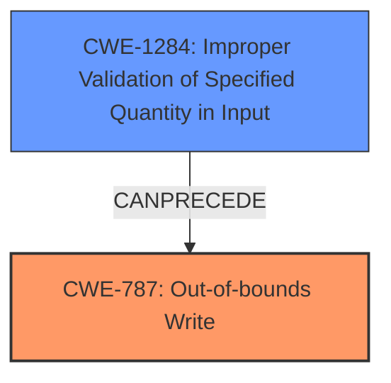

# Raw Analyzer Response for CVE-2024-33039

# Summary
| CWE ID | CWE Name | Confidence | CWE Abstraction Level | CWE Vulnerability Mapping Label | CWE-Vulnerability Mapping Notes |
|---|---|---|---|---|---|
| CWE-787 | Out-of-bounds Write | 0.9 | Base | Primary | Allowed |
| CWE-1284 | Improper Validation of Specified Quantity in Input | 0.7 | Base | Secondary | Allowed |

## Evidence and Confidence

*   **Confidence Score:** 0.8
*   **Evidence Strength:** HIGH

## Relationship Analysis
The primary relationship influencing the selection is the potential for **CWE-1284 (Improper Validation of Specified Quantity in Input)** to lead to **CWE-787 (Out-of-bounds Write)**. The graph analysis and retriever results both point to these CWEs. **CWE-787** is a base CWE, providing a good level of specificity.

## Vulnerability Chain
The vulnerability chain starts with the **IMPROPER VALIDATION** of the handle (**CWE-1284**). This **LACK OF VALIDATION** allows a random, potentially malicious value to be used as a handle. When this invalid handle is used, it results in a write operation to an unintended memory location, leading to **MEMORY CORRUPTION** via **CWE-787 (Out-of-bounds Write)**.

## Summary of Analysis
The initial analysis strongly suggests that the root cause is a **LACK OF VALIDATION** of the handle passed to the PAL service APIs, leading to memory corruption. The vulnerability description key phrases highlight the **ROOTCAUSE** as "**handle is not validated by service**" and the **WEAKNESS** as "**memory corruption**".

The Retriever Results list **CWE-787 (Out-of-bounds Write)** as the top candidate. This aligns with the "**memory corruption**" aspect described in the Vulnerability Description.

The Retriever Results also list **CWE-1284 (Improper Validation of Specified Quantity in Input)**. While the description doesn't explicitly mention the input being a quantity, the handle can be interpreted as a value that should have certain properties. The fact that the handle is not validated by the service points to this CWE.

The graph relationships also show that **CWE-1284** can precede **CWE-787**.

Therefore, the primary CWE is **CWE-787 (Out-of-bounds Write)**, representing the direct cause of the memory corruption. **CWE-1284 (Improper Validation of Specified Quantity in Input)** is a secondary CWE, representing the **ROOTCAUSE** that allowed the vulnerability to occur.

Other CWEs were considered but deemed less suitable:

*   **CWE-770 (Allocation of Resources Without Limits or Throttling)** and **CWE-789 (Memory Allocation with Excessive Size Value)**: These are related to memory allocation issues but don't directly address the **IMPROPER VALIDATION** and subsequent **OUT-OF-BOUNDS WRITE**.
*   **CWE-367 (Time-of-check Time-of-use (TOCTOU) Race Condition)**: This is related to race conditions, which are not mentioned in the vulnerability description.

Relevant CWE Information:

*   **CWE-787 (Out-of-bounds Write)**: This CWE describes a situation where a program writes data beyond the intended buffer, leading to memory corruption. This perfectly matches the "**memory corruption**" aspect of the vulnerability.
*   **CWE-1284 (Improper Validation of Specified Quantity in Input)**: This CWE describes a situation where the product does not validate input that specifies a quantity. In this case, the handle can be viewed as such a quantity, and the **LACK OF VALIDATION** is the **ROOTCAUSE** of the vulnerability.