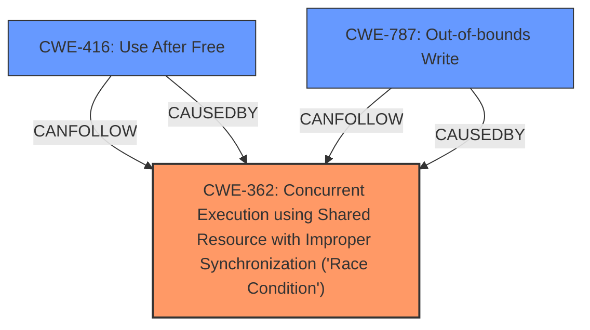

# Raw Analyzer Response for CVE-2024-33040

# Summary

| CWE ID | CWE Name | Confidence | CWE Abstraction Level | CWE Vulnerability Mapping Label | CWE-Vulnerability Mapping Notes |
|---|---|---|---|---|---|
| CWE-362 | Concurrent Execution using Shared Resource with Improper Synchronization ('Race Condition') | 0.9 | Class | Primary | Allowed-with-Review |
| CWE-416 | Use After Free | 0.7 | Variant | Secondary | Allowed |
| CWE-787 | Out-of-bounds Write | 0.6 | Base | Secondary | Allowed |

## Evidence and Confidence

*   **Confidence Score:** 0.7
*   **Evidence Strength:** MEDIUM

## Relationship Analysis

The primary weakness is a **race condition**, which falls under CWE-362. The potential consequence is **memory corruption**, which can lead to **use-after-free** (CWE-416) or **out-of-bounds write** (CWE-787). CWE-362 is a class-level CWE, and while more specific base-level CWEs related to race conditions exist (e.g., CWE-367), CWE-362 is appropriate given the high-level description of the race condition. CWE-416 and CWE-787 are possible consequences of the race condition and are included as secondary CWEs.

## Vulnerability Chain

The vulnerability chain starts with a **race condition** (CWE-362) between buffer release and buffer access in kernel space. This **race condition** can lead to **memory corruption**. The **memory corruption** can manifest as a **use-after-free** (CWE-416) or an **out-of-bounds write** (CWE-787).

CWE-362 (Race Condition) -> Memory Corruption -> CWE-416 (Use After Free) or CWE-787 (Out-of-bounds Write).

## Summary of Analysis

The vulnerability description clearly indicates a **race condition** as the root cause, leading to memory corruption. The Retriever results also point to CWE-362 as the top candidate. While the description doesn't provide explicit details about the type of memory corruption, **use-after-free** and **out-of-bounds write** are plausible consequences and are included as secondary CWEs.

The selection of CWE-362 is primarily based on the explicit mention of a "race condition" in the vulnerability description: "**race condition** can occur in kernel space between buffer release and buffer access".

The graph relationships highlight that CWE-416 and CWE-787 are potential consequences of CWE-362. These relationships reinforce the idea that the race condition can lead to memory corruption vulnerabilities.

The selected CWEs are at an appropriate level of specificity. CWE-362 is a class-level CWE, but it directly addresses the root cause, which is the **race condition**. CWE-416 and CWE-787 represent the potential consequences of the race condition and are at the variant and base levels, respectively.

Other CWEs Considered but Not Used:

*   CWE-367 (Time-of-check Time-of-use (TOCTOU) Race Condition): While related to race conditions, the description doesn't specifically mention a TOCTOU scenario.
*   CWE-667 (Improper Locking): While improper locking can lead to race conditions, the description doesn't explicitly mention locking issues.
*   CWE-476 (NULL Pointer Dereference): Not directly indicated in the description, although memory corruption could lead to this.
*   CWE-122 (Heap-based Buffer Overflow): A possible consequence of memory corruption, but not directly stated.
*   CWE-125 (Out-of-bounds Read): A possible consequence of memory corruption, but not directly stated.
*   CWE-1284 (Improper Validation of Specified Quantity in Input): Not relevant to the described vulnerability.
*   CWE-763 (Release of Invalid Pointer or Reference): A possible consequence of memory corruption, but not directly stated.
*   CWE-123 (Write-what-where Condition): A general consequence of memory corruption, but not specific enough.