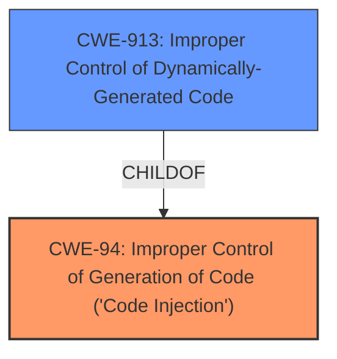

# Analysis Report for CVE-2024-3330

# Vulnerability Analysis Report: CVE-2024-3330

## Description

Vulnerability in Spotfire Spotfire Analyst, Spotfire Spotfire Server, Spotfire Spotfire for AWS Marketplace allows In the case of the installed Windows client Successful execution of this vulnerability will result in an attacker being able to run arbitrary code.This requires human interaction from a person other than the attacker., In the case of the Web player (Business Author) Successful execution of this vulnerability via the Web Player, will result in the attacker being able to run arbitrary code as the account running the Web player process, In the case of Automation Services Successful execution of this vulnerability will result in an attacker being able to run arbitrary code via Automation Services..This issue affects Spotfire Analyst from 12.0.9 through 12.5.0, from 14.0 through 14.0.2 Spotfire Server from 12.0.10 through 12.5.0, from 14.0 through 14.0.3, from 14.2.0 through 14.3.0 Spotfire for AWS Marketplace from 14.0 before 14.3.0.

## Vulnerability Description Key Phrases

- **Impact:** run arbitrary code
- **Product:** ['Spotfire Analyst', 'Spotfire Server', 'Spotfire for AWS Marketplace']
- **Version:** 12.0.9 through 12.5.0, from 14.0 through 14.0.2

## Analysis (with Relationship Data)

# Summary
| CWE ID | CWE Name | Confidence | CWE Abstraction Level | CWE Vulnerability Mapping Label | CWE-Vulnerability Mapping Notes |
|---|---|---|---|---|---|
| CWE-94 | Improper Control of Generation of Code ('Code Injection') | 0.7 | Base | Allowed-with-Review | Primary CWE. The vulnerability allows an attacker to run arbitrary code, which is a direct result of **improper control of code generation**. |

## Evidence and Confidence

*   **Confidence Score:** 0.7
*   **Evidence Strength:** MEDIUM

## Relationship Analysis
The primary relationship that influenced the decision was the parent-child relationship between CWE-913 (Improper Control of Dynamically-Generated Code) and CWE-94. CWE-94 is the broader, more general case of code injection, while CWE-913 is specific to dynamically generated code. Given the vulnerability description provides no information on whether the code being generated is dynamic or static, CWE-94 is a better fit. There is a CANFOLLOW relationship from CWE-94 to CWE-98 (Improper Control of Filename for Include/Require Statement in PHP Program ('PHP Remote File Inclusion')), but that's specific to PHP, which is not in the vulnerability description.



## Vulnerability Chain
The vulnerability chain starts with the **improper control of generation of code** (CWE-94), which leads to the ability to **run arbitrary code**.

## Summary of Analysis
The initial analysis, based on the provided evidence, points to CWE-94 as the most appropriate classification. The vulnerability description clearly states that successful exploitation results in the ability to **run arbitrary code**. The key phrase "run arbitrary code" aligns directly with the impact described in CWE-94 "Improper Control of Generation of Code ('Code Injection')". The evidence supporting this decision is derived from the vulnerability description: "Successful execution of this vulnerability will result in an attacker being able to run arbitrary code."

The retriever results also support this selection, listing CWE-94 as a relevant candidate. While other CWEs like CWE-732 (Incorrect Permission Assignment for Critical Resource), CWE-285 (Improper Authorization), and CWE-502 (Deserialization of Untrusted Data) were considered, they did not directly address the root cause of the vulnerability, which is the **improper control of code generation** that enables arbitrary code execution.

The graph relationships, particularly the parent-child relationship with CWE-913, reinforce the choice of CWE-94 due to its broader applicability given the lack of specific details about dynamic code generation.

Relevant CWE Information:

# Enhanced Context (25 CWEs)
The following CWEs were identified as potentially relevant to this vulnerability:

## CWE-497: Exposure of Sensitive System Information to an Unauthorized Control Sphere
**Abstraction Level**: Base
**Similarity Score**: 0.72
**Source**: dense

**Description**:
The product does not properly prevent sensitive system-level information from being accessed by unauthorized actors who do not have the same level of access to the underlying system as the product does.

**Mapping Guidance**:
- Usage: Allowed
- Rationale: This CWE entry is at the Base level of abstraction, which is a preferred level of abstraction for mapping to the root causes of vulnerabilities.


## CWE-668: Exposure of Resource to Wrong Sphere
**Abstraction Level**: Class
**Similarity Score**: 0.72
**Source**: dense

**Description**:
The product exposes a resource to the wrong control sphere, providing unintended actors with inappropriate access to the resource.

**Mapping Guidance**:
- Usage: Discouraged
- Rationale: CWE-668 is high-level and is often misused as a catch-all when lower-level CWE IDs might be applicable. It is sometimes used for low-information vulnerability reports [REF-1287]. It is a level-1 Class (i.e., a child of a Pillar). It is not useful for trend analysis.


## CWE-732: Incorrect Permission Assignment for Critical Resource
**Abstraction Level**: Class
**Similarity Score**: 0.71
**Source**: dense

**Description**:
The product specifies permissions for a security-critical resource in a way that allows that resource to be read or modified by unintended actors.

**Mapping Guidance**:
- Usage: Allowed-with-Review
- Rationale: While the name itself indicates an assignment of permissions for resources, this is often misused for vulnerabilities in which "permissions" are not checked, which is an "authorization" weakness (CWE-285 or descendants) within CWE's model [REF-1287].


## CWE-303: Incorrect Implementation of Authentication Algorithm
**Abstraction Level**: Base
**Similarity Score**: 0.70
**Source**: dense

**Description**:
The requirements for the product dictate the use of an established authentication algorithm, but the implementation of the algorithm is incorrect.

**Mapping Guidance**:
- Usage: Allowed
- Rationale: This CWE entry is at the Base level of abstraction, which is a preferred level of abstraction for mapping to the root causes of vulnerabilities.


## CWE-941: Incorrectly Specified Destination in a Communication Channel
**Abstraction Level**: Base
**Similarity Score**: 0.70
**Source**: dense

**Description**:
The product creates a communication channel to initiate an outgoing request to an actor, but it does not correctly specify the intended destination for that actor.

**Mapping Guidance**:
- Usage: Allowed
- Rationale: This CWE entry is at the Base level of abstraction, which is a preferred level of abstraction for mapping to the root causes of vulnerabilities.


## CWE-807: Reliance on Untrusted Inputs in a Security Decision
**Abstraction Level**: Base
**Similarity Score**: 0.70
**Source**: dense

**Description**:
The product uses a protection mechanism that relies on the existence or values of an input, but the input can be modified by an untrusted actor in a way that bypasses the protection mechanism.

**Mapping Guidance**:
- Usage: Allowed
- Rationale: This CWE entry is at the Base level of abstraction, which is a preferred level of abstraction for mapping to the root causes of vulnerabilities.


## CWE-74: Improper Neutralization of Special Elements in Output Used by a Downstream Component ('Injection')
**Abstraction Level**: Class
**Similarity Score**: 0.70
**Source**: dense

**Description**:
The product constructs all or part of a command, data structure, or record using externally-influenced input from an upstream component, but it does not neutralize or incorrectly neutralizes special elements that could modify how it is parsed or interpreted when it is sent to a downstream component.

**Mapping Guidance**:
- Usage: Discouraged
- Rationale: CWE-74 is high-level and often misused when lower-level weaknesses are more appropriate.


## CWE-266: Incorrect Privilege Assignment
**Abstraction Level**: Base
**Similarity Score**: 0.70
**Source**: dense

**Description**:
A product incorrectly assigns a privilege to a particular actor, creating an unintended sphere of control for that actor.

**Mapping Guidance**:
- Usage: Allowed
- Rationale: This CWE entry is at the Base level of abstraction, which is a preferred level of abstraction for mapping to the root causes of vulnerabilities.


## CWE-502: Deserialization of Untrusted Data
**Abstraction Level**: Base
**Similarity Score**: 0.69
**Source**: dense

**Description**:
The product deserializes untrusted data without sufficiently ensuring that the resulting data will be valid.

**Mapping Guidance**:
- Usage: Allowed
- Rationale: This CWE entry is at the Base level of abstraction, which is a preferred level of abstraction for mapping to the root causes of vulnerabilities.


## CWE-200: Exposure of Sensitive Information to an Unauthorized Actor
**Abstraction Level**: Class
**Similarity Score**: 0.69
**Source**: dense

**Description**:
The product exposes sensitive information to an actor that is not explicitly authorized to have access to that information.

**Mapping Guidance**:
- Usage: Discouraged
- Rationale: CWE-200 is commonly misused to represent the loss of confidentiality in a vulnerability, but confidentiality loss is a technical impact - not a root cause error. As of CWE 4.9, over 400 CWE entries can lead to a loss of confidentiality. Other options are often available. [REF-1287].


## CWE-285: Improper Authorization
**Abstraction Level**: Class
**Similarity Score**: 705.45
**Source**: sparse

**Description**:
The product does not perform or incorrectly performs an authorization check when an actor attempts to access a resource or perform an action.

**Mapping Guidance**:
- Usage: Discouraged
- Rationale: CWE


## CWE Relationship Analysis

Current CWEs represent these abstraction levels: .


### Vulnerability Chain Analysis

**Chain starting from CWE-502:**
- 502 (Deserialization of Untrusted Data) - ROOT


**Chain starting from CWE-94:**
- 94 (Improper Control of Generation of Code ('Code Injection')) - ROOT


### CWE Relationship Diagram

```mermaid
graph TD
    classDef primary fill:#f96,stroke:#333,stroke-width:2px
    classDef secondary fill:#69f,stroke:#333
    classDef tertiary fill:#9e9,stroke:#333
```


*Report generated on 2025-07-13 07:50:30*
