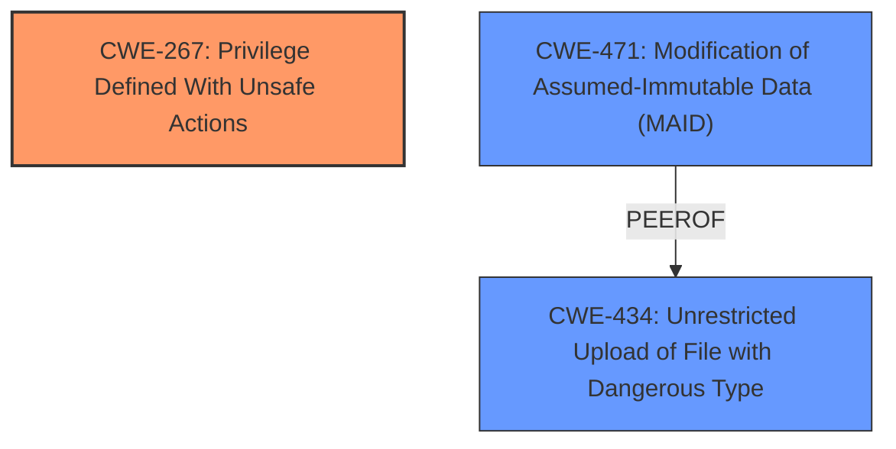

# Raw Analyzer Response for CVE-2024-33469

# Summary
| CWE ID | CWE Name | Confidence | CWE Abstraction Level | CWE Vulnerability Mapping Label | CWE-Vulnerability Mapping Notes |
|---|---|---|---|---|---|
| CWE-267 | Privilege Defined With Unsafe Actions | 0.7 | Base | Allowed | Primary CWE - captures the root cause of allowing unsafe actions through a privilege. |
| CWE-471 | Modification of Assumed-Immutable Data (MAID) | 0.5 | Base | Allowed | Secondary Candidate - potentially relevant if the arbitrary code execution involves modifying immutable data. |
| CWE-434 | Unrestricted Upload of File with Dangerous Type | 0.4 | Base | Allowed | Secondary Candidate - potentially relevant if the arbitrary code execution involves uploading dangerous files. |

## Evidence and Confidence

*   **Confidence Score:** 0.7
*   **Evidence Strength:** MEDIUM

## Relationship Analysis
The primary CWE is CWE-267, which stands alone as a Base level weakness. The secondary candidates, CWE-471 and CWE-434, are also Base level weaknesses and are peers of each other. These aren't direct parent-child relationships, but the choice of CWE-267 is supported because it focuses on the unsafe actions enabled by the privilege, which is more direct than focusing on input validation (CWE-20) or path traversal (CWE-22).

## Vulnerability Chain
The vulnerability chain starts with a privilege (inferred from the ability to execute arbitrary code via a specific method), which is then used to perform unsafe actions, leading to arbitrary code execution.
  - **Root Cause:** CWE-267 Privilege Defined With Unsafe Actions
  - **Impact:** Arbitrary code execution

## Summary of Analysis
The initial analysis considered several CWEs suggested by the retriever, especially those related to input validation and path traversal. However, the core issue lies in the fact that a local attacker can execute arbitrary code via a specific method (`onCreate` of `DatabaseViewerActivity.java`). This points to a problem with how privileges are defined and managed within the application. The key evidence is the arbitrary code execution achieved through a specific method. The retriever results also included CWE-862 (Missing Authorization), but CWE-267 is more specific because it implies that a privilege exists but is being misused or allows unintended actions.

The selection of CWE-267 is at the optimal level of specificity, as it directly addresses the **root cause** of the vulnerability: the ability to perform unsafe actions due to how a privilege is defined. The other considered CWEs, such as those related to input validation or path traversal, are potential secondary issues or consequences of the primary weakness.

Relevant CWE Information:

**CWE-267: Privilege Defined With Unsafe Actions**
A particular privilege, role, capability, or right can be used to perform unsafe actions that were not intended, even when it is assigned to the correct entity. The **impact** of this vulnerability is arbitrary code execution. The **root cause** is the insecure privilege definition that enables unsafe actions.

**CWE-471: Modification of Assumed-Immutable Data (MAID)**
The product modifies data that is expected to be immutable, which can cause unexpected behavior or security vulnerabilities. Could be relevant if the arbitrary code execution involves modification of immutable data.

**CWE-434: Unrestricted Upload of File with Dangerous Type**
The product allows the upload or transfer of dangerous file types that are automatically processed within its environment. Could be relevant if the arbitrary code execution involves uploading dangerous files.