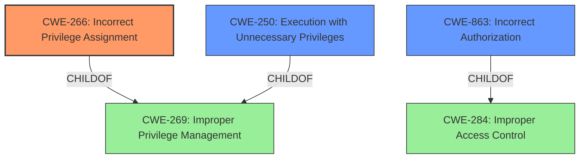

# Enhanced Analysis for CVE-2024-33503

# Summary
| CWE ID  | CWE Name                                                                   | Confidence | CWE Abstraction Level | CWE Vulnerability Mapping Label | CWE-Vulnerability Mapping Notes |
| :-------- | :------------------------------------------------------------------------- | :--------- | :---------------------- | :------------------------------ | :------------------------------ |
| CWE-266 | Incorrect Privilege Assignment                                             | 0.9        | Base                    | Primary CWE                     | Allowed                       |
| CWE-250 | Execution with Unnecessary Privileges                                    | 0.7        | Base                    | Secondary Candidate             | Allowed                       |
| CWE-863 | Incorrect Authorization                                                    | 0.6        | Class                   | Secondary Candidate             | Allowed-with-Review           |

## Evidence and Confidence

*   **Confidence Score:** 0.8
*   **Evidence Strength:** HIGH

## Relationship Analysis
The primary relationship influencing the CWE selection is the parent-child relationship between CWE-269 (Improper Privilege Management) and its children, specifically CWE-266 (Incorrect Privilege Assignment). The vulnerability involves an incorrect assignment of privileges, making CWE-266 a more specific and appropriate choice than its parent.

The relationships with CWE-250 (Execution with Unnecessary Privileges) and CWE-863 (Incorrect Authorization) offer alternative perspectives, though less directly relevant. The abstraction levels were considered to ensure the selected CWE was as specific as possible without overreaching the available evidence.



## Vulnerability Chain
The vulnerability chain starts with **improper privilege management**, specifically an incorrect assignment of privileges. This leads to privilege escalation, allowing an attacker to execute specific shell commands with elevated permissions.
  - Root Cause: CWE-266 Incorrect Privilege Assignment
  - Impact: Privilege Escalation

## Summary of Analysis
The initial assessment pointed towards CWE-269 (Improper Privilege Management) due to the vulnerability description mentioning "**improper privilege management**". However, upon further analysis, and leveraging the provided CWE guidance differentiating privileges and permissions, CWE-266 (Incorrect Privilege Assignment) emerges as a more precise classification. The CVE reference summary explicitly states "Improper privilege management due to incorrect filesystem permissions." This is the root cause. The "**improper privilege management**" is not simply a mismanagement of privileges but a specific error in how privileges are assigned. This aligns perfectly with CWE-266.

CWE-250 was considered because the elevated privileges might be unnecessary for the commands being executed, but the primary issue is the incorrect assignment, not the unnecessary execution with those privileges. CWE-863 (Incorrect Authorization) was considered but ultimately deemed less relevant as the core problem is not a flawed authorization check, but rather the initial misassignment of privileges that bypasses the authorization process altogether.

The selection of CWE-266 is at the optimal level of specificity because it directly addresses the root cause identified in the CVE description and supported by "**improper privilege management** due to incorrect filesystem permissions." The CWE guidance underscores that when a specific privilege assignment error is evident, CWE-266 is more appropriate than the more general CWE-269.

Relevant CWE Information:

# Enhanced Context (25 CWEs)
The following CWEs were identified as potentially relevant to this vulnerability:

## CWE-266: Incorrect Privilege Assignment
**Abstraction Level**: Base
**Similarity Score**: 0.79
**Source**: dense

**Description**:
A product incorrectly assigns a privilege to a particular actor, creating an unintended sphere of control for that actor.

**Mapping Guidance**:
- Usage: Allowed
- Rationale: This CWE entry is at the Base level of abstraction, which is a preferred level of abstraction for mapping to the root causes of vulnerabilities.


## CWE Relationship Analysis

Current CWEs represent these abstraction levels: .


### Vulnerability Chain Analysis

**Chain starting from CWE-863:**
- 863 (Incorrect Authorization) - ROOT


**Chain starting from CWE-269:**
- 269 (Improper Privilege Management) - ROOT


### CWE Relationship Diagram

```mermaid
graph TD
    classDef primary fill:#f96,stroke:#333,stroke-width:2px
    classDef secondary fill:#69f,stroke:#333
    classDef tertiary fill:#9e9,stroke:#333
```