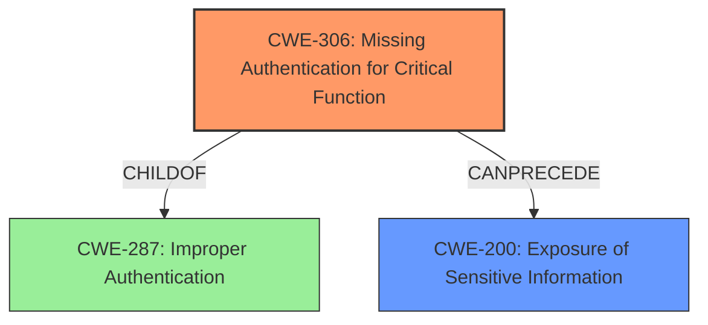

# Analysis Report for CVE-2024-33626

# Vulnerability Analysis Report: CVE-2024-33626

## Description

The LevelOne WBR-6012 router contains a vulnerability within its web application that allows unauthenticated disclosure of sensitive information, such as the WiFi WPS PIN, through a hidden page accessible by an HTTP request. Disclosure of this information could enable attackers to connect to the devices WiFi network.

## Vulnerability Description Key Phrases

- **Impact:** unauthenticated disclosure of sensitive information
- **Vector:** hidden page accessible by an HTTP request
- **Product:** LevelOne WBR-6012
- **Component:** web application

## Analysis (with Relationship Data)

# Summary
| CWE ID  | CWE Name                                           | Confidence | CWE Abstraction Level | CWE Vulnerability Mapping Label | CWE-Vulnerability Mapping Notes |
| :-------- | :------------------------------------------------- | :--------- | :---------------------- | :------------------------------ | :------------------------------ |
| CWE-306 | Missing Authentication for Critical Function | 0.9        | Base                    | Primary CWE                     | Allowed                       |
| CWE-200 | Exposure of Sensitive Information           | 0.8        | Class                   | Secondary Candidate             | Allowed                       |

## Evidence and Confidence

*   **Confidence Score:** 0.85
*   **Evidence Strength:** HIGH

## Relationship Analysis
The primary relationship influencing the decision is the child-of relationship between CWE-306 [CWE-306: Missing Authentication for Critical Function] and CWE-287 [CWE-287: Improper Authentication]. CWE-306 [CWE-306: Missing Authentication for Critical Function] is a more specific case of improper authentication, and accurately reflects the scenario where a critical function (accessing the `sysinfo.htm` page) lacks any authentication. Also, CWE-200 [CWE-200: Exposure of Sensitive Information] is a consequence of the **missing authentication**. It is the impact, rather than the root cause.



## Vulnerability Chain
The vulnerability chain starts with the **missing authentication** for the `sysinfo.htm` page (CWE-306 [CWE-306: Missing Authentication for Critical Function]). This leads to the **exposure of sensitive information** (CWE-200 [CWE-200: Exposure of Sensitive Information]), specifically the WiFi WPS PIN, which then allows for unauthorized access to the WiFi network.

## Summary of Analysis
The initial analysis focused on the **exposure of sensitive information**, but further examination revealed that the root cause is the **lack of authentication** for a critical function (accessing the hidden page). The evidence from the "CVE Reference Links Content Summary" section clearly states: "Lack of Access Control: The web application fails to restrict access to the `sysinfo.htm` page, allowing unauthenticated users to view its contents." This directly supports the selection of CWE-306 [CWE-306: Missing Authentication for Critical Function] as the primary CWE. While CWE-200 [CWE-200: Exposure of Sensitive Information] is a valid concern and impact, it is a consequence of the **missing authentication** rather than the root cause itself. The retriever results also showed CWE-306 [CWE-306: Missing Authentication for Critical Function] as a strong candidate. CWE-306 [CWE-306: Missing Authentication for Critical Function] is at the optimal level of specificity because it accurately describes the root cause: a critical function lacks any authentication mechanism.

Relevant CWE Information:
*   **CWE-306 [CWE-306: Missing Authentication for Critical Function]:** The product does not perform any authentication for functionality that requires a provable user identity or consumes a significant amount of resources.
*   **CWE-200 [CWE-200: Exposure of Sensitive Information]:** The product exposes sensitive information to an actor when it should not. This may lead to privacy violations, stolen credentials, fraud, identity theft, etc.

CWEs Considered but Not Used:

*   CWE-425 [CWE-425: Direct Request ('Forced Browsing')]: While 'forced browsing' might be involved, it's a technique, not the core weakness. The root cause is the **missing authentication**, not merely the direct request.
*   CWE-912 [CWE-912: Hidden Functionality]: The vulnerability is not due to the functionality being hidden, but due to the **lack of access control** on it.
*   CWE-798 [CWE-798: Use of Hard-coded Credentials]: There is no evidence of **hard-coded credentials** being used.


## CWE Relationship Analysis

Current CWEs represent these abstraction levels: .


### Vulnerability Chain Analysis

**Chain starting from CWE-306:**
- 306 (Missing Authentication for Critical Function) - ROOT


**Chain starting from CWE-798:**
- 798 (Use of Hard-coded Credentials) - ROOT


### CWE Relationship Diagram

```mermaid
graph TD
    classDef primary fill:#f96,stroke:#333,stroke-width:2px
    classDef secondary fill:#69f,stroke:#333
    classDef tertiary fill:#9e9,stroke:#333
```


*Report generated on 2025-07-13 07:55:25*
