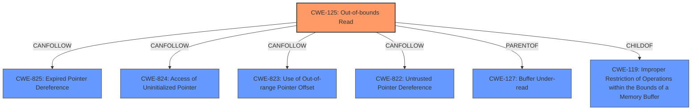

# Analysis Report for CVE-2024-33653

# Vulnerability Analysis Report: CVE-2024-33653

## Description

A vulnerability has been identified in Simcenter Femap (All versions < V2406). The affected applications contain an **out of bounds read** past the end of an allocated structure while parsing specially crafted BMP files. This could allow an attacker to execute code in the context of the current process.

## Vulnerability Description Key Phrases

- **Rootcause:** out of bounds read
- **Weakness:** out of bounds read past the end of an allocated structure
- **Impact:** execute code in the context of the current process
- **Vector:** specially crafted BMP files
- **Attacker:** attacker
- **Product:** Simcenter Femap
- **Version:** All versions < V2406

## Analysis (with Relationship Data)

# Summary
| CWE ID  | CWE Name                                             | Confidence | CWE Abstraction Level | CWE Vulnerability Mapping Label | CWE-Vulnerability Mapping Notes |
| :-------- | :--------------------------------------------------- | :--------- | :---------------------- | :------------------------------ | :------------------------------ |
| CWE-125   | Out-of-bounds Read                                 | 1          | Base                    | Primary CWE                    | Allowed                       |

## Evidence and Confidence

*   **Confidence Score:** 1
*   **Evidence Strength:** HIGH

## Relationship Analysis
The primary relationship observed is that CWE-125 [CWE-125: Out-of-bounds Read] is a type of memory corruption issue. It can be a direct result of other weaknesses like improper input validation or integer overflows that lead to incorrect buffer sizes. The graph relationships show that CWE-125 [CWE-125: Out-of-bounds Read] can be followed by CWE-825, CWE-824, CWE-823, and CWE-822.



## Vulnerability Chain
The vulnerability chain starts with the parsing of a specially crafted BMP file, leading to an **out-of-bounds read**, which can then lead to arbitrary code execution.

## Summary of Analysis
The primary weakness is an **out-of-bounds read** that occurs when parsing a specially crafted BMP file. The vulnerability description explicitly states "**out of bounds read past the end of an allocated structure**". The "CVE Reference Links Content Summary" section also confirms the root cause as an **out-of-bounds read** (CWE-125 [CWE-125: Out-of-bounds Read]).

CWE-125 [CWE-125: Out-of-bounds Read] is at the Base level of abstraction, which is the preferred level. The retriever results list CWE-125 [CWE-125: Out-of-bounds Read] and CWE-787 [CWE-787: Out-of-bounds Write] with high scores. However, the description clearly indicates a read operation, not a write operation.

CWE-787 [CWE-787: Out-of-bounds Write] was considered due to its high score in the "Top CWEs" and "Retriever Results", and its selection as the "Primary CWE Match" in the CWE for similar CVE Descriptions section. However, the vulnerability description specifically mentions an **out-of-bounds read**, making CWE-125 [CWE-125: Out-of-bounds Read] the more accurate choice.


## CWE Relationship Analysis

Current CWEs represent these abstraction levels: .


### Vulnerability Chain Analysis

**Chain starting from CWE-823:**
- 823 (Use of Out-of-range Pointer Offset) - ROOT


**Chain starting from CWE-127:**
- 127 (Buffer Under-read) - ROOT


### CWE Relationship Diagram

```mermaid
graph TD
    classDef primary fill:#f96,stroke:#333,stroke-width:2px
    classDef secondary fill:#69f,stroke:#333
    classDef tertiary fill:#9e9,stroke:#333
```


*Report generated on 2025-07-13 07:55:41*
