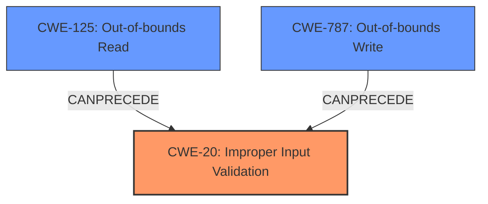

# Analysis Report for CVE-2024-33657

# Vulnerability Analysis Report: CVE-2024-33657

## Description

This SMM vulnerability affects certain modules, allowing privileged attackers to execute arbitrary code, manipulate stack memory, and leak information from SMRAM to kernel space, potentially leading to denial-of-service attacks.

## Vulnerability Description Key Phrases

- **Impact:** ['execute arbitrary code', 'manipulate stack memory', 'information leak from SMRAM to kernel space']
- **Attacker:** privileged attackers
- **Component:** certain modules

## Analysis (with Relationship Data)

# Summary
| CWE ID | CWE Name | Confidence | CWE Abstraction Level | CWE Vulnerability Mapping Label | CWE-Vulnerability Mapping Notes |
|---|---|---|---|---|---|
| CWE-20 | Improper Input Validation | 0.7 | Class | Primary | Allowed |
| CWE-125 | Out-of-bounds Read | 0.5 | Base | Secondary | Allowed |
| CWE-787 | Out-of-bounds Write | 0.5 | Base | Secondary | Allowed |

## Evidence and Confidence

*   **Confidence Score:** 0.7
*   **Evidence Strength:** MEDIUM

## Relationship Analysis
The primary CWE is CWE-20, which is a Class-level CWE. While it is generally discouraged to use Class-level CWEs, the provided information from the CVE Reference Links Content Summary specifically calls out "Improper Input Validation (CWE-20)" as a weakness. The vulnerability description speaks of arbitrary code execution and information leak. This could be achieved due to **improper input validation** leading to **out-of-bounds read** (CWE-125) to leak information, or **out-of-bounds write** (CWE-787) to achieve arbitrary code execution.


## Vulnerability Chain
The vulnerability chain starts with **improper input validation** (CWE-20). This **weakness** can lead to **out-of-bounds read** (CWE-125) for information leakage or **out-of-bounds write** (CWE-787) for arbitrary code execution.

## Summary of Analysis
The primary weakness identified in the CVE description is **improper input validation** (CWE-20). The impact, as described in the vulnerability description, includes arbitrary code execution, stack manipulation, and information leakage. These impacts can be achieved through out-of-bounds read/write operations. Therefore, CWE-125 and CWE-787 are included as secondary CWEs to indicate the potential consequences of the primary weakness. The selection is based on the CVE reference link summary which mentions CWE-20 directly.

Other CWEs Considered:

*   CWE-119: Improper Restriction of Operations within the Bounds of a Memory Buffer - This is a class-level CWE and is discouraged when more specific CWEs are available. CWE-125 and CWE-787 are more specific and accurately represent the out-of-bounds read/write conditions.
*   CWE-1285: Improper Validation of Specified Index, Position, or Offset in Input - This CWE is similar to CWE-20 but focuses on index/position/offset validation. The description doesn't provide enough information to confirm this specific type of input validation issue.
*   CWE-822: Untrusted Pointer Dereference, CWE-824: Access of Uninitialized Pointer, CWE-823: Use of Out-of-range Pointer Offset: These CWEs relate to pointer issues, but there is no explicit mention of pointers in the vulnerability description.
*   CWE-131: Incorrect Calculation of Buffer Size: While a buffer overflow might occur, the root cause is not explicitly stated as an incorrect calculation of buffer size.
*   CWE-252: Unchecked Return Value: There is no information about unchecked return values in the description.
*   CWE-755: Improper Handling of Exceptional Conditions: This is a general class-level CWE and doesn't provide specific details about the vulnerability.
*   CWE-665: Improper Initialization: This is a general class-level CWE and doesn't provide specific details about the vulnerability.
*   CWE-129: Improper Validation of Array Index: The description doesn't provide enough information to confirm this specific type of input validation issue.


## CWE Relationship Analysis

Current CWEs represent these abstraction levels: .


### Vulnerability Chain Analysis

**Chain starting from CWE-823:**
- 823 (Use of Out-of-range Pointer Offset) - ROOT


**Chain starting from CWE-125:**
- 125 (Out-of-bounds Read) - ROOT


### CWE Relationship Diagram

```mermaid
graph TD
    classDef primary fill:#f96,stroke:#333,stroke-width:2px
    classDef secondary fill:#69f,stroke:#333
    classDef tertiary fill:#9e9,stroke:#333
```


*Report generated on 2025-07-13 07:56:55*
