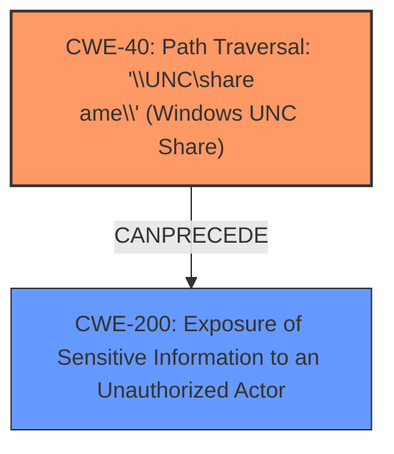

# Analysis for CVE-2024-33881

# Summary
| CWE ID | CWE Name | Confidence | CWE Abstraction Level | CWE Vulnerability Mapping Label | CWE-Vulnerability Mapping Notes |
|---|---|---|---|---|---|
| CWE-40 | Path Traversal: '\\UNC\share\name\' (Windows UNC Share) | 0.8 | Variant | Allowed | Primary CWE. The vulnerability description explicitly mentions a UNC share pathname being used in the path parameter, leading to an NTLMv2 hash leak. |
| CWE-200 | Exposure of Sensitive Information to an Unauthorized Actor | 0.5 | Class | Discouraged | Secondary candidate. The NTLMv2 hash leak falls under the broader category of sensitive information exposure, but CWE-40 is more specific. |

## Evidence and Confidence

*   **Confidence Score:** 0.8
*   **Evidence Strength:** MEDIUM

## Relationship Analysis
The primary CWE is CWE-40, which is a variant of path traversal. While CWE-200 could be considered as a higher-level categorization of the impact, CWE-40 directly addresses the root cause involving UNC pathnames.

## Vulnerability Chain
The vulnerability chain starts with the application's acceptance of a UNC share pathname. This leads to the unintended access of the UNC share, resulting in the NTLMv2 hash being leaked to an unauthorized actor.
- **Root Cause:** Acceptance of UNC share pathname (CWE-40)
- **Impact:** NTLMv2 hash leak, exposure of sensitive information.

## Summary of Analysis
The analysis is based on the provided evidence, specifically the vulnerability description mentioning the UNC share pathname and the NTLMv2 hash leak. The selection of CWE-40 is primarily driven by its direct relevance to the mentioned vulnerability details. The graph relationships show how CWE-40 can lead to CWE-200, but CWE-40 is more descriptive of the root cause. The selected CWEs are at the optimal level of specificity because CWE-40 directly reflects the vulnerability's mechanism, and CWE-200, while relevant, describes the general impact.

Relevant CWE Information:

# Enhanced Context (25 CWEs)
The following CWEs were identified as potentially relevant to this vulnerability:

## CWE-40: Path Traversal: '\\UNC\share\name\' (Windows UNC Share)
**Abstraction Level**: Variant
**Similarity Score**: 0.71
**Source**: dense

**Description**:
The product accepts input that identifies a Windows UNC share ('\\UNC\share\name') that potentially redirects access to an unintended location or arbitrary file.

**Mapping Guidance**:
- Usage: Allowed
- Rationale: This CWE entry is at the Variant level of abstraction, which is a preferred level of abstraction for mapping to the root causes of vulnerabilities.

**Why Selected:** This CWE directly matches the vulnerability description, which specifies the use of a UNC share pathname.

## CWE-59: Improper Link Resolution Before File Access ('Link Following')
**Abstraction Level**: Base
**Similarity Score**: 0.71
**Source**: dense

**Description**:
The product attempts to access a file based on the filename, but it does not properly prevent that filename from identifying a link or shortcut that resolves to an unintended resource.

**Mapping Guidance**:
- Usage: Allowed
- Rationale: This CWE entry is at the Base level of abstraction, which is a preferred level of abstraction for mapping to the root causes of vulnerabilities.

**Why Not Selected:** This CWE is related to link following, which is not the primary issue described in the vulnerability. The vulnerability specifically mentions UNC pathnames.

## CWE-434: Unrestricted Upload of File with Dangerous Type
**Abstraction Level**: Base
**Similarity Score**: 0.71
**Source**: dense

**Description**:
The product allows the upload or transfer of dangerous file types that are automatically processed within its environment.

**Mapping Guidance**:
- Usage: Allowed
- Rationale: This CWE entry is at the Base level of abstraction, which is a preferred level of abstraction for mapping to the root causes of vulnerabilities.

**Why Not Selected:** This CWE relates to file uploads, which is not mentioned in the vulnerability description.

## CWE-23: Relative Path Traversal
**Abstraction Level**: Base
**Similarity Score**: 0.71
**Source**: dense

**Description**:
The product uses external input to construct a pathname that should be within a restricted directory, but it does not properly neutralize sequences such as ".." that can resolve to a location that is outside of that directory.

**Mapping Guidance**:
- Usage: Allowed
- Rationale: This CWE entry is at the Base level of abstraction, which is a preferred level of abstraction for mapping to the root causes of vulnerabilities.

**Why Not Selected:** This CWE involves relative path traversal, but the vulnerability specifies UNC pathnames.

## CWE-427: Uncontrolled Search Path Element
**Abstraction Level**: Base
**Similarity Score**: 0.70
**Source**: dense

**Description**:
The product uses a fixed or controlled search path to find resources, but one or more locations in that path can be under the control of unintended actors.

**Mapping Guidance**:
- Usage: Allowed
- Rationale: This CWE entry is at the Base level of abstraction, which is a preferred level of abstraction for mapping to the root causes of vulnerabilities.

**Why Not Selected:** This CWE relates to uncontrolled search paths, which is not the focus of the vulnerability.

## CWE-73: External Control of File Name or Path
**Abstraction Level**: Base
**Similarity Score**: 0.69
**Source**: dense

**Description**:
The product allows user input to control or influence paths or file names that are used in filesystem operations.

**Mapping Guidance**:
- Usage: Allowed
- Rationale: This CWE entry is at the Base level of abstraction, which is a preferred level of abstraction for mapping to the root causes of vulnerabilities.

**Why Not Selected:** While this CWE is relevant to file paths, CWE-40 is more specific to the issue of UNC paths.

## CWE-212: Improper Removal of Sensitive Information Before Storage or Transfer
**Abstraction Level**: Base
**Similarity Score**: 0.69
**Source**: dense

**Description**:
The product stores, transfers, or shares a resource that contains sensitive information, but it does not properly remove that information before the product makes the resource available to unauthorized actors.

**Why Not Selected:** While sensitive information is leaked, this CWE is more about not removing it. The root cause is the UNC path.

## CWE-36: Absolute Path Traversal
**Abstraction Level**: Base
**Similarity Score**: 0.68
**Source**: dense

**Description**:
The product uses external input to construct a pathname that should be within a restricted directory, but it does not properly neutralize absolute path sequences such as "/abs/path" that can resolve to a location that is outside of that directory.

**Why Not Selected:** This CWE is related to absolute path traversal, but the vulnerability specifies UNC pathnames.

## CWE-472: External Control of Assumed-Immutable Web Parameter
**Abstraction Level**: Base
**Similarity Score**: 0.68
**Source**: dense

**Description**:
The web application does not sufficiently verify inputs that are assumed to be immutable but are actually externally controllable, such as hidden form fields.

**Why Not Selected:** This CWE relates to web parameters, which are not directly mentioned in the vulnerability.

## CWE-425: Direct Request ('Forced Browsing')
**Abstraction Level**: Base
**Similarity Score**: 0.68
**Source**: dense

**Description**:
The web application does not adequately enforce appropriate authorization on all restricted URLs, scripts, or files.

**Why Not Selected:** This CWE is about authorization, which is not the primary issue here.

## CWE-22: Improper Limitation of a Pathname to a Restricted Directory ('Path Traversal')
**Abstraction Level**: Base
**Similarity Score**: 544.63
**Source**: sparse

**Description**:
The product uses external input to construct a pathname that is intended to identify a file or directory that is located underneath a restricted parent directory, but the product does not properly neutralize special elements within the pathname that can cause the pathname to resolve to a location that is outside of the restricted directory.

**Why Not Selected:** Similar to CWE-23 and CWE-36, this is more generic than the UNC path issue described.

## CWE-209: Generation of Error Message Containing Sensitive Information
**Abstraction Level**: Base
**Similarity Score**: 490.86
**Source**: sparse

**Description**:
The product generates an error message that includes sensitive information about its environment, users, or associated data.

**Why Not Selected:** This is about the generation of error messages.

## CWE-200: Exposure of Sensitive