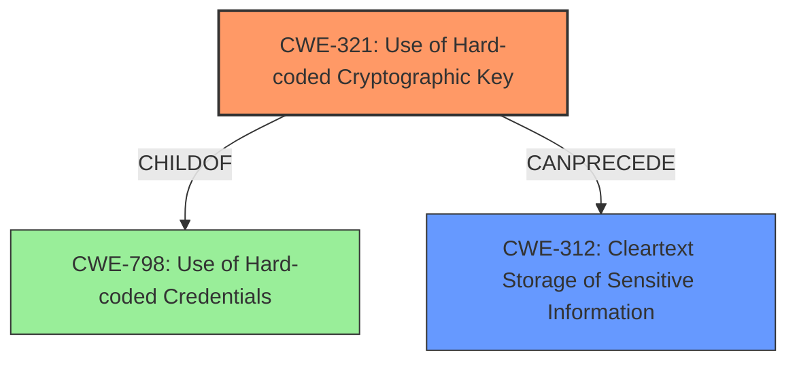

# Raw Analyzer Response for CVE-2024-33895

# Summary
| CWE ID | CWE Name | Confidence | CWE Abstraction Level | CWE Vulnerability Mapping Label | CWE-Vulnerability Mapping Notes |
|---|---|---|---|---|---|
| CWE-321 | Use of Hard-coded Cryptographic Key | 1.0 | Variant | Allowed | Primary CWE. The root cause is the use of a hard-coded cryptographic key. |
| CWE-312 | Cleartext Storage of Sensitive Information | 0.7 | Base | Allowed | Secondary candidate. The impact of using a hard-coded key is that the encrypted data can be easily decrypted, leading to potential cleartext storage of sensitive information. |

## Evidence and Confidence

*   **Confidence Score:** 0.9
*   **Evidence Strength:** HIGH

## Relationship Analysis
The primary CWE is CWE-321 (Use of Hard-coded Cryptographic Key), which is a variant. It is directly related to the vulnerability description which states that the device uses a hardcoded cryptographic key. CWE-312 (Cleartext Storage of Sensitive Information) is a potential consequence of using a hardcoded key, as the encrypted data can be easily decrypted. CWE-321 is a child of CWE-798 (Use of Hard-coded Credentials), but CWE-321 is more specific as it deals with cryptographic keys.

## Vulnerability Chain
The vulnerability chain starts with the **use of a hard-coded cryptographic key** (CWE-321). This leads to a potential **cleartext storage of sensitive information** (CWE-312) if an attacker gains access to the key and decrypts the data. The root cause is the hardcoded key which is then followed by the ability to decrypt sensitive information.

## Summary of Analysis
The primary weakness is CWE-321, which is the **use of a hard-coded cryptographic key**. The vulnerability description and the CVE Reference Links Content Summary both provide evidence for this. The summary clearly states, "The Ewon Cosy+ devices **use a hardcoded cryptographic key** for encrypting configuration parameters and passwords." This aligns perfectly with the description of CWE-321.

CWE-312 is a secondary weakness because the use of a hard-coded key can lead to the potential exposure of sensitive information in cleartext if the attacker is able to recover the key.

I considered several other CWEs from the Retriever Results, but they were not as accurate as CWE-321 and CWE-312.
*   CWE-287 (Improper Authentication) is related but not as specific as CWE-321.
*   CWE-522 (Insufficiently Protected Credentials) is also related, but CWE-312 is more fitting.
*   CWE-327 (Use of a Broken or Risky Cryptographic Algorithm) could be considered, but the core issue is the hardcoded key, not necessarily the algorithm itself.
*   CWE-311 (Missing Encryption of Sensitive Data) is not applicable because encryption is present, but the key is hardcoded.
*   CWE-78 (Improper Neutralization of Special Elements used in an OS Command ('OS Command Injection')) is not relevant to this vulnerability.
*   CWE-1391 (Use of Weak Credentials) is too broad.
*   CWE-798 (Use of Hard-coded Credentials) is a parent of CWE-321, so CWE-321 is more specific and appropriate.
*   CWE-323 (Reusing a Nonce, Key Pair in Encryption) is not relevant to this vulnerability.
*   CWE-613 (Insufficient Session Expiration) is not relevant to this vulnerability.

The selection of CWE-321 is at the optimal level of specificity because it directly addresses the root cause of the vulnerability: the **use of a hard-coded cryptographic key**.